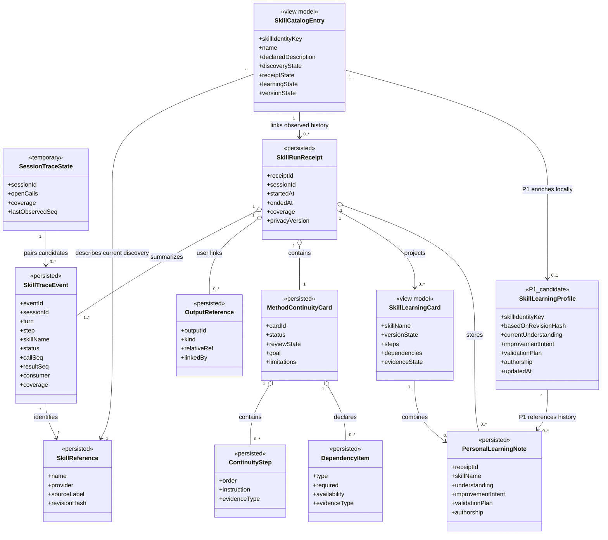
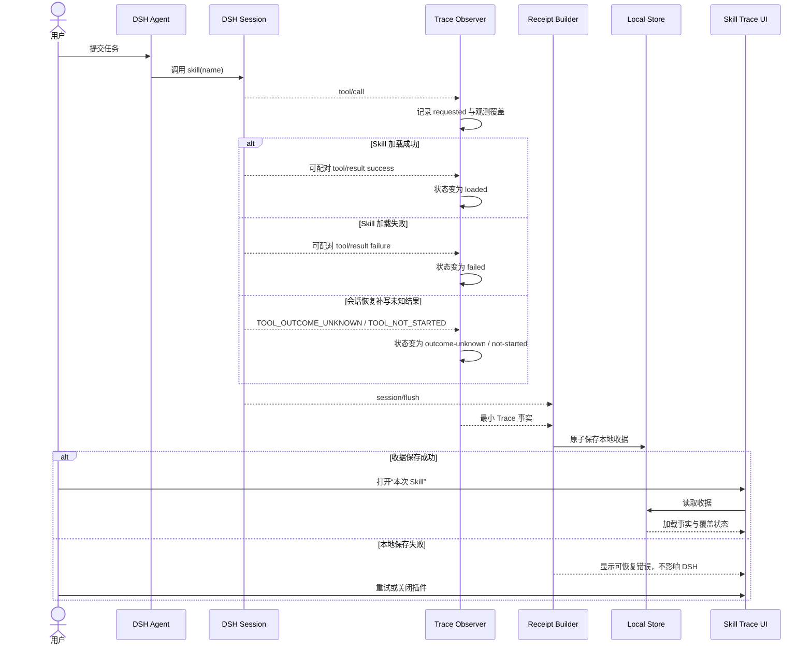
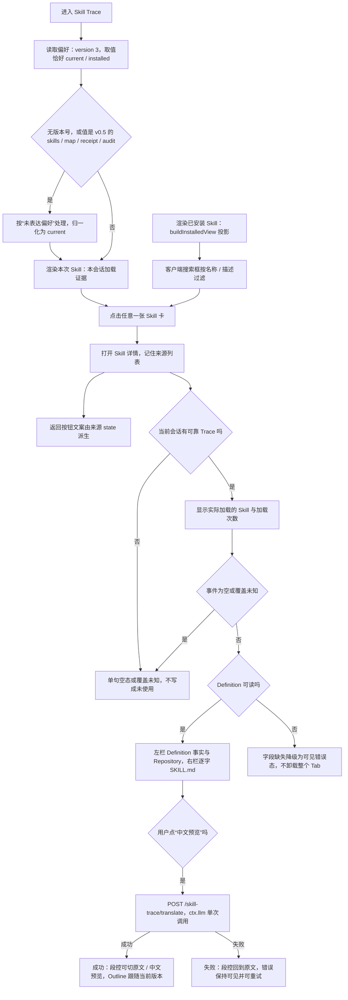
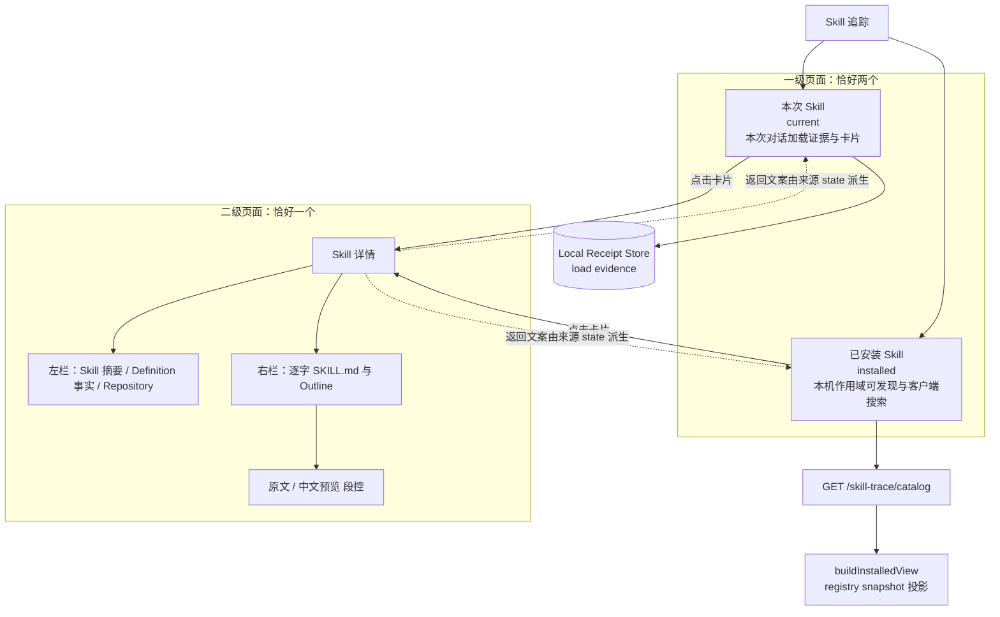
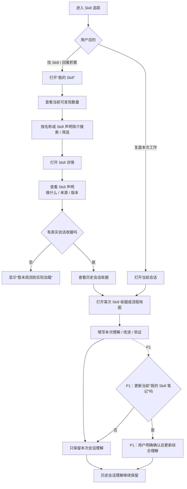
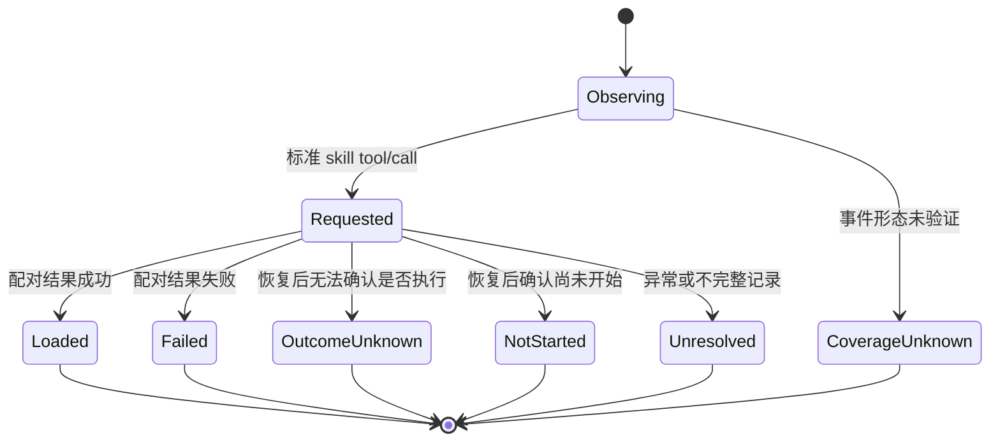

# DSH Skill Trace 概览 PRD

> 产品版本：V0.6 两级信息架构重构版  
> 当前阶段：v0.6 已把信息架构收敛为**一级两页 + 详情一页**；收据与 `trace-reducer.mjs` 作为加载证据底座原样保留，失去的只是收据自己的页面身份。当前为 328 项自动化测试、21 项静态契约守卫，Client 源码 3536 → 1256 行、Client bundle 421 KB → 49 KB  
> 工程发布候选：`dsh-skill-trace 0.4.0-beta.69`（v0.6 两级信息架构：本次 Skill / 已安装 Skill 两个一级页面 + Skill 详情一个二级页面），已发布到 npm 与 GitHub，`beta` 与 `latest` 两个标签都指向该版本；本轮唯一未完成项是 **DSH Desktop WebView 内的人眼走查**（亮色 / 暗色各一遍，1180 / 980 两处断点），清单见 `docs/RELEASE.md` §7.2
> 文档权威：本文件定义产品目标、业务对象、状态语义、范围与验收标准；技术实现以 `05-technical-design.md` 为准。

> 用户可见命名：DSH 会话 Tab 仍为“Skill 追踪”；一级页面**恰好两个**——“本次 Skill”（`current`，本次对话加载过哪些 Skill，来自收据的 load evidence）与“已安装 Skill”（`installed`，本机 / 当前作用域可发现什么，只读 `GET /skill-trace/catalog`，**刻意不读收据**）。二级页面**恰好一个**——Skill 详情，点任意一张卡都进入它，返回按钮文案由来源 state 派生（“返回 Skill 列表（本次 Skill）” / “返回 Skill 列表（已安装 Skill）”），不得硬编码。**没有 `Advanced` 组**：运行流程 / 运行图谱 / Skill 收据 / 上下文检查器 / 声明流程面板 / 跨会话学习工作台已在 v0.6 整体删除。“流程”只描述可观测事件关系，不代表 Agent 已执行 Skill 内全部步骤。

## 1. 概览

### 1.1 产品问题

用户在 DeepSeek Harness 中安装越来越多 Skill，但 Agent 的方法选择与加载过程通常不可见。用户能看到最终回答，却难以判断：

- 本次对话究竟加载过哪些 Skill，各自加载了几次；
- 每个 Skill 自己声明能做什么、以什么方式被调用（模型自动调用还是用户输入 `/name`）；
- 当前会话加载的这个 Skill，定义现在能不能读到、读到的这一版和当时那一版是不是同一版；
- 这个 Skill 的定义原文到底写了什么——它来自哪个仓库、是不是本机可解析的来源；
- 本机 / 当前工作区和 Agent Preset 下究竟可发现哪些 Skill，不记得准确名称时如何不依赖输入 `/` 找到它；
- 定义是英文、用户不是英文母语时，能不能先读一版中文预览再决定要不要用。

现有 Skill 管理、动态路由、使用统计和通用轨迹产品分别回答“有哪些”“该挂载哪些”“累计用了多少次”“Agent 做了什么”。新的直接竞品还能证明当前 Registry 返回的 Skill 内容指纹，但仍没有把“本会话实际加载证据 + 逐字定义原文 + 可核对的定义指纹”连成一条本地可复核的阅读链路：既不拿运行时事件去反推声明步骤，也不替用户判断 Skill 有没有执行、有没有用。

### 1.2 产品定位

> DSH Skill Trace 不负责安装、启停、更新、市场或自动路由 Skill；它以 Skill 为一级对象只读呈现：**这次对话用了哪些 Skill**，以及**本机 / 当前作用域能发现哪些 Skill**；点进任意一张卡，看这个 Skill 的摘要、定义事实、仓库来源与逐字 `SKILL.md` 原文。运行时画布（运行流程 / 运行图谱）与跨会话学习工作台已在 v0.6 删除，不再是本产品的一部分。

它记录加载证据，不判断因果：

- `skill(name)` 成功，只能写“已加载”；
- Agent 是否遵循方法、方法是否促成结果，由用户确认；
- 没有观测到事件，只能写“未观测”或“覆盖未知”；
- Skill 声明的步骤不等于 Agent 已执行的步骤；声明内容只能来自定义正文，运行时证据只能标注，不能增删改序步骤；
- 不评分、不给百分比、不做排名，也不使用“未观测到执行”这类词。

### 1.3 目标用户

**主要用户：** 在 DSH 中频繁使用多个 Skill、希望看懂 Agent 工作方法的普通用户。

**次要用户：** 需要排查 Skill 调用、回顾方法使用情况的 Skill 作者与 Agent 工作流设计者。

### 1.4 核心 JTBD

当一次对话结束后，我想一次点击就看清它实际加载过哪些 Skill、各自加载了几次、以什么方式被调用，再点进同一个详情页读这个 Skill 的定义事实与逐字原文，以便确认 Agent 到底用了什么能力包，而不是只能看最终回答。

当我准备开始一项工作、或不记得 Skill 的准确名称时，我希望不输入 `/` 就能按名称或描述搜索本机 / 当前作用域可发现的 Skill，以便找到可能适用的能力包——这份目录必须独立于我这次对话加载了什么。

当 `SKILL.md` 是英文而我不是英文母语时，我想在不修改原文、不污染对话、不落盘的前提下读到一版中文预览，以便判断这个 Skill 是否适用于我手头的工作。

### 1.5 为什么现在写 PRD

本 PRD 在编码前冻结了业务对象、状态语义、范围和验收门槛。V0.1 在真实 DSH Desktop 与隔离 Profile 中验证了官方 Consumer、SkillFlux `0.2.0`、成功/失败加载、恢复态语义、重启迁移与插件停用非干扰；v0.6 则把当时堆到 `Advanced` 下的运行画布和跨会话学习工作台整体删除，只留下“本次 Skill / 已安装 Skill / Skill 详情”这条最短阅读路径。

### 1.6 用户可见命名规则

| 层级 | 用户可见名称 | 使用边界 |
|---|---|---|
| DSH 工作栏 | Skill 追踪 | 产品入口；简短且不预设执行结果 |
| 一级页面（默认） | 本次 Skill（`current`） | 本次对话实际加载过的 Skill；只展示有真实加载证据的条目；不表示 Agent 完整执行了方法 |
| 一级页面 | 已安装 Skill（`installed`） | 本机 / 当前作用域可发现什么；只读 `GET /skill-trace/catalog`，**刻意不读收据**；不是市场、安装器或管理器 |
| 二级页面（唯一） | Skill 详情 | 左栏 Skill 摘要 / Definition 事实 / Repository，右栏逐字 `SKILL.md`；返回文案命名为来源列表 |
| Definition 事实卡 | 当前指纹 / 本次使用 / 调用方式 | 只陈述本机可核对的指纹与计数；比对结论只能是 `一致` / `已改变` / `无法比对` |
| 文档面板 | `SKILL.md` 原文 / 中文预览 | `原文` 永远可回看；`中文预览` 只读、仅内存、绑定 `sourceSha256`，不写回、不落盘、不进对话 |

“方法”可以出现在解释性句子中，例如“Agent 是否遵循了这套方法”，但不再作为页面、视图、卡片或导航的核心名称。“流程”只用于描述可观测事件关系；运行流程 / 运行图谱 / 上下文检查器 / 声明流程面板 / 学习工作台都不是本产品的页面。

## 2. 目标、指标与非目标

### 2.1 V0.1 目标

> **（历史版本）** 以下是 V0.1 立项时的目标清单，描述的是当时的产品范围。标 `v0.6 撤销` 的条目已在 v0.6 被删除，保留原文以留下“为什么当初做了、后来为什么删”的记录。

1. 可靠记录已验证标准 `skill(name)` 事件契约的请求、成功、失败与恢复态，并关联 Session、Turn、Step。
2. 把技术事件转成普通用户可理解的 `SkillRunReceipt`，而不是展示原始日志。
3. 让用户区分“已发现、已可用、已加载、有输出关联、可否按方法延续”。**（v0.6 重写）** 只保留“已发现 / 已加载”两级用户可见事实；输出关联与延续方式随输出引用和继续使用指南删除。
4. 提供最小 `MethodContinuityCard`，明确步骤和依赖，不承诺完全离线。**（v0.6 撤销）** 继续使用指南整体删除；替代它的是逐字 `SKILL.md` 原文，让用户直接读声明本身，而不是让产品先替他把声明拆成卡片。
5. 保证插件关闭、异常或未覆盖时不影响 DSH 原生 Session、Agent 与 Skill 行为。
6. 用同一份收据数据提供“Skill 收据”和“流程地图”两种视图，并按用户默认偏好只渲染其中一种。**（v0.6 撤销）** 两个视图连同 `Advanced` 组一起删除，替换为“本次 Skill / 已安装 Skill”两个一级页面——双视图让同一份证据被读了两次，却没有让用户更快知道“这次用了什么”。
7. 在同一会话出现多个或重复 Skill 调用时，以“Skill”和“加载事件”两层呈现：Skill 按名称聚合，每次真实调用完整保留且不静默截断。**（v0.6 重写）** 聚合规则保留在 `trace-reducer.mjs`；UI 只在“本次 Skill”卡片上显示加载次数，逐次 Turn/Step 展开随收据页删除。
8. 为每个成功加载的 Skill 分别生成 `SkillLearningCard`，不把多个 Skill 的候选步骤混成一套方法。**（v0.6 撤销）** 学习卡与学习工作台删除；v0.6 不再生成候选步骤投影。
9. 允许用户在本机记录个人理解、改进意图和验证计划，并生成可复制但不会自动执行或发布的迭代清单。**（v0.6 撤销）** 学习笔记、验证结果与迭代清单的写入入口全部删除；旧数据仍保留在收据里，但产品不再提供写路径。

### 2.2 成功指标

| 指标 | 当前基线 | V0.1 Gate | 验证阶段 |
|---|---:|---:|---|
| 标准 fixture Skill 调用配对准确率 | 未验证 | 100% | 技术 Spike |
| 成功、失败、结果未知、未开始事件区分准确率 | 未验证 | 100% | 技术 Spike |
| 持久化敏感正文数量 | 无实现 | 0 条 | Spike + Beta |
| “已加载”被写成“已遵循/已成功” | 无实现 | 0 条 | 文案测试 + Beta |
| “未观测”被写成“未使用” | 无实现 | 0 条 | 覆盖矩阵测试 |
| 插件关闭后 DSH 原生流程回归 | 未验证 | 0 个阻断回归 | 技术 Spike |
| 试点用户在 60 秒内回答“用了什么、以什么方式加载” | 未验证 | 不低于 80% | 内部 Beta |
| 多 Skill 学习卡步骤串卡 | 未验证 | 0 次 | **（v0.6 撤销）** 学习卡已删除 |
| 用户在 3 分钟内写出一条个人理解和一条改进意图 | 未验证 | 不低于 70% | **（v0.6 撤销）** 学习笔记已删除 |
| 迭代清单触发 Skill 自动写入或发布 | 无实现 | 0 次 | **（v0.6 撤销）** 迭代清单已删除 |
| 用户在 5 秒内回答“本机可发现多少个 Skill” | 未验证 | 不低于 80% | V0.4 P0 可用性测试 |
| 用户在 10 秒内按名称或描述找到目标 Skill | 未验证 | 不低于 80% | V0.4 P0 可用性测试 |
| 用户能区分“Skill 声明 / 实际收据 / 历次会话理解” | 未验证 | 不低于 80%，关键误解 0 个 | **（v0.6 撤销）** 历次会话理解面已删除；改为“能否区分本次加载事实与定义原文” |
| 中文预览在收据 / 备份 / `localStorage` / `sessionStorage` / 文件系统中出现次数 | — | 0 条 | v0.6 Translation 测试 |
| 坏输入导致整个 Tab 卸载或空白 | — | 0 次 | v0.6 详情页错误态测试 |
| 列表首屏读取 `SKILL.md` 全文的次数 | — | 0 次 | v0.6 投影测试 |

前六项是发布硬门槛；产品价值假设不达标时优先调整信息结构，不扩大功能。

### 2.3 非目标

- 不做 Skill 市场、安装器、更新器、批量启停或来源同步；
- 不做动态路由、自动挂载、远程发现或质量评分；
- 不做模型、工具、Skill 排名与趋势 Dashboard，也不做遵循率、百分比或评分；
- 不从 Agent 最终文本猜测 Skill 已使用；
- 不自动执行 Skill 脚本、修改用户项目或下载远程资源；
- 不自动判断 Skill 对结果有因果贡献；
- 不重新绘制运行流程 / 运行图谱，也不提供上下文检查器或声明-运行时对照面板；
- 不恢复跨会话学习工作台、学习笔记、验证结果、输出引用或迭代清单；
- 不自动生成、修改、覆盖、安装、执行、提交或发布 Skill；
- 除“中文预览”外不做任何模型调用：翻译只把**当前 Skill 的定义正文**发给用户自己配置的 DSH 模型一次，不发送会话 Prompt、Tool 内容、Cookie 或 credential，译文只留在内存；
- 不把用户数据上传给开发者或第三方服务；
- V0.1 不修改、不耦合 `dsh-visual-acceptance`。

## 3. 业务事实与状态语义

### 3.1 五层业务事实

| 层级 | 用户表达 | 成立条件 | 不能推出 |
|---|---|---|---|
| L1 | 已发现 | 当前 `ctx.skills.snapshot()` 观察中存在 Skill 摘要 | 当前 Agent 可调用 |
| L2 | 已可用 | 有可验证证据表明 Skill 对当前 Consumer 可见且可调用 | Agent 一定会加载 |
| L3 | 已加载 | `skill(name)` 的调用与成功结果已可靠配对 | Agent 完整遵循方法 |
| L3b | 定义可读 | 该 Skill 的 `SKILL.md` 当前能被读到，并算出当前 `sha256` 指纹 | 定义内容与本次加载时那一版相同 |
| L4 | 有输出关联 | 用户或受信结构化事件明确关联了输出引用。**（v0.6 撤销）** 输出引用功能已删除，本层不再有产生路径 | Skill 导致该输出 |
| L5 | 人工确认有用（未来） | 用户对本次方法作出明确判断。**（v0.6 撤销）** 人工有效性入口从未实现，v0.6 明确不再提供 | 对其他任务也有效 |

任何层级都不得由更低证据直接跳级。若当前 Consumer、事件字段或观测范围无法确认，则显示 `coverage-unknown`，不能显示“未使用”。“定义可读”只说明现在读得到，**不说明它和历史版本一致**——那要靠 §7.3 `FR-UI-037` 的指纹比对，且只有一侧有指纹时必须落到 `无法比对`。

### 3.2 加载状态

- `requested`：已收到 Skill 工具调用，尚未收到可配对结果；
- `loaded`：调用与成功结果已配对；
- `failed`：调用与失败结果已配对；
- `outcome-unknown`：DSH 恢复后无法确认工具是否已经执行；
- `not-started`：DSH 恢复后确认工具尚未开始；
- `unresolved`：仅用于不完整或异常记录，不作为正常 DSH 生命周期的目标状态；
- `coverage-unknown`：当前 Consumer 或事件形态不在已验证适配范围内。

### 3.3 人工有效性边界

V0.1 不提供“有用 / 没帮助 / 不确定”入口，因为当前没有开发者接收、统计或用户侧复用闭环。Schema 1 的 `humanAssessment` 只做本地兼容，不进入界面、指标或持久化 Gate。v0.6 之后这条边界更强：产品里已经没有“人工有效性”“继续方式判断”这一类状态，任何“这个 Skill 有用 / 正确 / 被遵循了”的表达都不允许出现。

### 3.4 方法延续状态

> **（v0.6 撤销）** 下面这组延续状态属于继续使用指南，已随该功能整体删除。替代它的不是另一套状态，而是**逐字 `SKILL.md` 原文**：产品不替用户判断“能不能手工继续”，只把定义原文和本机可核对的指纹摆出来。
>
> 历史定义（供回看，不再生效）：`unassessed` 证据不足；`manual` 用户确认可手工继续；`partial` 部分可继续；`blocked` 缺必要依赖。自动解析只生成候选，`manual` 必须人工确认。

## 4. 业务框架与交互图

### 4.1 核心业务框架图

```mermaid
flowchart LR
    U[用户]
    A[DSH Agent]
    SR[DSH Skill Registry]
    SE[DSH Session Event Stream]
    VA[DSH Visual Acceptance<br/>独立可选插件]

    subgraph ST[DSH Skill Trace 产品边界]
        O[Trace Observer<br/>只观察已验证事件]
        RB[Receipt Builder<br/>事件转业务收据]
        IV[Installed View<br/>buildInstalledView 只投影目录]
        LS[(Local Receipt Store<br/>最小本地数据)]
        UI[Skill Trace UI<br/>本次 Skill / 已安装 Skill / Skill 详情]
        TR[Translation<br/>ctx.llm 单次调用，仅内存]
    end

    U -->|发起任务| A
    A -->|读取目录或加载 Skill| SR
    A -->|产生会话事件| SE
    SE --> O
    O --> RB
    RB --> LS
    SR -->|catalogSnapshot| IV
    LS -->|本次加载证据| UI
    IV -->|installed 投影| UI
    UI -->|用户点击翻译| TR
    TR -->|定义正文单次发送| UI
    UI -. 用户显式交接 Web 产出，V0.2 .-> VA
```

> **（v0.6 撤销）** 原图中的 Learning Projector（按 Skill 生成候选步骤与依赖）与 Personal Notes（用户主动写入学习笔记）两个模块已删除。替代关系是：声明内容不再由产品投影，而是右栏**逐字渲染 `SKILL.md`**。收据与 `trace-reducer.mjs` 原样保留，继续回答“这次对话加载了哪些 Skill、各几次”。Translation 是 v0.6 唯一的模型调用点，只读、只存内存。

业务边界：Skill Trace 只读观察 DSH 的 Skill 与 Session 能力；本地收据是自己的业务对象，不改写 DSH 原始事件，也不向 Agent 注入路由决策。

### 4.2 业务实体类图

> 这是业务对象关系，不是数据库 ER 图。`SessionTraceState` 是进程内临时状态，其余标记为持久化的对象只保存最小业务数据。
>
> **（v0.6 历史）** 本图描述 V0.4 / V0.5 的对象模型。v0.6 删除了 `SkillLearningCard`、`PersonalLearningNote`、`MethodContinuityCard`、`SkillLearningProfile`、`OutputReference`、`ContinuityStep`、`DependencyItem` 的产生路径与全部 UI 入口；早期版本写入的 learning note / validation result 仍作为收据内的历史数据保留，但没有任何写路径。v0.6 的当前对象与页面关系见 §4.5。



### 4.3 主业务时序图



> **（v0.6 历史）** 原时序图末尾的“可选关联输出并确认延续状态 → 保存本地人工判断”已删除：输出引用与继续使用指南在 v0.6 不再存在。前半段（观测 → 收据 → 读取 → 覆盖状态）仍然有效。

### 4.4 最终用户交互流程图



### 4.5 v0.6 信息架构图：一级两页 + 详情一页



信息层级约束（v0.6 起）：**一级页面恰好两个，二级页面恰好一个**。`本次 Skill`（`current`，默认）读收据的 load evidence，回答“这次对话用了什么”；`已安装 Skill`（`installed`）只读 `GET /skill-trace/catalog`（`buildInstalledView` 对 registry snapshot 的投影），回答“本机 / 当前作用域能发现什么”，**刻意不读收据**。两者是同级但语义不同的两个页面，不是同一个列表的两种筛选。**没有 `Advanced` 组**——运行流程 / 运行图谱 / Skill 收据 / 上下文检查器 / 声明流程面板 / 跨会话学习工作台整体删除，不得以折叠区、次级标签或“更多”菜单的形式复活。

### 4.6 从发现到个人理解沉淀流程图（V0.4 / V0.5 历史，v0.6 撤销）

> **（v0.6 撤销）** 本图描述 V0.4 / V0.5 的“发现 → 个人理解沉淀”链路。v0.6 删除了学习笔记、验证结果、输出引用与跨会话综合理解的全部入口，该链路不再存在；保留此图仅作历史记录。当前信息架构见 §4.5。



P0 到“回看历史会话理解”即形成最小闭环，不创建综合理解对象。图中的 `SkillLearningProfile` 更新属于 P1：未来也不得自动把最新会话笔记覆盖为全局理解；历史 `PersonalLearningNote` 始终保留原会话、原版本和原证据上下文。

### 4.7 Skill 加载证据状态图



> **（v0.6 撤销）** `OutputReference` 与 `MethodContinuityCard` 曾作为收据上的独立对象，用来避免把“已加载 → 有输出 → 可手工延续”伪装成自动状态升级。v0.6 删除了这两个对象及其全部 UI。状态图其余部分（`requested / loaded / failed / outcome-unknown / not-started / unresolved / coverage-unknown`）仍是当前事实语义，由保留的 `trace-reducer.mjs` 维护。

## 5. 用户故事

| ID | 用户故事 | 优先级 |
|---|---|---|
| US-01 | 作为普通用户，我想查看本次会话实际加载的 Skill，以便知道 Agent 用了什么能力包 | P0 |
| US-02 | 作为普通用户，我想区分加载成功、失败、结果未知、未开始和覆盖未知，以免把缺少证据理解成未使用 | P0 |
| US-03 | **（v0.6 撤销）** 原“查看方法的目标、步骤和依赖以判断能否手工继续”的声明流程面板与继续使用指南已删除；声明内容改为右栏逐字 `SKILL.md`，是否可继续不再由产品判断 | P0 |
| US-04 | **（v0.6 撤销）** 原“确认方法可手工、可部分延续或当前受阻”的延续状态与卡片已删除，产品不提供任何“能否继续”的人工判断字段 | P0 |
| US-05 | **（v0.6 撤销）** 原“手工关联最小产出引用”已删除：输出引用不再有写入入口，收据也不再保存输出关联 | P1 |
| US-06 | 作为 Skill 作者，我想看到调用证据和失败位置，以便定位加载问题 | P1 |
| US-07 | **（v0.6 撤销）** 原“选择默认查看 Skill 收据或流程地图”已删除：两个视图都不再存在，默认项收敛为一级页面 `current` / `installed` | P0 |
| US-08 | **（v0.6 重写）** 作为学习者，我想逐字读到 Skill 自己的 `SKILL.md` 原文，并用由文档标题确定性抽取的 Outline 定位章节，以免把产品的二次投影误当成 Skill 的声明 | P0 |
| US-09 | **（v0.6 撤销）** 原“记录理解、改进意图、验证计划并复制迭代清单”已随学习工作台删除；产品不提供个人笔记、验证结果或迭代清单出口 | P0 |
| US-10 | **（v0.6 重写）** 作为 Skill 使用者，我想不依赖输入 `/`、也不依赖这次对话是否加载过，就看到本机 / 当前作用域可发现的 Skill 列表，以便知道当前配置下有哪些可选择的能力包 | V0.6 |
| US-11 | **（v0.6 重写）** 作为不记得准确名称的用户，我想按名称或描述在“已安装 Skill”里本地搜索，以便找到可能适用的 Skill；搜索是纯客户端过滤，不请求 Host | V0.6 |
| US-12 | **（v0.6 重写）** 作为用户，我想在同一个 Skill 详情里看到 Skill 自述、当前定义指纹、本次加载次数与仓库来源，以便区分“它自己声明什么”与“这次实际加载了几次” | V0.6 |
| US-13 | **（v0.6 撤销）** 原“保留历次会话理解并维护当前综合理解”已删除：历史 note / validation result 只作为收据数据保留，产品不再展示或更新它们 | V0.4 P1 |
| US-14 | 作为普通用户，我想在“本次 Skill”看到每张卡片的名称、描述、调用方式（`model` / `/name`）、加载次数与定义可读状态，以便一眼判断这次对话实际用到了什么 | V0.6 |
| US-15 | 作为普通用户，我想从任一列表点进同一个 Skill 详情，返回时回到我进来的那个列表，以便不丢失来源上下文 | V0.6 |
| US-16 | 作为中文用户，我想在不修改 `SKILL.md`、不污染对话、不落盘的前提下，把定义临时看成中文预览，以便判断这个 Skill 是否适用 | V0.6 |
| US-17 | 作为谨慎的用户，我想在字段缺失或翻译失败时看到明确的错误与重试入口，而不是整页空白，以便知道发生了什么、下一步做什么 | V0.6 |

## 6. V0.1 / V0.4 / V0.5 范围（历史）

> **（历史版本）** §6.1–§6.4 分别是 V0.1、V0.4、V0.5 当时确认的范围，保留原文以记录演进。**它们描述的不是 v0.6 的产品**；v0.6 的当前范围见 §6.5。

### 6.1 范围内

- 标准 `skill` 工具的 `tool/call` / `tool/result` 被动观测；已隔离验证官方 Consumer 与 SkillFlux `0.2.0`；
- Session、Turn、Step、Skill 名称、成功/失败与证据事件关联；
- 当前会话和历史会话的最小 `SkillRunReceipt`；
- 确定性优先的 Continuity 候选卡；
- `unassessed / manual / partial / blocked` 与人工确认；
- 用户主动关联最小输出引用；
- 本地存储、删除确认和观测覆盖说明；
- 插件启停不影响原生 DSH 行为。
- 同一 `SkillRunReceipt` 的 Skill 收据与流程地图双视图；切换不触发模型调用，也不创建第二份分析结果；
- 用户默认视图偏好；进入新会话时只挂载并渲染所选视图。
- 按成功加载 Skill 分开的 `SkillLearningCard`；
- 用户主动保存的本地个人理解、改进意图和验证计划；
- 只复制、不写回 Skill 的迭代清单。

### 6.2 范围外

- 不使用标准 `skill` 工具名或结果结构的 Consumer Adapter；
- 自动解析 Agent 文本并关联输出；
- 插件内模型调用、RAG、自动总结或自动有效性评价；
- 手动试跑与受控执行；
- 自动下载或运行 Skill 资源和脚本；
- 使用排行、趋势、周报或质量分；
- 与 `dsh-visual-acceptance` 的运行时集成。
- 自动修改、生成、提交或发布 Skill。

### 6.3 V0.4 已确认范围与后续候选

- V0.4 P0（本地实现与 Desktop 复验已完成）：`我的 Skill` 只读入口、当前会话范围的可发现数量、名称/声明简介搜索、基础状态筛选、Skill 详情、可靠历史收据关联与既有会话理解回看；
- V0.4 P1（待 P0 用户验证后再决定）：跨会话 `SkillLearningProfile`、当前综合理解及其明确更新操作；
- V0.4+：受控手动试跑；
- V0.4+：本地 Web 产出显式交给 DSH Visual Acceptance；
- V0.4+：无法留下标准 `skill` 事件的 Consumer Adapter；
- 是否需要白话解释、示例或术语提示，只能由 M6 理解验证结果决定；当前不承诺模型调用或自动生成。

`我的 Skill` 的最小开发范围、只读技术路径与本地实现已经完成。当前授权止于 P0；不得据此启动 P1 综合理解、Skill 管理、模型摘要或发布能力。

### 6.4 V0.5 已确认范围：Skill Runtime Scope

**问题**：Declaration ↔ Runtime Alignment 此前在整个 Session 的 Runtime Event 中寻找匹配项。
「Turn 1 的 read、Turn 2 加载 Skill A、Turn 3 的 test」会让 Skill A 声明的
「Inspect → Test」同时匹配 Turn 1 与 Turn 3。**事件是真的，归属是编的。**

**V0.5 的核心能力**是建立 **Skill Runtime Scope**：

```
Skill Declaration  ↕  Skill Runtime Scope  ↕  Observed Runtime Events
```

Alignment **只读取 Scope 内的事件**。Scope 内的每一个事件都必须能回指真实 Runtime Evidence。

**范围外**（不在 V0.5 内）：不做工作流编排、不做因果推断、不做遵循率、
不生成最终 Runtime Fingerprint、不改 Runtime Flow / Graph 的既有架构。

### 6.5 v0.6 已确认范围：两级信息架构收敛

**问题**：V5.0 的 Skill-first IA 仍然保留三层结构 `Skill → Definition / Declared Flow / Runs / Evidence / Repository`，并把 Runtime Flow / Runtime Graph / Skill 收据收进 `Advanced`。结果是**每次进入都要先理解“哪一层看什么”**，而多数使用只问两个问题：这次用了什么、本机有什么。

**v0.6 的核心变化**是把信息架构塌缩为**一级两页 + 二级一页**：

```text
本次 Skill（current）     ← 本次对话的加载证据
已安装 Skill（installed）  ← 本机 / 当前作用域的可发现集合
        └── Skill 详情     ← 唯一的二级页面：摘要 + Definition 事实 + Repository + 逐字 SKILL.md
```

**范围内**：

- 一级页面恰好两个：`本次 Skill` 与 `已安装 Skill`；`已安装 Skill` 只读 `GET /skill-trace/catalog`，由 `buildInstalledView` 从 registry snapshot 投影，**刻意不读收据**；搜索为纯客户端过滤；
- 二级页面恰好一个：Skill 详情；返回文案由来源 state 派生，不硬编码；
- 右栏逐字 `SKILL.md` + 由文档标题确定性抽取的 Outline + 渲染后的 Markdown；
- 中文预览：只读、仅内存、绑定 `sourceSha256`，由用户自己配置的 DSH 模型（`ctx.llm`）单次翻译；
- 偏好带版本号（`PREFERENCES_VERSION = 3`），保存词汇恰好 `current` / `installed`；无版本号与 v0.5 词汇一律归一化为 `current`。

**范围外 / 已删除**：Runtime Flow 画布、Runtime Graph 画布、Skill 收据页、Contextual Inspector、声明流程面板、跨会话学习工作台（学习笔记 / 验证结果 / 历史卡）、backup / export / outputs / continuity / learning-note / validation-result 功能，以及依赖 `elkjs` 与 `@xyflow/react`。Host 路由由 22 条收敛为 7 条：`/context`、`/skills`、`/skill`、`/installed`、`/definition`、`/translate`、`/preferences`。

**明确保留**：收据本身与 `trace-reducer.mjs`。SDD §4.4 要求不得为清理代码破坏仍然有用的 load-evidence reducer——收据失去的是**页面身份**，不是证据角色，它仍然回答“这次对话加载了哪些 Skill、各几次”。旧版本写下的 learning note / validation result 仍保留在收据内，但 UI 不再有写入入口。

**仍不可逆的两个方向**：`Declared`（定义正文）/ `Observed`（运行时）/ `Inferred`。声明步骤只能来自定义正文；运行时证据只能标注，不能增删改序。产品不评分、不给百分比、不做排名、不使用“未观测到执行”一类词汇。

**当前工程数字**：328 项自动化测试、21 项静态契约守卫、client 源码 3536 → 1256 行、client bundle 421 KB → 49 KB。

## 7. 功能需求

### 7.1 事件观测与证据

- `FR-OBS-001`：系统必须只把已验证 Skill Consumer 的工具调用识别为 Skill 加载请求。
- `FR-OBS-002`：系统必须按 Session、调用标识、Turn、Step 配对 `tool/call` 与 `tool/result`。
- `FR-OBS-003`：系统必须区分 `requested`、`loaded`、`failed`、`outcome-unknown`、`not-started`、异常 `unresolved` 与 `coverage-unknown`。
- `FR-OBS-004`：系统不得从 Assistant 文本、Skill 名称出现或目录可见性推断“已加载”。
- `FR-OBS-005`：系统必须记录观测器类型与覆盖状态，使“未观测”可解释。
- `FR-OBS-006`：插件停止、异常或被禁用时不得阻断 Session、Agent 或 Skill Consumer。
- `FR-OBS-007`：单条事件没有 Consumer 注册来源时必须显示“身份不可区分”；产品级覆盖可列出已验证 Consumer，但不得把它归因给某次调用。

### 7.2 会话收据

> **（v0.6）** 收据作为证据对象保留（SDD §4.4 要求不得为清理代码破坏仍然有用的 load-evidence reducer），但**不再有独立页面**；其加载证据由「本次 Skill」一级页面消费。下列要求中凡描述“收据页展示”的，均按此重写。

- `FR-REC-001`：系统必须按会话生成一张可重启读取的本地收据。
- `FR-REC-002`：**（v0.6 重写）** 收据必须保留实际加载的 Skill、发生步骤、成功/失败与证据引用；但这套事实的**展示位置**改为「本次 Skill」一级页面的卡片（名称、描述、调用方式、加载次数、定义可读状态），收据本身不再作为页面出现。
- `FR-REC-003`：**（v0.6 重写）** 失败、结果未知、未开始和异常未配对事件在**数据层**必须与成功加载保持可区分（由保留的 `trace-reducer.mjs` 保证）；v0.6 不再有收据页做分组展示，「本次 Skill」只呈现加载事实，**不得把缺证据写成“未加载”**。
- `FR-REC-004`：**（v0.6 撤销）** 输出引用功能整体删除：不再有“用户明确创建最小输出引用”的入口，收据也不再保存输出关联。
- `FR-REC-005`：V0.1 不提供“有用/没帮助/不确定”的人工反馈入口；当前实现没有远程回传、开发者接收或后续闭环，展示该入口会制造错误预期。旧收据中的 `humanAssessment` 仅作 Schema 兼容，不参与展示与持久化判断。
- `FR-REC-006`：用户删除收据或全部本地数据前，系统必须显示范围并二次确认。
- `FR-REC-007`：**（v0.6 重写）** 同名 Skill 在一张收据中仍然只能占一个 Skill 条目，其调用次数、成功次数、失败次数由 reducer 聚合；原“每次 Turn/Step 事件必须可展开核对”随收据页删除，不再有逐事件展开入口。
- `FR-REC-008`：一个 Skill 包含成功与失败等不同事件时，Skill 级状态必须显示为“状态混合”，不得用单次成功覆盖失败证据。
- `FR-REC-009`：成功结果包含标准 Skill 指令标签时，收据只保存 SHA-256 指纹和有界结构，不保存正文；指纹只用于内容相等比较，不称为签名或防篡改证明。

### 7.3 已安装 Skill 与 Skill 详情（V0.4 建立，v0.6 重写）

- `FR-SKL-001`：**（v0.6 重写）** 一级页面「已安装 Skill」（内部键 `installed`）只读展示当前作用域可发现的 Skill，**只调用 `GET /skill-trace/catalog`，由 `buildInstalledView` 从 registry snapshot 投影**；不提供启停、安装、更新或同步。
- `FR-SKL-002`：系统必须区分 Registry 已发现与当前 Consumer 已可用；证据不足时显示未知。
- `FR-SKL-003`：**（v0.6 重写）** 详情左栏必须显示 Skill 自述（名称、描述、调用方式）、`provider · source kind`、当前 `SKILL.md` 的 sha256 指纹与本次会话加载次数；原“最后一次可靠观测状态”不再展示。
- `FR-SKL-004`：完整 Skill 正文只能按需读取和临时展示，默认不得复制到收据存储。
- `FR-SKL-005`：**（v0.6 重写）** 入口名称使用“已安装 Skill”，语义限定为**本机 / 当前作用域可发现**；保留“不得把发现结果写成全局库存”的约束，但不再使用“当前可发现 X 个”作为入口文案。
- `FR-SKL-006`：列表概要优先读取 Skill 自带 `name / description / provider / safe source / version`；说明不足时显示“该 Skill 没有提供足够清晰的用途说明”，不得调用模型补写。
- `FR-SKL-007`：**（v0.6 重写）** 用户可按 Skill 名称和描述在**客户端**本地搜索；“全部 / 有真实收据 / 有会话理解 / 暂未观测 / 当前未发现 / 版本变化”六个筛选随学习工作台删除，不得以任何形式保留“暂未观测 = 从未使用”的暗示。
- `FR-SKL-008`：**（v0.6 重写）** 列表项只分开展示**发现状态**与**定义可读状态**；原本并列的“实际收据状态”“个人学习状态”不再进入该列表——那是「本次 Skill」一级页面与收据数据各自回答的问题。
- `FR-SKL-009`：**（v0.6 重写）** Skill 详情的组织顺序固定为：左栏 Skill 摘要 / Definition 事实 / Repository，右栏逐字 `SKILL.md` + Outline。原“Skill 声明 / 实际运行记录 / 历次会话理解”三层顺序随学习工作台删除。
- `FR-SKL-010`：**（v0.6 重写）** 未留下真实加载事件的 Skill 在「已安装 Skill」中只呈现发现与定义事实；**该列表刻意不读收据，因此不得显示“暂未观测到实际加载”**，也不得生成虚构流程、使用次数或结论。
- `FR-SKL-011`：列表与详情不提供安装、卸载、启停、更新、市场、来源同步、新建 Skill、使用排行或质量评分入口。
- `FR-SKL-012`：**（v0.6 撤销）** 跨会话历史身份关联已随学习工作台删除；产品不再自动合并收据或笔记，也不再标注“可能相关的历史记录”。
- `FR-SKL-013`：**（v0.6 撤销）** 原“Registry 可发现条目 ∪ 历史条目”的并集与“历史 Skill / 当前未发现”分组已删除；「已安装 Skill」只是 registry snapshot 的投影。
- `FR-SKL-014`：**（v0.6 撤销）** `PersonalLearningNote` 不再有任何 UI 展示面；旧数据只保留在收据内，不参与页面呈现。
- `FR-SKL-015`：当前目录必须从已挂载普通会话的 Agent Preset 作用域 Registry 读取；不得使用无法看到 Preset 内 Skill 的根级 Registry，也不得把只返回用户可调用项的 `/` 菜单 RPC 当成完整目录。
- `FR-SKL-016`：**（v0.6 撤销）** 未来收据的跨身份自动关联规则已失效：v0.6 不做任何跨会话身份合并，旧收据只作为历史数据保留。

### 7.4 继续使用指南（v0.6 撤销）

- `FR-CON-001`：**（v0.6 撤销）** 确定性提取目标 / 输入 / 步骤 / 输出 / 依赖候选的“继续使用指南”整体删除；声明内容改为逐字 `SKILL.md`，产品不再做二次解析。
- `FR-CON-002`：**（v0.6 撤销）** 依赖分类词表（`network` / `model` / `mcp` / `script` / `permission` / `workspace` / `human-decision`）随指南删除；v0.6 不对 Skill 做依赖分析。
- `FR-CON-003`：**（v0.6 撤销）** `declared / observed / inferred-candidate / human-confirmed` 的证据类型标注随指南删除；两层方向（Declared / Observed）本身仍不可逆，见 §6.5。
- `FR-CON-004`：**（v0.6 撤销）** `unassessed` 默认状态随指南删除；产品不再对“能否继续”给任何状态。
- `FR-CON-005`：**（v0.6 撤销）** Continuity 正式判断与人工确认入口删除，不存在候选转正路径。
- `FR-CON-006`：**（v0.6 撤销）** `partial` / `blocked` 与“最低成本继续方式”删除，产品不评估继续成本。
- `FR-CON-007`：**（v0.6 撤销）** “最多五条有序步骤”的确定性解析删除；“运行时证据不得反推声明步骤”这一原则保留，见 §7.6 `FR-UI-052`。
- `FR-CON-008`：**（v0.6 撤销）** `manual / partial / blocked` 本地人工判断删除；v0.6 不保存任何“能否继续”的人工字段。

### 7.5 Skill 学习与迭代（v0.6 撤销）

- `FR-LRN-001`：**（v0.6 撤销）** 分 Skill 学习卡删除；声明内容改为逐字 `SKILL.md`，不再生成候选步骤。
- `FR-LRN-002`：**（v0.6 撤销）** 学习卡字段（候选步骤、依赖线索、证据边界）删除；其中“本次加载次数、指令指纹、版本状态”改由 Skill 详情的 Definition 事实卡呈现，见 `FR-UI-019`。
- `FR-LRN-003`：**（v0.6 撤销）** “候选步骤必须标记为来自 Skill 指令”随学习卡删除；其保护目的由 `FR-UI-052`“UI 不得做 declared→runtime 推断”承接。
- `FR-LRN-004`：**（v0.6 撤销）** 用户保存“我的理解 / 我想改进 / 下次如何验证”的入口删除。
- `FR-LRN-005`：**（v0.6 撤销）** 个人笔记不再有写入路径。
- `FR-LRN-005A`：**（v0.6 撤销）** 笔记回看与编辑路径删除；插件仍无上传或遥测通道。
- `FR-LRN-006`：**（v0.6 撤销）** 可复制的 Skill 迭代清单删除，产品不再有任何 Skill 修改 / 安装 / 发布出口。
- `FR-LRN-007`：**（v0.6 撤销）** 迭代清单的版本变化提示删除；版本比对改由 Definition 事实卡的 `一致 / 已改变 / 无法比对` 表达。
- `FR-LRN-008`：**（v0.6 撤销）** `PersonalLearningNote` 不再产生或展示；旧数据只保留在收据内。
- `FR-LRN-009`（P1）：**（v0.6 撤销）** 跨会话 `SkillLearningProfile` 不立项。
- `FR-LRN-010`（P1）：**（v0.6 撤销）** 综合理解更新操作删除。
- `FR-LRN-011`（P1）：**（v0.6 撤销）** 历史笔记回看删除。
- `FR-LRN-012`：**（v0.6 撤销）** 从“我的 Skill”打开原会话收据的路径删除；v0.6 的详情返回只回到来源列表。
- `FR-LRN-013`（P1）：**（v0.6 撤销）** 综合理解的 Revision Hash 归属规则删除。
- `FR-LRN-014`（V0.4 P1）：**（v0.6 撤销）** 人工验证结果表单删除，`met / not-met / inconclusive` 不再有写入入口。
- `FR-LRN-015`：**（v0.6 撤销）** 验证结果写入收据的路径删除；旧 validation result 仍作为历史数据保留在收据内。
- `FR-LRN-016`：**（v0.6 撤销）** `human-authored` 验证语义删除。
- `FR-LRN-017`：**（v0.6 撤销）** 验证表单的字段长度与敏感内容拒绝规则随表单删除。
- `FR-LRN-018`：**（v0.6 撤销）** “待回看 / 已记录结果”状态投影删除。
- `FR-LRN-019`：**（v0.6 撤销）** 跨会话计数与关联等级删除。
- `FR-LRN-020`：**（v0.6 撤销）** 详情按原收据时间展示学习记录的要求删除；Skill 详情不再呈现任何个人数据。

### 7.7 Skill Runtime Scope（V0.5 建立，v0.6 撤销 alignment 展示面）

- `FR-SCOPE-001`：**（v0.6 撤销）** 声明步骤与 Runtime Event 的匹配范围计算随声明流程面板删除；产品不再做 alignment。
- `FR-SCOPE-002`：**（v0.6 撤销）** “Scope 边界必须来自 Runtime 明示关联”的规则随计算删除；其精神（不得由时间相邻推断归属）保留在 §11 与 `FR-UI-052`。
- `FR-SCOPE-003`：**（v0.6 撤销）** 显式拒绝「相邻事件 / 最近事件 / 最后一个 Tool」等归属依据的词表删除。
- `FR-SCOPE-004`：**（v0.6 撤销）** 事件必须回指真实 Runtime Event id 的校验随 Scope 计算删除。
- `FR-SCOPE-005`：**（v0.6 撤销）** `unlinked` 保留策略删除；v0.6 不计算归属，也就不产生未归属事件。
- `FR-SCOPE-006`：**（v0.6 撤销）** 同一 Turn 两次加载判为 `unlinked` 的特殊规则删除。
- `FR-SCOPE-007`：**（v0.6 撤销）** Scope 限制说明随 Scope 对象删除。
- `FR-SCOPE-008`：**（v0.6 撤销）** “Scope 只保存标识符与分类”的约束随 Scope 删除；v0.6 的对应约束见 §10“不保存 Prompt 正文、工具参数与项目内容”。
- `FR-SCOPE-009`：**（v0.6 重写）** alignment 状态词表随展示面删除，但**禁令保留并扩大到整个 UI**：不得出现 `not-observed` / `skipped` / `not-done` 一类词汇，缺证据只能写“未观测 / 覆盖未知”。
- `FR-SCOPE-010`：**（v0.6 重写）** **全产品不得计算或呈现遵循率、百分比、评分或排名**；该禁令在 v0.6 从 alignment 扩大到所有页面与所有字段。
- `FR-SCOPE-011`：**（v0.6 撤销）** Skill Inspector 与其运行范围展示删除；Contextual Inspector 不再存在。
- `FR-SCOPE-012`：**（v0.6 撤销）** Runtime Flow 因果连线禁令随 Runtime Flow 画布删除；不得绘制因果关系的原则继续有效——v0.6 根本不画关系图。

### 7.6 用户界面

- `FR-UI-001`：**（v0.6 重写）** **默认入口必须先回答“这次用了哪些 Skill”**：第一屏是「本次 Skill」——本次对话真正加载过的 Skill 卡片。点击一次进入唯一的 Skill 详情，读到 Definition 事实与逐字 `SKILL.md`。用户不得被迫先理解 Turn / Step / Invocation / Scope / Edge 才能读懂一个 Skill。
- `FR-UI-002`：界面必须为加载、空、错误、无可靠 Trace、覆盖未知提供独立状态。
- `FR-UI-003`：界面直接使用“Skill”；面向新手的解释可称“工作方式”，同时保留“Skill 是指令与资源包，不是人类专家”的说明。
- `FR-UI-004`：**（v0.6 重写）** 每个事实字段必须自述其边界（例如指纹比对直接写“无法比对”），不再依赖可展开的证据面板；v0.6 没有独立的证据区。
- `FR-UI-005`：**（v0.6 撤销）** “Skill 收据 / 流程地图”双视图删除，两者都不再存在。
- `FR-UI-006`：**（v0.6 撤销）** “双视图共享同一数据、不重复分析”的规则失去对象；v0.6 的两个一级页面数据源本来就不同（收据加载证据 / registry snapshot 投影）。
- `FR-UI-007`：**（v0.6 重写）** 默认一级页面只允许 `current`（本次 Skill）与 `installed`（已安装 Skill），**没有 `Advanced`**。偏好必须以 `PREFERENCES_VERSION = 3` 写入；读取时**任何无版本号的值，以及任何 v0.5 词汇（`skills` / `map` / `receipt` / `audit`），一律视为「从未表达偏好」并归一化为 `current`**。`map` 的处理尤其关键：运行地图在 v0.6 已不是一个页面，尊重一个无法实现的旧选择本身就是错误行为。
- `FR-UI-008`：**（v0.6 重写）** 一级页面切换或从详情返回，必须保留当前 Skill 与来源列表；页面切换不得改变任何业务状态。
- `FR-UI-009`：**（v0.6 撤销）** “两种视图使用同一证据语法”随双视图删除；颜色不得作为唯一编码这一无障碍规则继续有效。
- `FR-UI-010`：**（v0.6 重写）** 加载中只显示一句进度提示；当前没有 Trace 时只显示一句空态提示，不渲染卡片骨架、依赖、产出或推断结论。
- `FR-UI-011`：已确认标准 Skill 工具事件覆盖且事件为空时显示“当前对话暂未加载可追踪的 Skill”；覆盖未知时显示“暂时无法确认当前对话是否加载了 Skill”，不得写成“未使用”。
- `FR-UI-012`：**（v0.6 撤销）** “流程地图必须完整呈现全部加载事件、不得固定数量截断”随地图删除；列表不做截断的约束由 `FR-UI-002` 的空态与 `FR-SKL-007` 的搜索覆盖。
- `FR-UI-013`：**（v0.6 撤销）** 收据四阶段展开删除。
- `FR-UI-014`：**（v0.6 重写）** 「本次 Skill」卡片固定展示名称、描述、调用方式（`model` / `/name`）、本会话加载次数与定义可读状态；逐条 Turn/Step 展开随收据页删除。
- `FR-UI-015`：**（v0.6 撤销）** 地图节点详情删除；v0.6 的对应阅读面是右栏逐字 `SKILL.md`。
- `FR-UI-016`：**（v0.6 撤销）** 双视图底部“本次流程小结”删除，产品不再生成流程小结。
- `FR-UI-017`：**（v0.6 撤销）** 流程地图网格约束随地图删除。
- `FR-UI-018`：**（v0.6 重写）** 会话头部可显示一枚轻量状态提示，但它必须与「本次 Skill」同源读取收据投影，不生成第二套分析。
- `FR-UI-019`：**（v0.6 重写）** Skill 详情的 Definition 事实卡必须显示：文件 `SKILL.md`、**当前** sha256 指纹、本次会话加载次数、`provider · source kind`，以及**请求版本 vs 当前版本**的指纹比对，结论只能是 `一致` / `已改变` / `无法比对`。**只有一侧有 hash 时必须写 `无法比对`，不得温和地降级成 `已改变`。**
- `FR-UI-020`：**（v0.6 撤销）** 收据内“逐个看懂 Skill”区块随收据页删除。
- `FR-UI-021`：**（v0.6 撤销）** “流程地图不得把声明步骤画成已执行节点”随地图删除；同类禁令由新增的 `FR-UI-052` 承接。
- `FR-UI-022`：**（v0.6 撤销）** 右侧栏按 Skill 切换的本地学习笔记删除。
- `FR-UI-023`：**（v0.6 重写）** 顶级导航**恰好两个一级页面**：**「本次 Skill」**（内部键 `current`，默认）与**「已安装 Skill」**（内部键 `installed`）。两者语义不同：前者回答“这次对话用了什么”（读收据的 load evidence），后者回答“本机 / 当前作用域能发现什么”（只读 `GET /skill-trace/catalog` 的 `buildInstalledView` 投影，**刻意不读收据**），并带一个客户端搜索框。**不存在 `Advanced` 组**，也不得以折叠区、次级标签或“更多”菜单复活它。
- `FR-UI-024`：**（v0.6 重写）** 一级页面之间切换不得改变默认页面偏好，也不得丢失当前 Skill；从详情返回时必须回到进入它的那个列表。
- `FR-UI-025`：**（v0.6 重写）** 「已安装 Skill」空态必须区分“作用域完整但无发现结果”“作用域覆盖未知”“搜索无匹配”，三者不得共用“没有 Skill”一句话。
- `FR-UI-026`：**（v0.6 重写）** 「已安装 Skill」入口不依赖当前会话是否有 Trace；零 Skill 会话仍保留该入口，但当前会话区域继续遵守单句空态规则。
- `FR-UI-027`：Skill Trace 界面语言必须跟随 DeepSeek Harness 的 `zh / en` 设置；宿主运行中切换后，当前 Tab、会话状态提示和插件自有文案原位刷新。未知 locale 回退英文；Skill 名称、声明、证据字段、工作区名与收据正文不翻译、不重写、不上传。`SKILL.md` 正文只在用户显式触发「中文预览」时翻译，见 `FR-UI-047`。
- `FR-UI-028`：**（v0.6 重写）** 原 1000px 坐标舞台随流程地图删除；v0.6 的响应式要求见新增的 `FR-UI-053`。
- `FR-UI-029`：**（v0.6 撤销）** “两处入口编辑同一条验证结果、不得复制成两条”随验证表单与其双入口删除。
- `FR-UI-030`：**（v0.6 撤销）** “待回看 / 已记录结果”筛选删除。
- `FR-UI-031`：**（v0.6 撤销）** 验证表单及其保存/错误/清除状态机删除。
- `FR-UI-032`：**Skill 是产品的一级对象**。Tool / MCP / CLI / Subagent 不是，它们只能作为 Runtime Evidence 的来源出现，不得成为与 Skill 平级的对象。技能列表中禁止显示 Tool 数、Runtime 节点数或 Runtime Edge 数。
- `FR-UI-033`：**（v0.6 重写）** **声明内容只能来自 Skill 自己的定义文本**；v0.6 不再把声明投影成独立的 Declared Flow 面板，而是**逐字渲染 `SKILL.md`**（`FR-UI-046`）。运行时证据不得改写、补写或反推定义。系统不得为此引入 LLM、Embedding、向量库、RAG、自动摘要或 AI 分类——唯一例外是用户显式触发、且结果不落盘的「中文预览」（`FR-UI-047`）。
- `FR-UI-034`：数据模型与界面必须区分 `Declared`（来自 SKILL.md）、`Observed`（来自 DSH 运行时事件）与 `Inferred`（尽量不做）。禁止「某 Tool 距离某 Skill 最近 ⇒ 该 Tool 属于该 Skill」，也禁止「同一个 Turn ⇒ 把该 Turn 全部运行时事件都算成该 Skill 的」。
- `FR-UI-035`：**（v0.6 重写）** 「本次 Skill」列表**只**展示本次会话有真实加载证据的 Skill；「已安装 Skill」是另一个一级页面，**不得把已安装目录当作“本次使用的 Skill”**，反之也不得把加载证据混进已安装列表。
- `FR-UI-036`：Skill 运行记录以宿主给出的事件标识为准（`eventId` / `callId` / `turn-step`）。系统**不得伪造** `runId` 或其它 DSH 没有的原生字段。
- `FR-UI-037`：**（v0.6 重写）** 指纹比对必须保留 `Observed Definition Hash` / `Current Definition Hash` 与三态 `match` / `mismatch` / `unavailable`，界面结论写成 `一致` / `已改变` / `无法比对`。**禁止**把 `unavailable` 写成 `mismatch` / `已改变`，也禁止写成“Skill 已失效”——哈希只证明版本变化，不证明好坏。
- `FR-UI-038`：**（v0.6 重写）** Repository 是 Skill 详情的标准信息卡，地址按**三级解析：Skill frontmatter → 所在 git worktree 的 `origin` → 用户配置**；**禁止**根据目录名、Skill 名或 npm 包名猜测 GitHub；猜不到就显示「未解析」，**不伪造、不留禁用态占位**；带凭据的 remote 与本机绝对路径整条拒绝展示。
- `FR-UI-039`：**（v0.6 撤销）** Flow 步骤与 `SKILL.md` 互相定位的交互随声明流程面板删除；v0.6 用 Outline 章节跳转替代（`FR-UI-046`）。
- `FR-UI-040`：**（v0.6 重写）** 进入产品**不得**先出现运行图谱，也不得先面对 `Session / Turns / Nodes` 一类计数；第一屏是「本次 Skill」，Skill 详情的首屏范围内必须同时出现 Skill 名称与简介、Definition 事实与**逐字 `SKILL.md` 原文**。
- `FR-UI-041`：从进入到看懂一个 Skill 最多一次点击。禁止 `Session → Runtime → Node → Inspector → Skill → Definition` 这种四层以上的下钻路径。
- `FR-UI-042`：**（v0.6 撤销）** “Runtime Flow / Runtime Graph 不删除、降级为 `Advanced`”的决定被 v0.6 推翻：两者连同 `elkjs` / `@xyflow/react` 依赖整体删除，不得以任何形式保留或复活。
- `FR-UI-043`：**一级页面恰好两个。** 「本次 Skill」（`current`，默认）只读收据的 load evidence，回答“这次对话加载了哪些 Skill”；「已安装 Skill」（`installed`）只调用 `GET /skill-trace/catalog`，由 `buildInstalledView` 从 registry snapshot 投影，回答“本机 / 当前作用域能发现什么”，**刻意不读收据**，并提供客户端搜索框（名称 + 描述实时过滤）。**不存在 `Advanced` 组**；运行流程 / 运行图谱 / 收据页 / 上下文检查器都已删除。
- `FR-UI-044`：**二级页面恰好一个（Skill 详情）。** 一级两个列表的任意卡片都进入同一个详情页；**返回按钮文案必须由来源 state 派生**（“返回 Skill 列表（本次 Skill）” / “返回 Skill 列表（已安装 Skill）”），**绝不硬编码固定返回某一列表**。理由：写死返回目标会在用户从另一个列表进入时把他送到从未去过的页面。
- `FR-UI-045`：Skill 详情左栏固定三张卡：**Skill 摘要卡**；**Definition 事实卡**（文件 `SKILL.md` / 当前 sha256 / 本次会话加载次数 / `provider · source kind` / 请求 vs 当前指纹比对）；**Repository 卡**（三级解析 frontmatter → git origin → user config，未解析就写“未解析”）。
- `FR-UI-046`：右栏必须**逐字**渲染 `SKILL.md`（只读），并提供 `原文 / 中文预览` 段控；**Outline 从当前显示版本的文档标题确定性抽取**——切到中文预览时 Outline 跟随中文预览，切回原文时跟随原文，**不得混用两版标题**。第三方 Markdown 视为不可信：不使用 `dangerouslySetInnerHTML`，fence 内文本原样保留且 fence 内 `#` 不当标题，inline code 保持，仅 http(s) 成为链接，`javascript:` 之类退化为文本，不执行文档中的代码或脚本。
- `FR-UI-047`：**中文预览只读且仅内存**：**永不写回 `SKILL.md`，永不追加到用户对话，永不持久化到收据 / 备份 / `localStorage` / `sessionStorage` / 文件系统**。翻译结果绑定 `sourceSha256`；定义在翻译期间发生变化时必须按 `definition-changed` 失效，并提示“Skill 内容已变化，请重新翻译”。
- `FR-UI-048`：翻译必须保留结构：**fence、URL、文件路径、inline code 与 frontmatter 逐字保留**，只翻译散文；必须有 inspection 步骤比对源文与译文的 fence 数、标题层级、inline code、URL 与路径并报告违规；不得改命令、参数名、代码或 JSON / YAML / XML 结构，不得增删段落或改标题层级，不得添加额外解释性正文。
- `FR-UI-049`：翻译调用用户自己配置的 DSH 模型**一次**（`ctx.llm`），因此 UI 必须明说**当前 Skill 的定义文本会发送到该模型 provider，除此之外不出本机**；不得把完整 Session Prompt、Tool 内容、Cookie 或 credential 作为翻译上下文，也不得向用户对话追加“请翻译……”一类消息。
- `FR-UI-050`：翻译失败时段控**回到 `原文`（显示什么就是选中什么）**，但错误必须保持可见并提供重试入口；**禁止静默失败**。
- `FR-UI-051`：**页面不得因为坏输入卸载整个 Tab。** 任何缺失字段必须降级为可见的错误状态（一句说明 + 可重试），不得整页崩溃、空白，也不得把缺失字段静默当成空值渲染。
- `FR-UI-052`：**UI 不得做 declared→runtime 推断**：不得由运行时事件反推声明步骤，也不得把“已加载”渲染成“已执行”；没有证据只能显示未知。这条方向不可逆：`Skill Definition → 阅读`，绝不是 `Runtime → Flow`。
- `FR-UI-053`：响应式按内容需要收缩：宽屏（≥1180px）为左栏 + 文档两列；中等宽度（980–1179px）收窄左栏、缩短 Outline；极窄时左栏变成顶部 metadata block，Outline 可折叠。**长 code fence、长 URL 与长路径不得撑破容器**（`word-break` 或容器内横向滚动），且细则以 `01_重构方案/DSH-Skill-Trace-v0.6_design.md` §22 为准。

## 8. 信息架构与页面职责

### 8.1 本次 Skill（默认一级页面）

回答“这次对话加载了哪些 Skill”。数据只来自收据的 load evidence——`trace-reducer.mjs` 仍是这一层的唯一 reducer，v0.6 没有把它一并删掉，因为“这次到底加载了什么、加载了几次”仍然是产品要回答的第一个问题。

第一屏是**本次真正加载过的 Skill 卡片**：只有观测到真实加载证据的 Skill 才会出现；当前作用域里可发现但这次没加载的 Skill 不在这里——那是 §8.3「已安装 Skill」要回答的问题。每张卡给出名称、描述、调用方式（`model` / `/name`）、本会话加载次数与定义可读状态。

卡片**不**显示 Tool 数、Runtime 节点数或 Runtime Edge 数，也不展示市场、安装、启停、更新、同步、排行或质量评分。

点一次卡片进入唯一的 Skill 详情（§8.2）。从进入到看懂一个 Skill 只需一次点击；禁止 `Session → Runtime → Node → Inspector → Skill → Definition` 这类四层以上的下钻。

默认一级页面偏好只有 `current` 与 `installed` 两个取值，写入时带 `PREFERENCES_VERSION = 3`。**任何无版本号的值，以及任何 v0.5 词汇（`skills` / `map` / `receipt` / `audit`），都读作「从未表达偏好」并归一化为 `current`。** `map` 是这里最关键的一种情况：运行地图在 v0.6 已不是一个页面，尊重它等于把用户送到一个不存在的视图。偏好只影响呈现，不创建第二份收据，也不改变事实状态。

当当前会话没有可追踪事件时，本区域退化为单句状态（“当前对话暂未加载可追踪的 Skill”），不渲染空列表骨架，也不创建虚假的依赖、输出或推断结论。零 Skill 会话仍保留「已安装 Skill」入口。

### 8.2 Skill 详情（唯一二级页面）

Skill 详情是 v0.6 的核心阅读面，首屏范围内必须同时出现 Skill 名称与简介、Definition 事实与**逐字 `SKILL.md` 原文**。两列：左栏是 Skill 摘要、Definition 事实与 Repository；右栏是文档面板（`原文 / 中文预览` 段控、Outline、渲染后的 Markdown）。

**进入与返回。** 从「本次 Skill」或「已安装 Skill」的任意卡片进入同一个详情页；**返回按钮文案由来源 state 派生**（“返回 Skill 列表（本次 Skill）” / “返回 Skill 列表（已安装 Skill）”）。**实现不得固定返回某个列表页**——写死返回目标会把从另一个列表进来的用户送到他没去过的页面。

左栏固定三张卡：

1. **Skill 摘要卡**：名称、描述、调用方式（`model` / `/name`）。
2. **Definition 事实卡**：文件 `SKILL.md`、当前 sha256 指纹、本次会话加载次数、`provider · source kind`，以及“请求版本 vs 当前版本”的指纹比对。结论**只能是** `一致` / `已改变` / `无法比对`，且**只有一侧有 hash 时必须写 `无法比对`**——不得温和地降级成 `已改变`，也不得写成“Skill 已失效”：哈希只证明版本变化，不证明好坏。
3. **Repository 卡**：三级解析 `frontmatter → git origin → user config`。解析不到就显示「未解析」，**不猜仓库、不猜 GitHub、不伪造不可点击的占位链接**，也不暴露带凭据的 remote 或本机绝对路径。

**右栏逐字文档。** `SKILL.md` 原样只读展示；Outline 从**当前显示版本**的文档标题确定性抽取，切到中文预览时跟随中文预览、切回原文时跟随原文，不得混用两版标题。第三方 Markdown 视为不可信：不使用 `dangerouslySetInnerHTML`，fence 内文本原样保留且 fence 内 `#` 不当标题，inline code 保持，仅 http(s) 成为链接，`javascript:` 之类退化为文本，不执行文档中的代码或脚本。

**中文预览不是编辑能力，是阅读能力。** 它只读、只在内存、绑定 `sourceSha256`：永不写回 `SKILL.md`，永不追加到用户对话，永不持久化到收据 / 备份 / `localStorage` / `sessionStorage` / 文件系统。它调用用户自己配置的 DSH 模型一次（`ctx.llm`），因此当前 Skill 的定义文本会发送到该模型 provider，**除此之外不出本机**。翻译用 inspection 步骤比对 fence 数、标题层级、inline code、URL 与路径，违规必须报告。失败时段控回到 `原文`（显示什么就是选中什么），但错误保持可见并可重试——**禁止静默失败**。

隐私边界在这里同样生效：定义正文**永不落盘、永不进收据**，只在当前会话上现读现返；资源基的绝对路径只暴露类别不暴露路径；凭据型仓库地址整条拒绝；`<skill_content>` 外壳在插件内不可复现，因此显式报告为不可复现而不是自行拼装。

### 8.3 已安装 Skill（第二个一级页面）

回答“本机 / 当前作用域能发现什么”。**只调用 `GET /skill-trace/catalog`**，由 `buildInstalledView` 从 registry snapshot 投影出名称、描述、调用方式与发现 / 覆盖状态；**刻意不读收据**——它不知道、也不该暗示这次对话用了什么。带一个客户端搜索框，按名称与描述实时过滤。

布局示意：

```text
[ 本次 Skill ] [ 已安装 Skill ]                  │  搜索：[ 名称或描述 ]
```

无论当前会话有没有 Trace，这个入口都可用；单句空态只约束当前会话区域。

首屏回答三个问题：

1. 本机 / 当前作用域下能发现多少个 Skill；
2. 每个 Skill 自己声明做什么；
3. 哪些 Skill 提供方 / 来源信息完整、定义当前可读。

空态必须区分“作用域完整但无发现结果”“作用域覆盖未知”“搜索无匹配”，三者不得共用“没有 Skill”一句话。列表不展示市场、安装、启停、更新、同步、排行或质量评分，也不提供安装 / 卸载动作；说明不足时显示“该 Skill 没有提供足够清晰的用途说明”，不调用模型补写。

### 8.4 原“我的 Skill 详情”（v0.6 撤销）

> **（v0.6 撤销）** 原按“Skill 声明 / 实际运行记录 / 历次会话理解”三层组织的跨会话详情页已删除。v0.6 只有一个统一的 Skill 详情（§8.2）：跨会话历史收据枚举、历次会话理解回看、身份合并与“我的 Skill 笔记”一并删除。旧版本写入收据的学习笔记与验证结果仍保留在收据数据中，但 UI 不再有读取或写入路径。

### 8.5 个人理解沉淀（v0.6 撤销）

> **（v0.6 撤销）** 个人理解沉淀（会话笔记、改进意图、验证计划、验证结果、综合理解）整体删除。v0.6 不收集、不展示、不更新任何用户自述知识；旧数据留在收据文件里只是为了不破坏既有数据，不构成任何 UI 入口。

### 8.6 设置与数据

设置页只保留**默认一级页面偏好**（`PREFERENCES_VERSION = 3`，取值恰好 `current` / `installed`），以及当前 Observer 覆盖与数据保存位置的脱敏表达。**备份、导出、恢复与草稿暂存入口随 v0.6 删除**。删除本地收据的入口若保留，必须先显示删除范围并二次确认。

### 8.7 手动试跑（非目标）

V0.2 后置入口，v0.6 仍未实现。试跑请求与真实加载事实必须分离：创建试跑请求不等于 Skill 已加载。

### 8.8 原 Advanced：运行流程、运行图谱与 Skill 收据（v0.6 删除）

> **（v0.6 撤销）** 这三个视图连同 `Advanced` 分组整体删除。删除理由：它们把 Skill 降级成运行时图上的一个节点，用户必须先理解 Turn / Step / Node / Edge 才能看懂一个 Skill；v0.6 用「逐字定义 + 一次点击」替代。依赖 `elkjs` 与 `@xyflow/react` 一并移除，Host 路由从 22 条收敛到 7 条。**不得以折叠区、隐藏标签或“更多”菜单复活。**

## 9. 异常与边界场景

| 场景 | 预期行为 |
|---|---|
| 当前观察尚未到可靠边界 | 保持 `requested`，不提前写成功或失败 |
| 恢复事件为 `TOOL_OUTCOME_UNKNOWN` | 标记 `outcome-unknown`，显示“结果未知” |
| 恢复事件为 `TOOL_NOT_STARTED` | 标记 `not-started`，显示“未开始” |
| Skill 返回错误 | 标记 `failed`，保留错误类别，不默认保存完整错误正文 |
| Registry snapshot 不完整 | 「已安装 Skill」显示覆盖未知，不得显示确定总数 |
| 单条事件无法识别 Consumer | 显示“Consumer 身份不可区分”；不影响标准事件本身的加载事实 |
| Session 崩溃或中断 | 依据 DSH 补写的恢复结果区分“结果未知/未开始” |
| 本地收据写入失败 | 显示可恢复错误并允许重试，不影响原生会话 |
| Skill 定义正文发生变化 | Definition 事实卡的比对结论变为 `已改变`；若已存在中文预览，按 `definition-changed` 失效并要求重新翻译 |
| 只有一侧有指纹 | 结论写 `无法比对`；**不得**写成 `已改变`，也不得写成“Skill 已失效” |
| 定义正文不可读 | 右栏降级为可见错误状态（一句说明 + 重试），**不卸载整个 Tab**；左栏其余事实照常显示 |
| 定义缺少 `description` | 显示“该 Skill 没有提供足够清晰的用途说明”，不调用模型补写 |
| 请求字段缺失或类型错误 | 该字段局部降级为可见错误；页面不得整体崩溃或空白，也不得静默当成空值 |
| Repository 无法解析 | Repository 卡显示“未解析”；**不伪造链接、不留禁用态占位** |
| Repository 地址带凭据或是本机绝对路径 | 整条拒绝展示，只显示“未解析” |
| 翻译请求失败（模型不可用 / 超时 / 输出不合规） | 段控回到 `原文`，错误保持可见并提供重试；**禁止静默失败** |
| 翻译期间定义发生变化 | 返回 `definition-changed`，丢弃译文，提示“Skill 内容已变化，请重新翻译” |
| 译文未通过 inspection（fence / 标题层级 / inline code / URL / 路径不匹配） | 报告违规项，不得把译文当作原文的等价替代 |
| 「已安装 Skill」作用域完整但无发现结果 | 显示明确空态，不显示会话收据或虚构目录 |
| 作用域覆盖未知或读取失败 | 显示“暂时无法确认完整 Skill 列表”，不得显示确定总数 |
| 「已安装 Skill」搜索无匹配 | 显示“没有匹配的 Skill”，与上两者区分 |
| 当前页面没有已挂载的普通会话 | 允许进入「已安装 Skill」；当前会话区域显示“需要进入一个会话后确认”，不得冷启动 Agent 只为取目录 |
| 用户删除一张会话收据 | 明确提示删除范围并二次确认；不影响 DSH 原生数据 |
| 用户删除全部 Skill Trace 本地数据 | 明确列出收据与偏好范围，二次确认后统一删除 |
| 插件被关闭 | 停止新增 Trace；历史本地收据仍按产品设置处理；DSH 原生行为不变 |

## 10. 数据与隐私要求

### 10.1 默认允许保存

- 产品自己的 ID、Schema 版本与时间；
- Session 标识及 Turn/Step/事件序号；
- Skill 名称、Provider、脱敏来源标签、版本或 SHA-256；
- 加载状态、Observer 类型与覆盖状态；
- Skill 的发现状态与定义可读状态（当前 sha256、本次会话加载次数、请求版本与当前版本的比对结论）；
- 旧版本 `humanAssessment` 字段可在读取旧收据时保留，但 V0.1 起就不提供写入入口，也不以该字段决定是否保存空收据；
- 旧版本写入的学习笔记、改进意图、验证计划与验证结果继续留在既有收据文件中，**只为不破坏既有数据**；v0.6 不再有读取或写入它们的 UI 路径。

**（v0.6 撤销）** 最小输出引用、Continuity 卡片字段与 `SkillLearningProfile` 不再属于可保存对象：输出关联、继续使用指南与跨会话综合理解已整体删除。

### 10.2 默认禁止保存

- 完整 Prompt、Assistant 回答与 Tool 输出；
- 完整 Skill 正文和资源文件；
- Token、Cookie、密钥、环境变量值；
- 未脱敏绝对路径；
- 项目文件正文或自动抓取的工作区内容；
- 从用户任务正文自动生成的未确认标签；
- 自动从 Prompt、回答或项目正文生成的个人理解；
- **中文预览的译文**：不得写入 `SKILL.md`、收据、备份、`localStorage`、`sessionStorage` 或文件系统，也不得追加进用户对话；只存在于页面运行时内存，卸载即消失。

### 10.3 本地数据原则

- V0.1 本地优先，不依赖远程服务；
- 写入采用插件独立存储，不修改 DSH 原始 Session 日志；
- 失败时保留可重试状态，不静默丢失或伪造成功；
- 删除操作必须由用户发起并确认范围；
- **唯一的出网行为是用户显式触发的翻译**：它把当前 Skill 的定义文本发送给用户自己配置的 DSH 模型 provider 一次，其余数据不出本机。

## 11. AI 与自动分析边界

**v0.6 只有一处模型调用：用户显式触发的「中文预览」翻译。** 它的边界是硬的：

- 只翻译当前 Skill 的 `SKILL.md` 定义正文；单次只译当前 Skill，不自动翻译、不批量翻译；
- 通过 `ctx.llm` 调用**用户自己配置的 DSH 模型**，不引入插件自有模型、密钥或服务端；
- 必须向用户明说：定义文本会发送到该模型 provider，**除此之外不出本机**；
- 不得把完整 Session Prompt、Tool 输出、Cookie 或 credential 作为翻译上下文；不得向用户对话追加“请翻译……”一类消息；
- 译文只进内存并绑定 `sourceSha256`；失败可见且可重试，**禁止静默失败**。

其余一切分析继续是确定性的，不调用模型：本次加载证据由收据 reducer 投影，已安装列表由 `buildInstalledView` 投影，Outline 由文档标题抽取，指纹比对是纯哈希比较，Repository 是三级字符串解析。

**（v0.6 撤销）** 本段此前规划过的模型生成 Continuity 候选、学习卡摘要与个人结论已随学习卡、继续使用指南与个人理解沉淀整体删除，相关模型边界随之失去对象。任何未来新增的模型用途（包括反馈或远程分析）必须先定义接收方、用途、保存周期与单独授权。

## 12. 技术约束与集成点

### 12.1 技术约束

- 当前本机基线为 DSH `0.1.1-rc.2`，仍处于 RC API 演进阶段；
- 只依赖已验证的公开服务与事件契约，不读取 DSH 私有内部状态；
- Observer、Receipt Builder、Storage 必须可独立替换；**（v0.6 撤销）** Continuity Analyzer 随继续使用指南删除；
- UI 不直接解释原始 SessionEvent，统一读取业务对象；
- **（v0.6 重写）** 两个一级页面各有唯一投影：本次 Skill 读收据 load evidence（`trace-reducer.mjs`），已安装 Skill 读 `buildInstalledView`。两者**不得互相借用数据源**；
- **Host 路由恰好 7 条**：`/context`、`/skills`、`/skill`、`/installed`、`/definition`、`/translate`、`/preferences`（v0.6 前为 22 条）；
- **依赖收敛**：不引入 `elkjs` 与 `@xyflow/react`，也不引入图形画布库；
- Consumer 覆盖采用产品级验证矩阵；单条事件仍保持身份不可区分，未验证形态使用 `coverage-unknown`。

### 12.2 集成点

- `ctx.skills.snapshot()`：读取发现结果与完整性，作为 `buildInstalledView` 的输入；
- `ctx.skills.get(name)`：用户进入详情时按需读取当前定义；
- `skills/change`：触发方法目录重新读取，不作为增删改明细；
- `session/event`：观察 Session 事件；
- `session/flush`：本地收据一致性收口；
- `ctx.llm`：**唯一模型调用入口**，只在用户触发翻译时使用一次；
- `ctx.sessionPersistence`：用于恢复/读取既有事件能力；
- **（v0.6 撤销）** `dsh-visual-acceptance` 的未来交接不再保留为集成点。

### 12.3 客户端预算（v0.6 实测）

- client 源码 3536 → 1256 行；client bundle 421 KB → 49 KB；
- 328 项自动化测试、21 项静态契约守卫；
- 列表首屏不读 `SKILL.md` 全文，进入详情才读；
- 翻译只由用户点击触发，结果只在内存。

## 13. 依赖与风险

### 13.1 依赖

| 依赖 | 当前状态 | 延迟影响 |
|---|---|---|
| 标准 Skill 事件形态 | 官方 Consumer 与 SkillFlux 0.2.0 已验证 | DSH/Consumer 升级后必须重跑 Spike |
| Session lifecycle 与 flush | 成功、失败、恢复态映射、重启均已验证 | 真实强杀时点仍由 DSH 恢复契约决定 |
| Consumer 身份证据 | 单事件不提供注册来源 | 永远显示身份不可区分，不做猜测 |
| 本地插件存储位置与生命周期 | 独立目录、Schema 迁移、原子写入和删除已实现 | 批量管理仍待设计 |
| 用户配置的 DSH 模型（`ctx.llm`） | v0.6 新增，仅「中文预览」使用一次 | 模型不可用 / 繁忙时翻译失败并回退原文，不阻塞其它功能；定义文本会离开本机到达该 provider |
| 图形画布依赖 `elkjs` / `@xyflow/react` | **（v0.6 撤销）** 随运行流程 / 运行图谱删除 | 不再存在该类依赖风险 |

### 13.2 风险

| 风险 | 可能性 | 影响 | 缓解 |
|---|---|---|---|
| DSH RC API 变更 | 高 | 高 | Adapter 隔离、版本 Gate、升级重跑 Spike |
| 加载事件与有效性混淆 | 中 | 高 | 五层事实模型、固定证据边界、不推断因果 |
| 非标准 Consumer 漏观测 | 中 | 高 | 验证矩阵、`coverage-unknown`、不把未观测写成未使用 |
| 两个一级页面数据源互相污染 | 中 | 高 | 本次 Skill 只读收据、已安装 Skill 只读 `buildInstalledView`；静态契约守卫 |
| 偏好词汇迁移被误读 | 中 | 中 | `PREFERENCES_VERSION = 3`；无版本号与 v0.5 词汇一律归一化为 `current`，绝不尊重无法实现的旧选择 |
| 中文预览被当成持久化结果 | 中 | 高 | 只进内存、绑定 `sourceSha256`；禁止写入收据 / 备份 / `localStorage` / `sessionStorage` / 文件系统；自动化断言零落盘 |
| 翻译破坏 Markdown 结构 | 中 | 中 | fence / URL / 路径 / inline code / frontmatter 逐字保留；inspection 比对 fence 数、标题层级、inline code、URL、路径并报告违规 |
| 翻译把超出定义正文的数据发给模型 provider | 中 | 高 | 只发送当前 Skill 定义正文；UI 明示出网范围；禁止拼接 Session Prompt / Tool 内容 / Cookie / credential |
| 坏输入导致整页空白 | 中 | 高 | 缺失字段降级为可见错误 + 重试；**禁止卸载整个 Tab** |
| 定义正文不可读 | 中 | 中 | 详情右栏降级为可见错误，左栏事实照常显示 |
| 已删除页面以折叠区 / “更多”菜单复活 | 中 | 中 | IA 契约守卫：一级页面恰好两个、二级页面恰好一个、**无 `Advanced`** |
| 隐私字段被意外持久化 | 中 | 高 | 字段白名单、禁止存正文、fixture 扫描 Gate |
| 与 Skill Hub/SkillFlux 范围膨胀 | 中 | 中 | 非目标清单、已安装 Skill 只读边界、拒绝管理与路由需求 |
| 已安装 Skill 退化为弱化版 Skill Hub | 中 | 高 | 目录只作发现索引；不做安装、启停、市场、同步、诊断、排行 |
| 列表概要引入模型成本或幻觉 | 低 | 高 | 首屏只读声明简介；说明不足直接降级，不调用模型 |
| **（v0.6 撤销）** 收据退化为开发者日志 / 地图连线误读 / 双视图两套逻辑 / Continuity 误导离线能力 / 声明步骤被误读为已执行 / 多 Skill 步骤串卡 / 迭代出口被误解为自动改 Skill / 最新笔记覆盖长期理解 / 同名 Skill 串联错误历史 | — | — | 这些风险的前置对象（收据页、地图、双视图、Continuity、学习卡、迭代清单、综合理解、跨会话身份合并）已随 v0.6 删除；残留的“不得把已加载写成已执行”由 `FR-UI-052` 承接 |

## 14. 里程碑与开工 Gate

| 里程碑 | 交付物 | 进入条件 | 退出条件 |
|---|---|---|---|
| M0 概览 PRD | 本文件及业务图 | 调研完成 | 已完成：用户确认定位、状态与 V0.1 范围 |
| M1 生命周期 Spike | 隔离 Profile 中的最小事件探针与报告 | M0 确认 | 已通过：官方/SkillFlux、成功/失败、恢复态、重启、停用与隐私 |
| M2 技术设计 | 架构、模块、存储、Adapter、接口和测试设计 | M0 确认与首版 Spike 证据 | 已形成 `05-technical-design.md`；随剩余 Spike 更新 |
| M3 V0.1 Core | Trace、Receipt、Storage 的无 UI 闭环 | M0 确认 | Beta 已实现：23 项测试与隐私 Gate 通过 |
| M4 V0.1 UI Beta | Skill 收据、流程地图、白话展开、流程小结与 Continuity 候选 | M3 通过 | Desktop 与隔离 Profile 已验证；产品价值测试仍待真实用户 |
| M5 V0.2 本地学习闭环 | 分 Skill 学习卡、个人理解、改进意图、验证计划和复制迭代清单 | M4 通过、竞品空位复审完成 | 多 Skill 不串卡、笔记重启可读、无自动 Skill 写入或发布、真实 Desktop 通过 |
| M6 V0.3 理解验证 | 个人 Gate、24 小时复测、固定 Rubric 与反方结论 | M5 通过、用户确认理解验证优先 | P0 至少 2/3 Skill 通过、无关键误解，再决定是否增加解释能力 |
| M7 V0.4“我的 Skill”范围评审 | 信息架构、跨会话学习流程、对象边界与候选验收标准 | 用户真实发现问题并确认先写 PRD | 已完成：P0 冻结为只读列表、可靠历史收据关联与既有会话理解回看；综合理解降为 P1 |
| M8 V0.4 P0 只读技术 Spike | Registry 完整度、历史收据枚举与身份关联报告 | M7 范围确认 | 已通过：会话作用域 Registry 3/3 字段完整，4 份正式收据可安全枚举；旧收据缺历史来源身份并已降级为候选 |
| M9 V0.4 P0 本地实现 | 我的 Skill 目录、证据分级历史、会话理解回看与 Desktop 复验 | M8 通过、用户单独授权编码 | 已完成：Schema 4、只读接口、三层详情、40 项测试与 Desktop 当前目录/搜索/历史展开复验通过 |
| M10 V0.5 P0 真实使用工程验收 | 3 个熟悉度代理梯度 Skill、真实收据、个人重述、本地回读与反方结论 | M9 通过、用户授权真实调度 | 工程闭环已通过；用户本人理解与 24 小时迁移复测仍待完成，不进入 P1 |
| M11 V0.6 两级信息架构收敛 | 「本次 Skill」/「已安装 Skill」两个一级页面、唯一 Skill 详情（Definition 事实 / Repository / 逐字 `SKILL.md` / Outline）、只读仅内存的中文预览、偏好 v3 迁移与 7 条 Host 路由 | M10 工程闭环、SDD v0.6 与设计系统 v0.6 确认 | 工程完成：328 项自动化测试、21 项静态契约守卫、client 源码 3536 → 1256 行、bundle 421 → 49 KB；剩余**真实 DSH Desktop WebView 人眼走查**（亮 / 暗、1180 / 980 断点） |

**V0.4 P0 顺序：** 范围确认 → 只读技术 Spike → 同步技术设计 → 单独编码授权 → 实现 → DSH Desktop 验证。该链路已完成；下一 Gate 是用户实际使用验证，不自动进入 P1。

**V0.6 顺序：** 删除（Runtime Flow / Runtime Graph / Skill 收据页 / Inspector / 声明流程面板 / 学习工作台 / 备份导出链路）→ 收敛为两个一级页面与一个详情页 → 接入只读仅内存的中文预览 → 偏好迁移到 v3 → 补齐契约守卫。M11 的工程面已关闭，唯一未完成项是真实 DSH Desktop WebView 内的人眼走查。

## 15. 待确认决策

- [x] `DEC-01`：V0.1 承诺已验证的标准 `skill` 事件契约；官方 Consumer 与 SkillFlux 0.2.0 均兼容，但单事件不归因 Consumer。
- [x] `DEC-02`：采用 `unassessed / manual / partial / blocked`，且 `manual` 必须人工确认。**（v0.6 撤销）** 该词表随继续使用指南删除，v0.6 不再有任何人工作出的延续状态。
- [x] `DEC-03`：**（v0.6 撤销）** V0.1 输出关联只允许用户手工添加最小引用——输出引用功能在 v0.6 整体删除。
- [x] `DEC-04`：**（v0.6 重写）** 只读目录改名「已安装 Skill」（`installed`），只调 `GET /skill-trace/catalog`，仍不提供启停、安装、更新和市场；原“我的 Skill”跨会话学习入口随学习工作台删除。
- [x] `DEC-05`：**（v0.6 重写）** 除用户显式触发的「中文预览」外，插件不做任何模型调用；事件识别、投影、Outline、指纹比对与 Repository 解析全部确定性。
- [x] `DEC-06`：先完成隔离生命周期 Spike，再把通过的机制并入正式插件。
- [x] `DEC-07`：**（v0.6 撤销）** “Skill 收据 / 流程地图”双视图删除；收据失去页面身份但保留证据角色（见 `DEC-29`）。
- [x] `DEC-08`：**（v0.6 重写）** 首次默认**「本次 Skill」**（`current`）；用户主动选择后保存为其默认一级页面，词汇**恰好** `current` / `installed`。`0.4.0-beta.69` 起偏好写入 `PREFERENCES_VERSION = 3`；读取时**任何无版本号的值，以及任何 v0.5 词汇（`skills` / `map` / `receipt` / `audit`），一律视为「从未表达偏好」并归一化为 `current`**。理由不变：文件里没有字段能证明旧值是用户选的，而 `map`（运行地图）在 v0.6 已不是一个页面——**尊重一个无法实现的旧选择本身就是错误行为**。
- [x] `DEC-09`：**（v0.6 重写）** Tab 仍使用“Skill 追踪”；一级页面直接使用「本次 Skill」与「已安装 Skill」，二级页面是「Skill 详情」。“流程地图 / 流程小结”随页面删除，原“本次 Skill 使用记录”页名一并撤销。
- [x] `DEC-10`：V0.1 移除无法形成开发者接收闭环的人工反馈入口；旧字段只保留兼容边界。
- [x] `DEC-11`：**（v0.6 重写）** 核心目标收缩为“知道这次对话用了哪些 Skill → 读懂这个 Skill 的定义与来源”；“内化为个人知识 / 准备人工迭代”随学习工作台删除。插件仍不自动修改或发布 Skill。
- [x] `DEC-12`：**（v0.6 撤销）** “声明步骤 + 个人重述”的理解验证随声明流程面板与个人重述入口删除；v0.6 验证的是用户能否用逐字定义 + 中文预览读懂一个 Skill（见 `DEC-28`）。
- [x] `DEC-13`：**（v0.6 撤销）** 跨会话学习入口“我的 Skill”删除，由只读目录「已安装 Skill」取代；后者只回答“本机 / 当前作用域能发现什么”，不回看个人积累。
- [x] `DEC-14`：**（v0.6 重写）** 目录口径不变（受当前工作区与 Agent Preset 影响，不得写成全局库存），入口名改为「已安装 Skill」；原“当前可发现 X 个”入口文案撤销。
- [x] `DEC-15`：**（v0.6 重写）** 「已安装 Skill」只做只读发现目录，不提供 Skill Hub 已覆盖的安装、启停、更新、市场、同步、诊断、排行或新建能力；原“学习索引”定位撤销。
- [x] `DEC-16`：**（v0.6 撤销）** 会话理解与跨会话 `SkillLearningProfile` 的汇合方案连同 P1 一起删除；v0.6 不再保留任何个人理解对象。
- [x] `DEC-17`：首版列表概要使用 Skill 自带描述；说明不足直接降级，不增加模型自动摘要。
- [x] `DEC-18`：0.9 轮只同步 PRD 信息架构与流程图，不写代码；最小开发范围已在本轮评审中由 `DEC-19` 至 `DEC-22` 继续冻结。
- [x] `DEC-19`：V0.4 P0 最小范围为“只读 Skill 列表＋可靠历史收据关联＋既有会话理解回看”。**（v0.6 撤销）** 其中“可靠历史收据关联＋既有会话理解回看”已删除。
- [x] `DEC-20`：**（v0.6 撤销）** 跨会话历史身份关联随历史卡删除，不再有自动关联或候选降级逻辑。
- [x] `DEC-21`：**（v0.6 撤销）** 跨会话 `SkillLearningProfile`、当前综合理解及其更新操作由 P1 直接删除，不再等待 P0 用户验证。
- [x] `DEC-22`：本次确认只冻结 V0.4 P0 产品范围，不授权技术 Spike 或编码；历史版本授权不自动沿用。
- [x] `DEC-23`：用户随后授权并完成 V0.4 P0 只读技术 Spike；该决策保留 Spike 与编码分开的历史 Gate。
- [x] `DEC-24`：用户单独授权 V0.4 P0 编码；实现范围止于只读目录、证据分级历史关联和既有会话理解回看，不扩展综合理解或 Skill 管理。**（v0.6 撤销）** 证据分级历史关联与会话理解回看已删除。
- [x] `DEC-25`：V0.5 三次真实加载、精确收据和本地理解回读只证明工程闭环；主持人代理重述不得计作用户理解，P1 继续冻结到无提示复述与 24 小时复测完成。**（v0.6 撤销）** 复测对应的个人理解对象已删除，该冻结随之终止。
- [x] `DEC-26`：**（v0.6 取代）** V5.0 Skill-first Information Architecture Refactor：把 Skill 提升为产品一级对象，把 Runtime Flow / Runtime Graph / Skill 收据降级为 `Advanced`。v0.6 取消这一层分级——两个画布、收据页与 `Advanced` 组整体删除，声明流程面板改为逐字 `SKILL.md`。**仍然成立的部分**：Skill 是一级对象；Tool / MCP / CLI / Subagent 不是；声明内容只能来自定义正文，运行时证据只能标注，不得增删改序（方向不可逆）。取代决定见 `DEC-27`。
- [x] `DEC-27`：**V0.6 两级信息架构收敛**。一级页面恰好两个：「本次 Skill」（`current`，默认，读收据 load evidence）与「已安装 Skill」（`installed`，只读 `GET /skill-trace/catalog` 的 `buildInstalledView` 投影，**刻意不读收据**，带客户端搜索框）；二级页面恰好一个：Skill 详情（左栏 Skill 摘要 / Definition 事实 / Repository，右栏逐字 `SKILL.md` + Outline），返回按钮文案**由来源 state 派生**，绝不硬编码。**没有 `Advanced` 组**：运行流程、运行图谱、Skill 收据页、Contextual Inspector、声明流程面板、跨会话学习工作台、备份 / 导出 / 输出引用 / 继续方式 / 学习笔记 / 验证结果，以及依赖 `elkjs`、`@xyflow/react` 全部删除；Host 路由 22 → 7。
- [x] `DEC-28`：**中文预览是阅读能力，不是编辑能力。** 只读且只进内存：永不写回 `SKILL.md`、永不追加到用户对话、永不持久化到收据 / 备份 / `localStorage` / `sessionStorage` / 文件系统；绑定 `sourceSha256`，定义在翻译期间变化按 `definition-changed` 失效；fence / URL / 文件路径 / inline code / frontmatter 逐字保留，只翻译散文，并由 inspection 比对 fence 数、标题层级、inline code、URL、路径并报告违规；通过 `ctx.llm` 调用用户自己配置的 DSH 模型一次（因此定义文本会到达该 provider，UI 必须明说）；失败时段控回到原文但错误保持可见并可重试，**禁止静默失败**。
- [x] `DEC-29`：**收据本身保留，收据页不保留。** SDD §4.4 明确不得为清理代码破坏仍然有用的 Skill load evidence reducer，因此 `trace-reducer.mjs` 与收据数据继续存在，仍然回答“这次对话加载了哪些 Skill、各多少次”。收据失去的是**页面身份**，不是证据角色。旧版本写入的学习笔记与验证结果继续保留在收据文件中，但 v0.6 不再提供任何写入或读取入口。

## 16. 验收标准

### 16.1 PRD Gate

- 产品承诺与竞品非重复边界明确；
- 五层业务事实、加载状态与证据状态无混用；**（v0.6 撤销）** 人工状态与 Continuity 状态随继续使用指南删除；
- 核心框架、实体、时序、信息架构与证据状态图与功能需求一致；
- V0.1 范围、非目标、异常、隐私与风险完整；
- 用户完成 `DEC-01` 至 `DEC-29` 确认。
- **（v0.6 新增）** 一级页面恰好两个、二级页面恰好一个、无 `Advanced` 已冻结；详情返回按钮文案由来源 state 派生已冻结；
- **（v0.6 新增）** 中文预览的只读、仅内存、绑定 `sourceSha256`、结构保留、明示出网与失败可见已冻结；
- **（v0.6 新增）** 偏好 `PREFERENCES_VERSION = 3`、词汇恰好 `current` / `installed`，且无版本号与 v0.5 词汇归一化为 `current` 已冻结。
- **（v0.6 撤销）** 双视图共享数据、默认偏好 `skills` / `map`、切换语义与“我的 Skill”层级 / 搜索范围 / 状态语义条目随对应页面删除；P0 只回看既有会话理解的路径随个人理解对象删除。

### 16.2 Spike Gate

- 在真实 DSH `0.1.1-rc.2` 非空会话中观察一个成功和一个失败 Skill 加载；
- `tool/call` / `tool/result` 可关联 Session、Turn、Step 与 Skill 名称；
- DSH 恢复结果可区分 `outcome-unknown / not-started`，不会误写为普通失败或成功；
- `session/flush` 后可读，重启后仍可恢复最小收据；
- 存储检查中不存在 Prompt、Skill 正文、Token、Cookie、绝对路径或项目正文；
- 插件关闭后 DSH 原生 Session、Agent、Skill Consumer 不受影响；
- 任一无法验证的事件形态显示 `coverage-unknown`；标准事件仍显示 Consumer 身份不可区分。
- 收据与地图对同一 fixture 的 Skill 名称、状态、Turn、Step、依赖和人工状态完全一致；切换视图不新增 Trace 或网络请求。
- 在包含至少 3 个有效 Skill、1 个重复 Skill 和 1 个失败事件的真实会话中，唯一 Skill 数与事件数分别准确；收据展开记录与地图步骤数相等，且超过 4 条事件不截断。
- 历史零 Skill 会话只显示与覆盖状态相符的一句提示，不出现视图切换、依赖、产出或人工反馈。
- 收据四个阶段、Skill 加载记录和地图节点详情均可展开，展开后必须出现普通语言解释，不能只出现 Turn/Step 编号。
- 收据与地图底部流程小结的事件数、成功数、失败数、未确定数和输出引用必须与同一 View Model 完全一致。
- 在宽屏下地图网格覆盖整个可滚动画布，1000px 图形舞台相对可用网格区域水平居中；右侧详情栏开合后保持居中。
- 在可用宽度低于 1000px 时，地图从左侧起点进入并可横向滚动到输出与最右侧依赖节点；不得裁掉节点或把右侧变成无网格白底。
- 宿主首次以中文或英文载入、运行中中英互切、未知 locale 英文回退均符合界面语言矩阵；切换前后本地收据数量、指纹、个人笔记和输出引用保持不变，界面不存在遗漏的插件自有硬编码文案。
- UI 与本机路由中不存在人工反馈写入入口；旧 `humanAssessment` 不会单独保留一张空收据。
- 至少两个成功 Skill 的学习卡分别展示各自步骤和依赖，不出现跨 Skill 串卡。
- 用户保存个人理解、改进意图和验证计划后，刷新与 Desktop 重启仍能恢复。
- 复制的迭代清单不包含完整 Skill 正文、绝对路径、Prompt、项目正文或凭据；复制动作不产生 Skill 文件写入、安装、提交或发布。
- 当前版本 Hash 与本次观察 Hash 不一致时，学习卡和迭代清单均显示版本变化提示。

### 16.3 V0.4“我的 Skill”P0 本地实现 Gate（历史，v0.6 撤销）

- 用户无需输入 `/`，可在 5 秒内看到当前会话范围的“当前可发现”总数；辅助说明该结果受工作区与 Agent Preset 影响，Registry 不完整时不显示确定总数；
- 用户可按名称或 Skill 声明简介搜索，并在 10 秒内打开目标 Skill；
- 列表至少区分“当前发现 / 有真实收据 / 有会话理解 / 暂未观测 / 当前未发现 / 版本变化”，且不存在“未观测 = 未使用”的文案；
- 有历史收据或个人笔记、但当前 Registry 不再发现的 Skill 仍可在“历史 Skill”分组回看，且不计入当前可发现总数；
- “本次 Skill”与“我的 Skill”在视觉上可同栏进入，但语义上不是两个同级列表；“Advanced”（运行流程 / 运行图谱 / Skill 收据）与它们分组，不得成为第一视觉中心；
- Skill 详情固定区分“Skill 声明 / 实际运行记录 / 历次会话理解”；测试中关键误解为 0；
- 未使用 Skill 只显示 Registry 声明，不生成虚构流程、使用次数、Continuity 结论或模型摘要；
- 详情只按原收据、原版本回看既有 `PersonalLearningNote`，不把最近笔记、最长笔记或自动结果包装成综合理解；
- Provider、Skill 名称与安全来源指纹一致时才自动关联历史；身份不足时只显示“可能相关的历史记录”；
- 旧收据的名称和指令 Hash 即使与当前定义一致，也只能标记“内容匹配”，不能补写为运行当时已验证的 Provider 或来源；
- 从历史收据返回后保留原 Skill、搜索条件和筛选上下文；
- 零 Skill 会话仍能进入“我的 Skill”，但当前会话区域继续只显示单句空态；

- 同名异源 Skill 不自动合并；身份不确定时显示待确认；
- 没有安装、卸载、启停、更新、市场、同步、诊断、新建、排行或自动发布入口；
- 列表、详情和笔记首屏不触发模型、网络或第二份收据分析；
- 只读技术 Spike、技术设计、Schema 4、Host 接口、Client UI、40 项自动测试与真实 Desktop 复验均已完成；V0.5 已补齐真实新事件的 `exact` UI 与笔记回读样本，仍未验证大规模收据性能和完整无障碍审计。

### 16.4 V0.5 P0 真实使用工程 Gate（历史，v0.6 撤销）

- `editing-cordis-compositions`、`cordis-plugin-development`、`pinokio` 各观察到 1 次真实成功加载，并形成 1 张来源身份完整一致的正式收据；
- 三份收据各保存 1 条有界本地会话理解，并能从“我的 Skill”按原会话回读；
- `pinokio` 在成功加载后因控制平面不可达被人工标记为“当前受阻”，没有把加载成功包装成能力可用；
- 主持人代理重述均包含目标、步骤、边界、改进和验证，但不计入钟先生即时理解得分；
- 无提示个人复述和 24 小时复测完成前，不启动 P1 综合理解、自动解释、Skill 修改或发布能力。

### 16.5 V0.4 P1“个人综合理解”启动 Gate（历史，v0.6 撤销）

- **（v0.6 撤销）** 该 Gate 的前置对象（`SkillLearningProfile`、当前综合理解及其更新 / 撤销 / 删除语义）已在 v0.6 整体删除，Gate 不再存在；以下条目仅作历史记录。

- P0 真实测试中，用户在同一 Skill 存在多次会话理解时，持续出现“无法判断当前认识”的明确问题；
- 历史会话理解回看不能用更简单的排序、筛选或对比解决该问题；
- 已单独确认 `SkillLearningProfile` 的身份键、版本归属、更新、撤销、删除和迁移语义；
- 用户明确操作才可更新综合理解，任何最新笔记、模型输出或系统规则都不得自动覆盖；
- P1 仍保持本地、无模型、无上传，并获得单独的范围与编码授权。

### 16.6 V0.6 两级信息架构 Gate（工程通过，人眼走查待完成）

- `npm run verify` 通过：328 项自动化测试、21 项静态契约守卫全绿；
- client 源码 3536 → 1256 行、bundle 421 KB → 49 KB；
- Host 路由只有 7 条：`/context`、`/skills`、`/skill`、`/installed`、`/definition`、`/translate`、`/preferences`；
- 一级页面只有两个；不存在任何 `Advanced` 组、折叠区或“更多”菜单能到达已删除页面；
- 从「本次 Skill」和「已安装 Skill」各进入同一个 Skill 详情，返回按钮分别显示“返回 Skill 列表（本次 Skill）”与“返回 Skill 列表（已安装 Skill）”，并确实回到来源列表；
- 「已安装 Skill」打开时**不读收据**：清空收据后该列表仍正常；搜索按名称与描述实时过滤；
- 详情左栏显示文件 `SKILL.md`、当前 sha256、本次会话加载次数、`provider · source kind` 与请求 vs 当前指纹比对结论；只有一侧有 hash 时显示 `无法比对` 而不是 `已改变`；
- Repository 只在 frontmatter、git `origin` 或用户配置能确定时给出地址；否则显示“未解析”，页面不存在伪造链接或禁用态占位；
- 右栏逐字渲染 `SKILL.md`：fence 内的 `#` 不成标题、inline code 保持、仅 http(s) 成链接、`javascript:` 退化为文本、文档中的代码或脚本不执行；Outline 跟随当前显示的版本（原文 / 中文预览）；
- 中文预览只读且只进内存：翻译后 `SKILL.md` 字节不变；收据 / 备份 / `localStorage` / `sessionStorage` / 文件系统 / 用户对话中均不出现译文；重新打开插件后译文消失；
- 翻译失败时段控回到 `原文`，错误与重试入口保持可见；不存在静默失败；翻译期间定义变化按 `definition-changed` 失效并提示重新翻译；
- 译文 inspection 比对 fence 数、标题层级、inline code、URL、路径，违规必须报告；
- 坏输入（缺失字段、类型错误、定义不可读）只降级为局部可见错误，**不卸载整个 Tab、不出现空白页**；
- 偏好迁移：无版本号偏好与 `skills` / `map` / `receipt` / `audit` 一律落到 `current`，不得复活 `map`；
- **剩余唯一未完成项**：真实 DSH Desktop WebView 内的人眼走查（亮色 / 暗色、1180 / 980 断点），清单见 `docs/RELEASE.md` §7.2。

## 17. 关联文档

- [产品命题与第一性原理审查](02-product-thesis.md)
- [技术设计](05-technical-design.md)
- [UI 设计规范](design.md)
- **v0.6 权威文档（本地 / 未跟踪，`01_重构方案/` 已 gitignore）**：
  - `01_重构方案/DSH-Skill-Trace-SDD-v0.6.md`：软件设计说明。§4 删除项、§6–§13 页面规格、§16 接口。
  - `01_重构方案/DSH-Skill-Trace-v0.6_design.md`：UI 设计系统。§17 Definition / Repository 卡、§22 响应式断点、§24 无障碍。
  - `01_重构方案/dsh-skill-trace-v0.6-prototype.html`：静态原型，仅供视觉对照，不作为实现依据。
- **（v0.6 撤销）** Skill Learning Loop 的 requirements / design / tasks 随学习循环整体删除，不再作为关联文档。

### 17.1 本地数据安全闭环（0.4.0-beta.3 候选；v0.6 整体撤销）

**（v0.6 撤销）** 备份 / 恢复 / 导出 / 清空联动、输出引用与未保存草稿这些前置功能已随 v0.6 删除，本组要求不再适用。保留 ID 只为需求连续性。

- `FR-DATA-001`：**（v0.6 撤销）** 备份 / 导出链路删除，不再有“已下载”提示。
- `FR-DATA-002`：**（v0.6 撤销）** 备份回执与“打开备份文件夹”入口删除。
- `FR-DATA-003`：**（v0.6 撤销）** 备份历史列表删除。
- `FR-DATA-004`：**（v0.6 撤销）** 恢复预览与仅补缺恢复删除。
- `FR-DATA-005`：**（v0.6 撤销）** “删除前先创建并验证安全备份”随备份链路删除，该前置条件不再成立。
- `FR-DATA-006`：**（v0.6 撤销）** 备份 / 恢复 / 清空 / 学习笔记 / 继续方式 / 输出引用的结果提示随功能删除；语言原位刷新与“用户正文不翻译”规则由 `FR-UI-027` 承接。
- `FR-DATA-007`：**（v0.6 撤销）** 输出引用功能删除。
- `FR-DATA-008`：**（v0.6 撤销）** 备份目录与权限约束随备份功能删除；不得引入云端、上传、同步、账号或遥测的结论不变。
- `FR-DATA-009`：**（v0.6 撤销）** 个人理解 / 人工验证 / 输出引用的未保存草稿随对应功能删除；v0.6 的中文预览同样禁止任何形式的暂存或落盘（见 `FR-UI-047`）。

候选 Gate：**（v0.6 撤销）** 原“创建备份 → 清空 → 恢复”往返验证不再执行。

## 18. 修订记录

| 版本 | 日期 | 变更 |
|---|---|---|
| 0.19 | 2026-10-01 | **V0.6 两级信息架构收敛**：删除运行流程 / 运行图谱 / Skill 收据页 / Contextual Inspector / 声明流程面板 / 跨会话学习工作台 / 备份导出链路，以及依赖 `elkjs`、`@xyflow/react`；一级页面收敛为「本次 Skill」（`current`）与「已安装 Skill」（`installed`），二级页面收敛为唯一 Skill 详情；新增只读仅内存的中文预览、Definition 事实卡与 Repository 三级解析；Host 路由 22 → 7；偏好升级到 `PREFERENCES_VERSION = 3`（无版本号与 v0.5 词汇 `skills` / `map` / `receipt` / `audit` 一律归一化为 `current`）；新增 `FR-UI-043` 至 `FR-UI-053`、`US-14` 至 `US-17`、`DEC-27` 至 `DEC-29`；328 项自动化测试 / 21 项静态契约守卫；剩余唯一未完成项为真实 DSH Desktop WebView 人眼走查 |
| 0.18 | 2026-09-30 | **（v0.6 部分取代）** **Skill-first Information Architecture Refactor**：Skill 提升为产品一级对象，旧 `Session → Runtime → Definition` 层级改为 `Skill → Definition / Declared Flow / Runs / Evidence / Repository`；新增 §8.1「本次 Skill」为默认页、§8.2 本次 Skill 详情、§8.8 Advanced，原双视图与新学习入口收进 Advanced；默认视图偏好收敛为 `skills / map`（`receipt` 归一化为 `skills`）；新增 `FR-UI-032` 至 `FR-UI-042` 与 `DEC-26`；其中 `Advanced` 分组、声明流程面板与跨会话学习入口已在 0.19 删除 |
| 0.17 | 2026-08-28 | 补齐未保存草稿闭环：当前 Desktop 运行期间分域暂存、页面返回恢复、保存版本冲突失效、成功写入或删除后的确定性清理，以及关闭/重载提醒 |
| 0.16 | 2026-08-28 | 纠正“工程闭环已通过”的过宽声明；冻结 Host 可验证备份、恢复预览、仅补缺恢复、删除前安全备份、动态语言提示与真实数据验收边界 |
| 0.13 | 2026-08-27 | 同步 V0.5 P0 真实使用工程验收：3 个 Skill 均形成精确收据与本地会话理解；冻结“工程通过不等于用户理解”，等待无提示复述与 24 小时复测 |
| 0.12 | 2026-08-27 | 完成 V0.4 P0 本地实现与 Desktop 复验：新增“我的 Skill”目录、搜索筛选、三层详情、逐事件来源身份、历史候选降级与同名异源隔离；P1 仍未启动 |
| 0.11 | 2026-08-27 | 完成 V0.4 P0 只读技术 Spike：冻结会话作用域 Registry、当前可发现语义、正式收据安全枚举、未来精确身份与旧收据候选降级；技术路径通过但编码仍未授权 |
| 0.10 | 2026-08-27 | 确认 V0.4 P0 最小范围为只读 Skill 列表、可靠历史收据关联和既有会话理解回看；将跨会话 `SkillLearningProfile` 降为 P1；新增严格身份关联、只读技术 Spike 与独立编码授权 Gate |
| 0.9 | 2026-08-27 | 新增“我的 Skill → Skill 详情 → 会话收据 → 个人理解沉淀”跨会话信息架构与流程图；冻结“当前可发现”语义、会话笔记/综合理解分层、无模型摘要和非 Skill 管理器边界；仅完成 PRD，未授权编码 |
| 0.8 | 2026-08-27 | 冻结 V0.3 理解验证 Gate：以即时理解、24 小时复述和迭代闭环衡量内化，不把填写笔记或自评当成理解证据 |
| 0.7 | 2026-08-27 | 依据竞品复审收缩为空位交集：新增按 Skill 学习卡、个人理解、改进意图、验证计划和只复制不发布的迭代清单；明确 Skill 声明步骤不等于实际执行 |
| 0.6 | 2026-08-27 | 重构用户可见命名：保留“Skill 追踪”，页面改为“本次 Skill 使用记录”，双视图改为“Skill 收据 / 流程地图”，延续卡改为“继续使用指南”；流程只指可观测事件关系 |
| 0.5 | 2026-08-27 | 增加标准事件覆盖矩阵、SkillFlux 兼容、恢复态、指令指纹、Continuity 候选与本地判断、Schema 迁移和插件停用非干扰结论 |
| 0.4 | 2026-08-27 | 增加阶段与事件白话展开、双视图确定性运行概要、地图全幅弱网格、Skill 方法追踪中文名；移除无接收闭环的人工反馈入口并保留旧字段兼容边界 |
| 0.3 | 2026-08-27 | 冻结多 Skill 两层模型、重复调用与混合状态、零 Skill 单句空态、地图全事件呈现和真实多 Skill 验收 Gate |
| 0.2 | 2026-08-27 | 确认首版开工；纳入方法收据与方法地图双视图、用户默认偏好、共享数据投影和本机 DSH Desktop 验证 Gate |
| 0.1 | 2026-08-26 | 建立产品定位、事实语义、业务对象、范围、风险与 Spike Gate |
