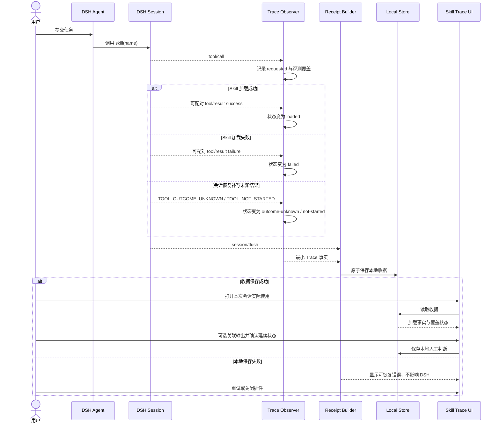
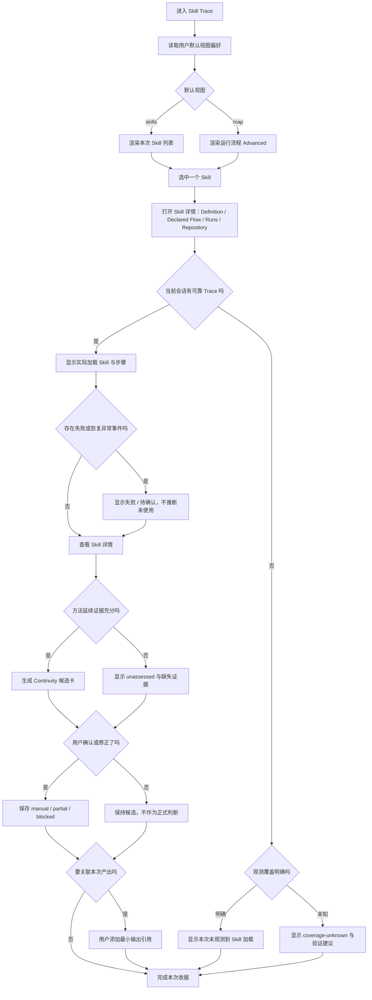
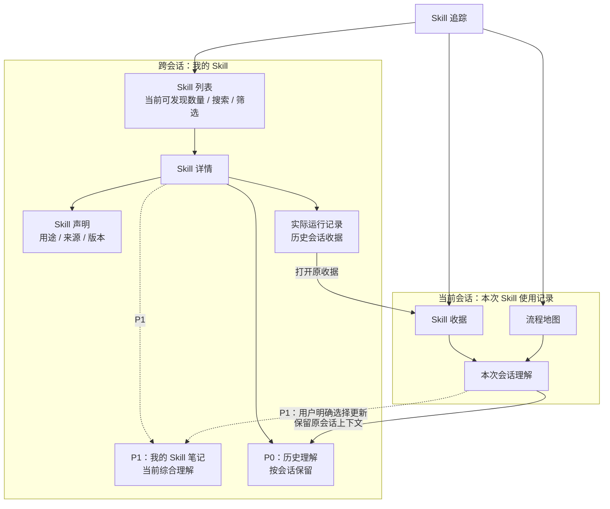
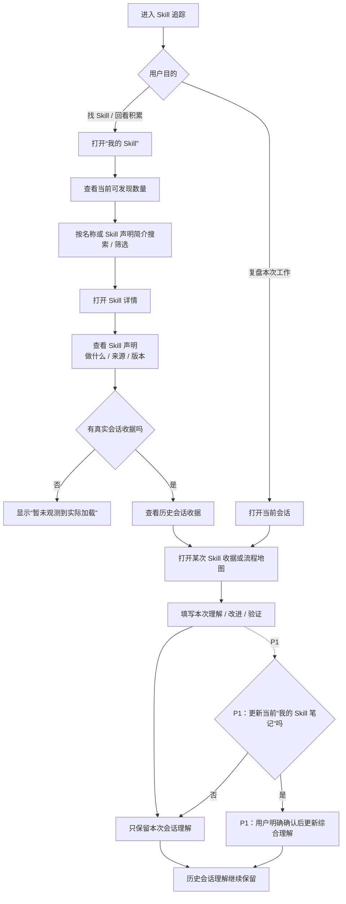
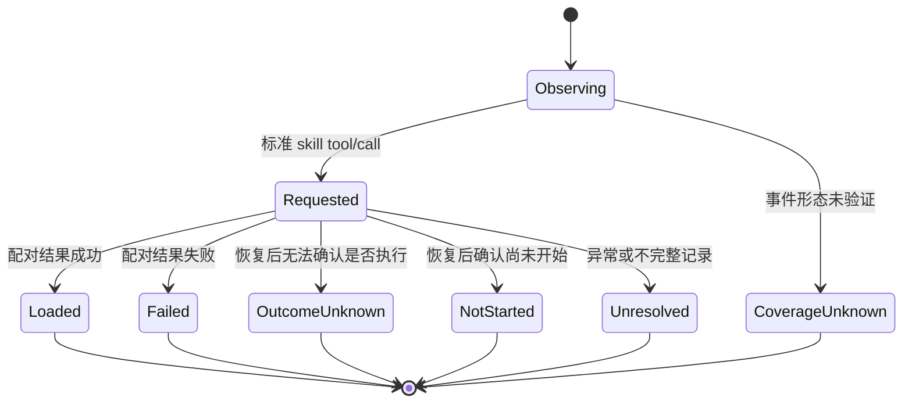

# DSH Skill Trace 概览 PRD

> 产品版本：V0.5 P0 真实使用工程验收版；V0.3 理解验证 Gate 继续有效  
> 当前阶段：真实 Skill 加载、精确关联收据和本地会话理解链路已有运行证据；这不等于全部业务闭环完成，也不能作为钟先生已理解的证据。个人无提示复述与 24 小时复测仍待执行  
> 工程发布候选：`dsh-skill-trace 0.4.0-beta.3` 停用无法证明落盘的 WebView Blob 下载，改为 Host 可验证本地备份、备份历史、打开位置、恢复预览、仅补缺恢复，以及清空/单删前安全备份；公开试用版仍为 `0.3.0-beta.1`，未执行发布或推送
> 文档权威：本文件定义产品目标、业务对象、状态语义、范围与验收标准；技术实现以 `05-technical-design.md` 为准。

> 用户可见命名：DSH 会话 Tab 使用“Skill 追踪”；默认段使用“本次 Skill”（Skill 列表 → Skill 详情），跨会话入口使用“我的 Skill”，两者之外的运行流程 / 运行图谱 / Skill 收据收在 `Advanced` 之下。“我的 Skill”不是第三种会话视图，“本次 Skill”与“我的 Skill”回答的是两个不同问题（这次用了哪些 / 工作区里有哪些）。“流程”只描述可观测事件关系，不代表 Agent 已执行 Skill 内全部步骤。

## 1. 概览

### 1.1 产品问题

用户在 DeepSeek Harness 中安装越来越多 Skill，但 Agent 的方法选择与加载过程通常不可见。用户能看到最终回答，却难以判断：

- 当前工作区究竟可发现多少个 Skill，每个 Skill 声明能做什么；
- 当用户不记得 Skill 的准确名称时，如何不依赖输入 `/` 完成发现与筛选；
- 当前会话实际加载了哪个 Skill；
- Skill 在哪个任务步骤被加载，加载成功还是失败；
- 本次产出与哪些已加载方法有关；
- 方法依赖网络、模型、MCP、脚本还是权限；
- 没有 Agent 或网络时，哪些部分仍能手工继续；
- 某套方法是否真的对本次工作有用。
- 每个 Skill 自己声明的工作步骤是什么，多个 Skill 之间是否被混在一起；
- 如何把看到的步骤转化成自己的理解，并形成下一次改进 Skill 的准备材料。
- 已经保存的个人理解在哪里集中回看，如何从一次会话笔记沉淀为长期 Skill 知识。

现有 Skill 管理、动态路由、使用统计和通用轨迹产品分别回答“有哪些”“该挂载哪些”“累计用了多少次”“Agent 做了什么”。新的直接竞品还能证明当前 Registry 返回的 Skill 内容指纹，但仍没有把“本会话实际加载证据、逐个 Skill 的声明步骤、个人理解与后续迭代准备”连成一条本地学习链路。

### 1.2 产品定位

> DSH Skill Trace 不负责安装、启停、更新、市场或自动路由 Skill；它以 Skill 为一级对象只读呈现：这次会话用了哪些 Skill、每个 Skill 自己声明了什么、声明流程各自拿到了什么运行时证据，以及来源与版本是否变化。运行流程与运行图谱仍然保留，但降级为服务技术用户的高级视图。

它记录加载证据，不判断因果：

- `skill(name)` 成功，只能写“已加载”；
- Agent 是否遵循方法、方法是否促成结果，由用户确认；
- 没有观测到事件，只能写“未观测”或“覆盖未知”；
- 方法可手工延续，不等于完全离线可用。
- Skill 声明的步骤不等于 Agent 已执行的步骤；
- 用户的迭代清单只用于后续人工工作，不自动修改或发布 Skill。

### 1.3 目标用户

**主要用户：** 在 DSH 中频繁使用多个 Skill、希望看懂 Agent 工作方法的普通用户。

**次要用户：** 需要排查 Skill 调用、回顾方法使用情况的 Skill 作者与 Agent 工作流设计者。

### 1.4 核心 JTBD

当 Agent 完成一次工作后，我希望逐个看懂它实际加载的 Skill 是怎样工作的、证据和依赖在哪里，再用自己的语言记录理解、改进意图和验证计划，以便把一次 Agent 使用转化为我的个人知识，并在之后安全地迭代 Skill。

当我准备开始一项工作或回看过去经验时，我希望不依赖记住准确名称或输入 `/`，就能知道当前有哪些可发现 Skill、它们声明做什么、哪些留下过真实收据和个人理解，以便找到并继续学习合适的 Skill。

### 1.5 为什么现在写 PRD

本 PRD 在编码前冻结了业务对象、状态语义、范围和验收门槛。2026-08-27 已在真实 DSH Desktop 与隔离 Profile 中验证官方 Consumer、SkillFlux `0.2.0`、成功/失败加载、恢复态语义、重启迁移、插件停用非干扰、双视图和本地 Continuity 判断。

### 1.6 用户可见命名规则

| 层级 | 用户可见名称 | 使用边界 |
|---|---|---|
| DSH 工作栏 | Skill 追踪 | 产品入口；简短且不预设执行结果 |
| 页面标题 | 本次 Skill 使用记录 | 面向普通用户概括本会话；底层状态仍严格使用“请求/已加载/失败/结果未知/未开始” |
| 新手视图 | Skill 收据 | 把本次可验证事实整理成可回看的证据收据 |
| 关系视图 | 流程地图 | 只展示可观测事件顺序和关系，不表示 Skill 内步骤已全部执行 |
| Continuity 区域 | 继续使用指南 | 展示候选步骤与人工确认的继续方式，不承诺完全离线 |
| 学习区域 | Skill 学习卡 | 按 Skill 分开展示声明步骤、依赖、版本状态和个人笔记；不表示本次已经执行全部步骤 |
| 迭代出口 | 复制迭代清单 | 只复制有界证据和用户笔记；不写回、不安装、不发布 Skill |
| 跨会话入口 | 我的 Skill | 只读 Skill 学习库；不是 Skill 市场、安装器或管理器；数量写“当前可发现”，不写“已安装” |
| 跨会话详情 | Skill 详情 | P0 汇合 Skill 声明、实际会话收据和历次会话理解；P1 才增加当前综合理解；各层证据不互相覆盖 |

“方法”可以出现在解释性句子中，例如“Agent 是否遵循了这套方法”，但不再作为页面、视图、卡片或导航的核心名称。“流程”只用于事件关系视图与小结，不能替代 Skill 加载事实。

## 2. 目标、指标与非目标

### 2.1 V0.1 目标

1. 可靠记录已验证标准 `skill(name)` 事件契约的请求、成功、失败与恢复态，并关联 Session、Turn、Step。
2. 把技术事件转成普通用户可理解的 `SkillRunReceipt`，而不是展示原始日志。
3. 让用户区分“已发现、已可用、已加载、有输出关联、可否按方法延续”。
4. 提供最小 `MethodContinuityCard`，明确步骤和依赖，不承诺完全离线。
5. 保证插件关闭、异常或未覆盖时不影响 DSH 原生 Session、Agent 与 Skill 行为。
6. 用同一份收据数据提供“Skill 收据”和“流程地图”两种视图，并按用户默认偏好只渲染其中一种。
7. 在同一会话出现多个或重复 Skill 调用时，以“Skill”和“加载事件”两层呈现：Skill 按名称聚合，每次真实调用完整保留且不静默截断。
8. 为每个成功加载的 Skill 分别生成 `SkillLearningCard`，不把多个 Skill 的候选步骤混成一套方法。
9. 允许用户在本机记录个人理解、改进意图和验证计划，并生成可复制但不会自动执行或发布的迭代清单。

### 2.2 成功指标

| 指标 | 当前基线 | V0.1 Gate | 验证阶段 |
|---|---:|---:|---|
| 标准 fixture Skill 调用配对准确率 | 未验证 | 100% | 技术 Spike |
| 成功、失败、结果未知、未开始事件区分准确率 | 未验证 | 100% | 技术 Spike |
| 持久化敏感正文数量 | 无实现 | 0 条 | Spike + Beta |
| “已加载”被写成“已遵循/已成功” | 无实现 | 0 条 | 文案测试 + Beta |
| “未观测”被写成“未使用” | 无实现 | 0 条 | 覆盖矩阵测试 |
| 插件关闭后 DSH 原生流程回归 | 未验证 | 0 个阻断回归 | 技术 Spike |
| 试点用户在 60 秒内回答“用了什么、能否继续” | 未验证 | 不低于 80% | 内部 Beta |
| 多 Skill 学习卡步骤串卡 | 未验证 | 0 次 | 单测 + Desktop |
| 用户在 3 分钟内写出一条个人理解和一条改进意图 | 未验证 | 不低于 70% | 目标用户测试 |
| 迭代清单触发 Skill 自动写入或发布 | 无实现 | 0 次 | 静态 + Desktop |
| 用户在 5 秒内回答“当前可发现多少个 Skill” | 未验证 | 不低于 80% | V0.4 P0 可用性测试 |
| 用户在 10 秒内按名称或声明简介找到目标 Skill | 未验证 | 不低于 80% | V0.4 P0 可用性测试 |
| 用户能区分“Skill 声明 / 实际收据 / 历次会话理解” | 未验证 | 不低于 80%，关键误解 0 个 | V0.4 P0 理解测试 |

前六项是发布硬门槛；最后一项是产品价值假设，Beta 不达标时优先调整信息结构，不扩大功能。

### 2.3 非目标

- 不做 Skill 市场、安装器、更新器、批量启停或来源同步；
- 不做动态路由、自动挂载、远程发现或质量评分；
- 不做模型、工具、Skill 排名与趋势 Dashboard；
- 不从 Agent 最终文本猜测 Skill 已使用；
- 不自动执行 Skill 脚本、修改用户项目或下载远程资源；
- 不自动判断 Skill 对结果有因果贡献；
- 不把方法延续状态表述为完全离线保证；
- 不自动生成、修改、覆盖、安装、执行、提交或发布 Skill；
- 不把用户笔记上传给开发者、模型或第三方服务；
- V0.1 不修改、不耦合 `dsh-visual-acceptance`。

## 3. 业务事实与状态语义

### 3.1 五层业务事实

| 层级 | 用户表达 | 成立条件 | 不能推出 |
|---|---|---|---|
| L1 | 已发现 | 当前 `ctx.skills.snapshot()` 观察中存在 Skill 摘要 | 当前 Agent 可调用 |
| L2 | 已可用 | 有可验证证据表明 Skill 对当前 Consumer 可见且可调用 | Agent 一定会加载 |
| L3 | 已加载 | `skill(name)` 的调用与成功结果已可靠配对 | Agent 完整遵循方法 |
| L4 | 有输出关联 | 用户或受信结构化事件明确关联了输出引用 | Skill 导致该输出 |
| L5 | 人工确认有用（未来） | 用户对本次方法作出明确判断；V0.1 不采集 | 对其他任务也有效 |

任何层级都不得由更低证据直接跳级。若当前 Consumer、事件字段或观测范围无法确认，则显示 `coverage-unknown`，不能显示“未使用”。

### 3.2 加载状态

- `requested`：已收到 Skill 工具调用，尚未收到可配对结果；
- `loaded`：调用与成功结果已配对；
- `failed`：调用与失败结果已配对；
- `outcome-unknown`：DSH 恢复后无法确认工具是否已经执行；
- `not-started`：DSH 恢复后确认工具尚未开始；
- `unresolved`：仅用于不完整或异常记录，不作为正常 DSH 生命周期的目标状态；
- `coverage-unknown`：当前 Consumer 或事件形态不在已验证适配范围内。

### 3.3 人工有效性边界

V0.1 不提供“有用 / 没帮助 / 不确定”入口，因为当前没有开发者接收、统计或用户侧复用闭环。Schema 1 的 `humanAssessment` 只做本地兼容，不进入界面、指标或持久化 Gate。“继续方式判断”属于下一节的独立状态，不等于评价 Skill 有效性。

### 3.4 方法延续状态

- `unassessed`：证据不足或尚未进行方法解析；
- `manual`：用户确认可以按卡片步骤手工继续，且没有未解决的必要自动依赖；
- `partial`：部分步骤可手工继续，仍有外部依赖；
- `blocked`：必要输入、服务、权限或执行能力缺失，无法按同一方法继续。

自动解析只生成候选状态；`manual` 必须由用户确认。`partial` 与 `blocked` 必须列出具体阻塞依赖。

## 4. 业务框架与交互图

### 4.1 核心业务框架图

```mermaid
flowchart LR
    U[用户]
    A[DSH Agent]
    SR[DSH Skill Registry]
    SE[DSH Session Event Stream]
    VA[DSH Visual Acceptance<br/>独立可选插件]

    subgraph ST[DSH Skill Trace 产品边界]
        O[Trace Observer<br/>只观察已验证事件]
        RB[Receipt Builder<br/>事件转业务收据]
        MC[Learning Projector<br/>按 Skill 生成候选步骤与依赖]
        PN[Personal Notes<br/>用户主动写入]
        LS[(Local Receipt Store<br/>最小本地数据)]
        UI[Skill Trace UI<br/>本次 Skill 列表 / Skill 详情 / 我的 Skill / Advanced]
    end

    U -->|发起任务| A
    A -->|读取目录或加载 Skill| SR
    A -->|产生会话事件| SE
    SE --> O
    SR -->|按需读取摘要或定义| MC
    O --> MC
    O --> RB
    RB --> LS
    MC --> LS
    LS --> UI
    U -->|查看、记录理解与迭代计划| PN
    PN --> LS
    U -->|查看、关联输出、人工确认| UI
    UI -. 用户显式交接 Web 产出，V0.2 .-> VA
```

业务边界：Skill Trace 只读观察 DSH 的 Skill 与 Session 能力；本地收据是自己的业务对象，不改写 DSH 原始事件，也不向 Agent 注入路由决策。

### 4.2 业务实体类图

> 这是业务对象关系，不是数据库 ER 图。`SessionTraceState` 是进程内临时状态，其余标记为持久化的对象只保存最小业务数据。


### 4.3 主业务时序图



### 4.4 最终用户交互流程图



### 4.5 “我的 Skill”信息架构图



信息层级约束（V5.0 起）：顶级导航是 `本次 Skill` 与 `我的 Skill` 两段；`运行流程 / 运行图谱 / Skill 收据` 收在 `Advanced` 之下，不与前两者平级。它们可以出现在同一工具栏，但必须通过分隔、分组或标签表达不同层级，不能做成几个无差别的视图按钮，尤其**不能让运行流程 / 运行图谱成为第一视觉中心**。

### 4.6 从发现到个人理解沉淀流程图



P0 到“回看历史会话理解”即形成最小闭环，不创建综合理解对象。图中的 `SkillLearningProfile` 更新属于 P1：未来也不得自动把最新会话笔记覆盖为全局理解；历史 `PersonalLearningNote` 始终保留原会话、原版本和原证据上下文。

### 4.7 Skill 加载证据状态图



`OutputReference` 与 `MethodContinuityCard` 是收据上的独立对象，不是 `SkillTraceEvent` 的后续状态；这样避免把“已加载 → 有输出 → 可手工延续”伪装成自动状态升级。

## 5. 用户故事

| ID | 用户故事 | 优先级 |
|---|---|---|
| US-01 | 作为普通用户，我想查看本次会话实际加载的 Skill，以便理解 Agent 使用了什么方法 | P0 |
| US-02 | 作为普通用户，我想区分加载成功、失败、结果未知、未开始和覆盖未知，以免把缺少证据理解成未使用 | P0 |
| US-03 | 作为普通用户，我想查看方法的目标、步骤和依赖，以便判断能否手工继续 | P0 |
| US-04 | 作为普通用户，我想在本机确认方法可手工、可部分延续或当前受阻，以便下次按真实条件继续 | P0 |
| US-05 | 作为普通用户，我想手工关联最小产出引用，以便回看这套方法对应了什么结果 | P1 |
| US-06 | 作为 Skill 作者，我想看到调用证据和失败位置，以便定位加载问题 | P1 |
| US-07 | 作为用户，我想选择默认查看 Skill 收据或流程地图，以便用适合自己的认知方式理解同一份证据 | P0 |
| US-08 | 作为学习者，我想逐个查看每个 Skill 声明的步骤和依赖，以便把运行方式内化成自己的知识 | P0 |
| US-09 | 作为 Skill 迭代者，我想记录自己的理解、改进意图和验证计划，并复制一份安全的迭代清单 | P0 |
| US-10 | 作为 Skill 使用者，我想不依赖输入 `/` 就看到当前会话范围可发现的 Skill 数量与列表，以便知道当前工作区和 Agent 配置下有哪些可选择的工作方式 | V0.4 P0 |
| US-11 | 作为不记得准确名称的用户，我想按名称或 Skill 声明简介搜索和筛选，以便找到可能适用的 Skill | V0.4 P0 |
| US-12 | 作为学习者，我想在同一 Skill 详情中区分“Skill 声明、实际会话收据、历次会话理解”，以免把声明或个人判断误当成执行事实 | V0.4 P0 |
| US-13 | 作为 Skill 迭代者，我想保留历次会话理解，同时维护一份当前综合理解，以便看见自己的学习变化而不覆盖历史 | V0.4 P1 |

## 6. V0.1 范围

### 6.1 范围内

- 标准 `skill` 工具的 `tool/call` / `tool/result` 被动观测；已隔离验证官方 Consumer 与 SkillFlux `0.2.0`；
- Session、Turn、Step、Skill 名称、成功/失败与证据事件关联；
- 当前会话和历史会话的最小 `SkillRunReceipt`；
- 确定性优先的 Continuity 候选卡；
- `unassessed / manual / partial / blocked` 与人工确认；
- 用户主动关联最小输出引用；
- 本地存储、删除确认和观测覆盖说明；
- 插件启停不影响原生 DSH 行为。
- 同一 `SkillRunReceipt` 的 Skill 收据与流程地图双视图；切换不触发模型调用，也不创建第二份分析结果；
- 用户默认视图偏好；进入新会话时只挂载并渲染所选视图。
- 按成功加载 Skill 分开的 `SkillLearningCard`；
- 用户主动保存的本地个人理解、改进意图和验证计划；
- 只复制、不写回 Skill 的迭代清单。

### 6.2 范围外

- 不使用标准 `skill` 工具名或结果结构的 Consumer Adapter；
- 自动解析 Agent 文本并关联输出；
- 插件内模型调用、RAG、自动总结或自动有效性评价；
- 手动试跑与受控执行；
- 自动下载或运行 Skill 资源和脚本；
- 使用排行、趋势、周报或质量分；
- 与 `dsh-visual-acceptance` 的运行时集成。
- 自动修改、生成、提交或发布 Skill。

### 6.3 V0.4 已确认范围与后续候选

- V0.4 P0（本地实现与 Desktop 复验已完成）：`我的 Skill` 只读入口、当前会话范围的可发现数量、名称/声明简介搜索、基础状态筛选、Skill 详情、可靠历史收据关联与既有会话理解回看；
- V0.4 P1（待 P0 用户验证后再决定）：跨会话 `SkillLearningProfile`、当前综合理解及其明确更新操作；
- V0.4+：受控手动试跑；
- V0.4+：本地 Web 产出显式交给 DSH Visual Acceptance；
- V0.4+：无法留下标准 `skill` 事件的 Consumer Adapter；
- 是否需要白话解释、示例或术语提示，只能由 M6 理解验证结果决定；当前不承诺模型调用或自动生成。

`我的 Skill` 的最小开发范围、只读技术路径与本地实现已经完成。当前授权止于 P0；不得据此启动 P1 综合理解、Skill 管理、模型摘要或发布能力。

### 6.4 V0.5 已确认范围：Skill Runtime Scope

**问题**：Declaration ↔ Runtime Alignment 此前在整个 Session 的 Runtime Event 中寻找匹配项。
「Turn 1 的 read、Turn 2 加载 Skill A、Turn 3 的 test」会让 Skill A 声明的
「Inspect → Test」同时匹配 Turn 1 与 Turn 3。**事件是真的，归属是编的。**

**V0.5 的核心能力**是建立 **Skill Runtime Scope**：

```
Skill Declaration  ↕  Skill Runtime Scope  ↕  Observed Runtime Events
```

Alignment **只读取 Scope 内的事件**。Scope 内的每一个事件都必须能回指真实 Runtime Evidence。

**范围外**（不在 V0.5 内）：不做工作流编排、不做因果推断、不做遵循率、
不生成最终 Runtime Fingerprint、不改 Runtime Flow / Graph 的既有架构。

## 7. 功能需求

### 7.1 事件观测与证据

- `FR-OBS-001`：系统必须只把已验证 Skill Consumer 的工具调用识别为 Skill 加载请求。
- `FR-OBS-002`：系统必须按 Session、调用标识、Turn、Step 配对 `tool/call` 与 `tool/result`。
- `FR-OBS-003`：系统必须区分 `requested`、`loaded`、`failed`、`outcome-unknown`、`not-started`、异常 `unresolved` 与 `coverage-unknown`。
- `FR-OBS-004`：系统不得从 Assistant 文本、Skill 名称出现或目录可见性推断“已加载”。
- `FR-OBS-005`：系统必须记录观测器类型与覆盖状态，使“未观测”可解释。
- `FR-OBS-006`：插件停止、异常或被禁用时不得阻断 Session、Agent 或 Skill Consumer。
- `FR-OBS-007`：单条事件没有 Consumer 注册来源时必须显示“身份不可区分”；产品级覆盖可列出已验证 Consumer，但不得把它归因给某次调用。

### 7.2 会话收据

- `FR-REC-001`：系统必须按会话生成一张可重启读取的本地收据。
- `FR-REC-002`：收据必须优先显示实际加载的 Skill、发生步骤、成功/失败与证据引用。
- `FR-REC-003`：失败、结果未知、未开始和异常未配对事件必须与成功加载分组展示。
- `FR-REC-004`：V0.1 输出关联只能由用户明确创建，系统不得根据文本自动归因。
- `FR-REC-005`：V0.1 不提供“有用/没帮助/不确定”的人工反馈入口；当前实现没有远程回传、开发者接收或后续闭环，展示该入口会制造错误预期。旧收据中的 `humanAssessment` 仅作 Schema 兼容，不参与展示与持久化判断。
- `FR-REC-006`：用户删除收据或全部本地数据前，系统必须显示范围并二次确认。
- `FR-REC-007`：同名 Skill 在一张收据中只能占一个 Skill 条目；其调用次数、成功次数、失败次数和每次 Turn/Step 事件必须可展开核对。
- `FR-REC-008`：一个 Skill 包含成功与失败等不同事件时，Skill 级状态必须显示为“状态混合”，不得用单次成功覆盖失败证据。
- `FR-REC-009`：成功结果包含标准 Skill 指令标签时，收据只保存 SHA-256 指纹和有界结构，不保存正文；指纹只用于内容相等比较，不称为签名或防篡改证明。

### 7.3 “我的 Skill”与 Skill 详情（V0.4 P0 已实现）

- `FR-SKL-001`：系统可只读展示当前 Registry 发现的 Skill，不提供启停、安装、更新或同步。
- `FR-SKL-002`：系统必须区分 Registry 已发现与当前 Consumer 已可用；证据不足时显示未知。
- `FR-SKL-003`：详情必须显示来源标签、Provider、版本或 Hash，以及最后一次可靠观测状态。
- `FR-SKL-004`：完整 Skill 正文只能按需读取和临时展示，默认不得复制到收据存储。
- `FR-SKL-005`：入口名称使用“我的 Skill”；总数必须写“当前可发现 X 个 Skill”，辅助说明该结果按当前工作区和 Agent Preset 计算，不得把 Registry 发现数量写成“已安装”或全局库存。
- `FR-SKL-006`：列表概要优先读取 Skill 自带 `name / description / provider / safe source / version`；说明不足时显示“该 Skill 没有提供足够清晰的用途说明”，不得调用模型补写。
- `FR-SKL-007`：用户可按 Skill 名称和声明简介本地搜索；P0 筛选至少包括“全部 / 有真实收据 / 有会话理解 / 暂未观测 / 当前未发现 / 版本变化”，不得把“暂未观测”写成“从未使用”。
- `FR-SKL-008`：列表项必须分开展示当前发现状态、实际收据状态、个人学习状态和版本状态；不得把四者压缩成一个“可用/不可用”标签。
- `FR-SKL-009`：P0 Skill 详情按顺序展示“Skill 声明 / 实际运行记录 / 历次会话理解”；声明和个人理解不得进入已执行事实层。P1 才增加独立的“我的 Skill 笔记 / 当前综合理解”。
- `FR-SKL-010`：未留下真实加载事件的 Skill 可以展示声明信息，但必须显示“暂未观测到实际加载”，不得生成虚构流程、使用次数或 Continuity 结论。
- `FR-SKL-011`：列表与详情不提供安装、卸载、启停、更新、市场、来源同步、新建 Skill、使用排行或质量评分入口。
- `FR-SKL-012`：Skill 身份不得只按显示名称合并；P0 只有安全 Provider、Skill 名称与安全来源指纹均可确认时才自动关联历史。身份信息不完整时只能列为“可能相关的历史记录”，不得自动合并收据或笔记。
- `FR-SKL-013`：“我的 Skill”数据集合由“当前 Registry 可发现条目”与“已有本地收据/个人理解的历史条目”取并集；总数只统计当前可发现条目，历史条目单列“当前未发现”，不得因当前 Registry 缺失而隐藏用户积累。
- `FR-SKL-014`：P0 只读取既有 `PersonalLearningNote` 并按原会话、原版本展示，不选择“最新一条”充当综合理解，也不创建第二份个人知识存储。
- `FR-SKL-015`：P0 当前目录必须从已挂载普通会话的 Agent Preset 作用域 Registry 读取；不得使用无法看到 Preset 内 Skill 的根级 Registry，也不得把只返回用户可调用项的 `/` 菜单 RPC 当成完整目录。
- `FR-SKL-016`：未来收据只有在运行当时已保存 Provider、Skill 名称与安全来源指纹时，才可自动关联为同一身份；旧收据即使名称和指令 Hash 与当前定义一致，也只能标记“内容匹配的可能历史”，不得补写为已验证来源。

### 7.4 继续使用指南

- `FR-CON-001`：系统应优先以确定性规则提取目标、输入、步骤、输出和依赖候选。
- `FR-CON-002`：依赖至少分为 `network`、`model`、`mcp`、`script`、`permission`、`workspace` 与 `human-decision`。
- `FR-CON-003`：每个字段必须带证据类型：`declared`、`observed`、`inferred-candidate` 或 `human-confirmed`。
- `FR-CON-004`：证据不足时状态必须为 `unassessed`，不得默认写 `manual`。
- `FR-CON-005`：只有用户确认后才能将 Continuity 状态保存为正式判断；自动分析结果始终是候选。
- `FR-CON-006`：`partial` 与 `blocked` 必须列出未满足依赖和最低成本的继续方式。
- `FR-CON-007`：确定性解析最多保留五条有序步骤；依赖关键词只能标成候选，并排除明确“不需要/不依赖”的否定声明。
- `FR-CON-008`：`manual / partial / blocked` 是当前收据的本地人工判断，不上传、不计入排行榜，也不等于向开发者提交反馈。

### 7.5 Skill 学习与迭代

- `FR-LRN-001`：系统必须为每个成功加载的 Skill 分别生成学习卡，不得把多个 Skill 的候选步骤合并成同一条流程。
- `FR-LRN-002`：学习卡必须展示本次加载次数、指令短指纹、当前版本状态、候选步骤、依赖线索与证据边界。
- `FR-LRN-003`：候选步骤必须标记为来自 Skill 指令，不得写成 Agent 已执行步骤。
- `FR-LRN-004`：用户可按 Skill 主动保存“我的理解 / 我想改进 / 下次如何验证”，三项均标记为 `human-authored`。
- `FR-LRN-005`：个人笔记只保存在本机当前收据，不从 Prompt、Assistant 回答或项目文件自动生成。
- `FR-LRN-005A`：用户返回同一会话并选择对应 Skill 后，可继续查看和编辑已保存笔记；插件没有上传给开发者的反馈或遥测通道。
- `FR-LRN-006`：系统可生成可复制的 Skill 迭代清单，但不得自动修改、覆盖、安装、执行、提交或发布 Skill。
- `FR-LRN-007`：当前版本与本次观察版本不一致时，迭代清单必须优先提示版本变化，避免用户基于错误版本修改。
- `FR-LRN-008`：当前收据内的 `PersonalLearningNote` 表示“本次会话理解”，必须保留原 Session、Skill 版本与证据上下文。
- `FR-LRN-009`（P1）：跨会话的 `SkillLearningProfile` 表示用户当前综合理解，与任一单次会话笔记分开保存；两者均为本地 `human-authored` 数据。
- `FR-LRN-010`（P1）：本次会话笔记只有在用户明确选择“更新我的 Skill 笔记”后，才能更新综合理解；保存到当前收据不得自动覆盖综合理解。
- `FR-LRN-011`（P1）：综合理解更新后，历史会话笔记仍可按时间和原收据回看；系统不得把旧笔记删除、重写或伪装成当前结论。
- `FR-LRN-012`：从“我的 Skill”进入详情时，用户可打开原会话收据；返回详情后必须保留搜索、筛选和当前 Skill 上下文。
- `FR-LRN-013`（P1）：`SkillLearningProfile` 必须记录其理解所依据的 Skill Revision Hash；当前版本变化时显示“当前理解基于旧版本”，不得静默迁移或写成已适用于新版本。
- `FR-LRN-014`（V0.4 P1）：用户可为原会话中成功加载的单个 Skill 保存一条人工验证结果，字段为“结果状态 / 实际观察 / 下一步动作”；结果状态仅允许 `met / not-met / inconclusive`。
- `FR-LRN-015`：验证结果必须继续保存在原 `SkillRunReceipt`，不得为此建立第二套知识库；保存时必须校验该 Skill 在对应收据中存在成功加载证据。
- `FR-LRN-016`：验证结果必须标记 `human-authored`，不得由 Agent 回答、Skill 正文、项目文件或模型自动生成；`met` 只表示该用户认为本次验证符合预期，不代表 Skill 普遍有效、质量更高或促成了产出。
- `FR-LRN-017`：实际观察为必填且单项最多 500 字；下一步动作可选且最多 500 字。两项沿用学习笔记的敏感内容拒绝规则，不允许绝对路径、带凭据链接或密钥值。
- `FR-LRN-018`：包含非空“下次如何验证”但尚无验证结果的历史记录进入“待回看”；已有验证结果的记录进入“已记录结果”。两种状态均由本地收据确定性投影，不调用模型。
- `FR-LRN-019`：跨会话计数必须继续区分来源身份完整一致的真实历史与内容匹配、仅名称相同、来源冲突或当前未发现的候选历史，不得因验证结果存在而提升关联等级。
- `FR-LRN-020`：Skill 详情必须按原收据时间展示会话理解、验证计划与验证结果；不得选择最新记录充当“当前正确理解”，不得自动合并、评分、推荐或写回 Skill。

### 7.7 Skill Runtime Scope（V0.5）

- `FR-SCOPE-001`：系统必须把 Skill 声明步骤的匹配范围限定在**该 Skill 的 Runtime Scope 内**。
  **Scope 外的 Runtime Event 不得参与任何声明步骤的匹配。**
- `FR-SCOPE-002`：Scope 的边界必须来自 Runtime **明示**的关联（`turn` / `step` / `invocationId` /
  lineage 等），**不得**由时间相邻推断。
- `FR-SCOPE-003`：系统必须显式拒绝以下归属依据——「相邻事件」「最近事件」「时间距离最短」
  「最后一个 Tool」「Skill 之后的所有事件」。
- `FR-SCOPE-004`：Scope 内的每个事件必须能回指真实存在的 Runtime Event id，否则该事件不得计入。
- `FR-SCOPE-005`：无法可靠归属时，系统必须返回 `unlinked`，**并保留该事件**；
  **不得**为凑齐 Scope 而猜测。
- `FR-SCOPE-006`：**同一 Turn 内出现两次 Skill 加载时，两者都必须判为 `unlinked`。**
  Turn 无法区分这些调用属于哪一次，因此不得把该 Turn 的事件分配给其中任何一个。
- `FR-SCOPE-007`：Scope 必须携带其限制说明（不表示因果、不表示遵循、不读取意图、以 Turn 为界）。
- `FR-SCOPE-008`：Scope 只保存标识符与分类。**不得**保存提示词正文、工具参数或项目内容。
- `FR-SCOPE-009`：Alignment 的状态词表保持 `observed` / `partial` / `insufficient` / `unknown`。
  **不得**引入 `not-observed` / `skipped` / `not-done`。
- `FR-SCOPE-010`：**不得**计算或呈现遵循率、百分比、评分或排名。
- `FR-SCOPE-011`：Skill Inspector 必须展示该 Skill 的**运行范围**（Turn 区间与范围内按能力分类的计数），
  以及它的限制说明。
- `FR-SCOPE-012`：系统**不得**在 Runtime Flow 中绘制 Skill → Tool 的因果连线。
  Scope 表达的是「这些事件属于当前可验证范围」，**不是**「Skill 导致这些事件」。

### 7.6 用户界面

- `FR-UI-001`：**默认入口必须先回答“这次用了哪些 Skill”**：第一屏是本次会话真正加载过的 Skill 列表，再由此展开定义、声明流程、运行记录与证据。用户不得被迫先理解 Turn / Step / Invocation / Runtime Graph / Scope / Edge 才能理解一个 Skill。
- `FR-UI-002`：界面必须为加载、空、错误、无可靠 Trace、覆盖未知提供独立状态。
- `FR-UI-003`：界面直接使用“Skill”；面向新手的解释可称“工作方式”，同时保留“Skill 是指令与资源包，不是人类专家”的说明。
- `FR-UI-004`：所有事实标签必须能展开查看证据来源和边界。
- `FR-UI-005`：系统必须提供“Skill 收据”和“流程地图”两种视图；两者必须读取同一份 `SkillRunReceipt`、`SkillTraceEvent`、`MethodContinuityCard` 与依赖数据。V5.0 起两者降级到 `Advanced`，不再是第一视觉中心，也不得再与 Skill 平级。
- `FR-UI-006`：系统不得因双视图而重复执行事件分析、模型调用、持久化或 Continuity 判断。
- `FR-UI-007`：用户可设置默认视图为 `skills` 或 `map`；新会话进入 Skill Trace 时只渲染默认视图，用户主动切换后立即保存偏好。`receipt` 与 `audit` 已不再是可保存的默认页：历史存下的 `receipt` 在读取时归一化为 `skills`（那是旧 IA 写下的默认值，不是用户的选择）。
- `FR-UI-008`：切换视图必须保留当前 Session、选中 Skill、Step 与证据上下文；视图不得改变任何业务状态。
- `FR-UI-009`：两种视图必须使用同一证据语法；除颜色外，同时使用标签、线型、图标或边框表达已验证、候选、待人工确认和覆盖未知。
- `FR-UI-010`：加载中只显示一句进度提示；当前没有 Trace 时只显示一句空态提示，不渲染流程小结、依赖、产出、人工反馈或双视图切换。
- `FR-UI-011`：已确认标准 Skill 工具事件覆盖且事件为空时显示“当前对话暂未加载可追踪的 Skill”；覆盖未知时显示“暂时无法确认当前对话是否加载了 Skill”，不得写成“未使用”。
- `FR-UI-012`：流程地图必须完整呈现当前收据的全部加载事件；V0.1 不允许使用固定数量截断。复杂会话可通过滚动、聚合或折叠改善密度，但被折叠事件必须有数量与展开入口。
- `FR-UI-013`：收据中的 Turn、Step、Skill 加载和收据形成四个阶段必须支持展开；展开内容必须用普通语言说明“发生了什么、这能说明什么、不能说明什么”，不得只列 `Turn N / Step N`。
- `FR-UI-014`：Skill 卡的每次加载记录必须同时展示 Skill 名、Turn、Step、结果解释和“加载不等于采用/有效”的边界。
- `FR-UI-015`：地图节点点击后必须在详情区展示白话说明；Skill 节点还必须列出相关加载记录，Step 节点必须解释请求与结果的配对依据。
- `FR-UI-016`：两种视图底部必须显示同源的“本次流程小结”，最少包括事件顺序、加载结果、用户明确关联的产出和证据边界。小结由确定性规则生成，不调用模型，不补写 Agent 动机或因果；其中“流程”只表示可观测事件顺序。
- `FR-UI-017`：流程地图网格必须覆盖完整可滚动画布，不能在宽屏右侧露出白底；网格对比度不得高于原边框弱色的 50%。
- `FR-UI-018`：会话头部可显示一枚轻量状态提示，但必须读取与收据相同的 View Model，不生成第二套分析。
- `FR-UI-019`：Skill 详情应显示本次指令指纹、当前安全来源可用性及内容一致性；Agent 作用域 Registry 无法解析时明确显示不可用。
- `FR-UI-020`：Skill 收据必须新增“逐个看懂 Skill”区块；每张学习卡使用完整描边，并在多 Skill 时保持相互独立。
- `FR-UI-021`：流程地图不得把 Skill 声明步骤画成已执行节点；选择 Skill 节点后，应在详情区展示其候选步骤和版本状态。
- `FR-UI-022`：右侧栏应提供按 Skill 切换的本地学习笔记；收据模式默认选择第一个成功加载的 Skill，地图模式跟随当前选中的 Skill。
- `FR-UI-023`：顶级导航由两段组成：**“本次 Skill”**（当前会话，默认段）与**“我的 Skill”**（跨会话只读目录）。两者必须有明确标签区分，不得表现为同一个列表，也不得表现为同一种会话视图。“Advanced”中的运行流程 / 运行图谱 / Skill 收据单独成组，不与上述两者平级。
- `FR-UI-024`：进入“我的 Skill”不得改变用户的 `skills / map` 默认偏好；返回当前会话时恢复原视图、选中 Skill 和展开上下文。
- `FR-UI-025`：“我的 Skill”空态区分 Registry 完整但无发现结果、Registry 覆盖未知和筛选无匹配；三者不得共用“没有 Skill”一句话。
- `FR-UI-026`：“我的 Skill”入口不依赖当前会话是否有 Trace；零 Skill 会话仍保留入口，但当前会话区域继续遵守单句空态规则。
- `FR-UI-027`：Skill Trace 界面语言必须跟随 DeepSeek Harness 的 `zh / en` 设置；宿主运行中切换后，当前 Tab、会话状态提示和插件自有文案原位刷新。未知 locale 回退英文；Skill 名称、声明、证据字段、工作区名、输出引用和用户笔记不翻译、不重写、不上传。
- `FR-UI-028`：流程地图的网格视口可铺满可用宽度，但节点、连线与区块标签必须共享一个固定 1000px 坐标舞台；可用宽度大于 1000px 时舞台水平居中，低于 1000px 时从左侧起点进入并可横向滚动到全部节点。右侧详情栏开合或窗口尺寸变化后由 CSS 自动重新居中，不改变当前选中节点或收据数据。
- `FR-UI-029`：当前会话侧栏与“我的 Skill”时间线都可以编辑同一条原会话验证结果；保存后列表计数、筛选和展开内容必须同步刷新，不得复制为两条记录。
- `FR-UI-030`：“我的 Skill”新增“待回看 / 已记录结果”筛选；待回看只由非空验证计划且无验证结果确定，已记录结果必须明确写成“人工记录”，不得缩写为“已验证 Skill”。
- `FR-UI-031`：验证表单必须提供三种互斥状态、实际观察、下一步动作、保存中、错误、成功和清除状态；清除使用页面内二次确认并明确个人理解与验证计划仍会保留，不依赖宿主 WebView 的原生确认框；键盘焦点、窄屏重排与中英文切换沿用现有 UI 合同。
- `FR-UI-032`：**Skill 是产品的一级对象**。Tool / MCP / CLI / Subagent 不是，它们只能作为 Runtime Evidence 的来源出现，不得成为与 Skill 平级的对象。技能列表中禁止显示 Tool 数、Runtime 节点数或 Runtime Edge 数。
- `FR-UI-033`：**声明流程只能来自 Skill 自己的定义文本**（`Markdown → 确定性解析器 → Declared Skill Flow`）。运行时证据只能给已有步骤挂标注，**不得增加、删除、改名或重排步骤**；禁止从运行时事件反推出一条流程。系统不得为此引入 LLM、Embedding、向量库、RAG、自动摘要或 AI 分类。
- `FR-UI-034`：数据模型与界面必须区分 `Declared`（来自 SKILL.md）、`Observed`（来自 DSH 运行时事件）与 `Inferred`（尽量不做）。禁止「某 Tool 距离某 Skill 最近 ⇒ 该 Tool 属于该 Skill」，也禁止「同一个 Turn ⇒ 把该 Turn 全部运行时事件都算成该 Skill 的」。
- `FR-UI-035`：Skill 列表**只**展示当前会话有真实加载证据的 Skill，并必须与「当前 Registry 中可发现」区分开；不得把“我的 Skill”目录当作“本次使用的 Skill”。
- `FR-UI-036`：Skill 运行记录以宿主给出的事件标识为准（`eventId` / `callId` / `turn-step`）。系统**不得伪造** `runId` 或其它 DSH 没有的原生字段。
- `FR-UI-037`：定义指纹比对必须保留 `Observed Definition Hash` / `Current Definition Hash` 与三态 `match` / `mismatch` / `unavailable`。**禁止**把 `unavailable` 写成 `mismatch`，也禁止写成“Skill 已失效”——哈希只证明版本变化，不证明好坏。
- `FR-UI-038`：Repository 属于 Skill 详情的标准信息（地址、打开仓库、打开 Skill 路径、复制 Clone URL）。地址只能来自 frontmatter、git remote `origin` 或明确的 metadata；**禁止**根据目录名、Skill 名或 npm 包名猜测 GitHub。猜不到就显示「未解析」，不伪造、不留禁用态占位。
- `FR-UI-039`：Flow 步骤与 `SKILL.md` 必须可互相定位：点 Flow 步骤 → 右侧切到证据面板 + 原文滚到对应位置；点原文标题 → 对应步骤高亮。
- `FR-UI-040`：进入产品**不得**先出现运行图谱，也不得先面对 `Session / Turns / Nodes` 一类计数；Skill 详情的首屏范围内必须同时出现 Skill 名称与简介、Declared Skill Flow 和 `SKILL.md` 原文。
- `FR-UI-041`：从进入到看懂一个 Skill 最多一次点击。禁止 `Session → Runtime → Node → Inspector → Skill → Definition` 这种四层以上的下钻路径。
- `FR-UI-042`：Runtime Flow 与 Runtime Graph **不删除**，但必须降级为 `Advanced`，服务技术型用户。产品分三层：第一层 Skill；第二层 Definition / Declared Flow / Runs / Evidence / Repository；第三层 Advanced Runtime Flow / Runtime Graph。

## 8. 信息架构与页面职责

### 8.1 本次 Skill（默认段）

**默认页。** 「本次 Skill」回答“这次会话用了哪些 Skill”，并按 `Skill → Skill Definition → Declared Skill Flow → Skill Run → Runtime Evidence` 的关系展开。

第一屏是**本次会话真正加载过的 Skill 列表**：只有观测到真实加载证据的 Skill 才会出现；当前 Registry 里可发现但这次未加载的不在其中——那是 §8.3「我的 Skill」要回答的问题。每一项给出名称、声明简介、本会话加载次数、最近加载时间与当前定义状态。列表**不**显示 Tool 数、Runtime 节点数或 Runtime Edge 数，也不展示市场、安装、启停、更新、同步、排行或质量评分。

点一次列表项进入 Skill 详情（§8.2）。从进入到看懂一个 Skill 只需一次点击；禁止 `Session → Runtime → Node → Inspector → Skill → Definition` 这类四层以上的下钻。

默认视图偏好只有 `skills` 与 `map` 两个取值；`receipt` 与 `audit` 已不再可保存为默认页（历史存下的 `receipt` 在读取时归一化为 `skills`）。偏好只影响呈现，不创建第二份收据，也不改变事实状态。

当当前会话没有可追踪事件时，本区域退化为单句状态（“当前对话暂未加载可追踪的 Skill”），不渲染空列表骨架，也不创建虚假的依赖、输出或 Continuity 判断。零 Skill 会话仍保留「我的 Skill」入口。

### 8.2 本次 Skill 的详情

Skill 详情是 Skill-first IA 的核心阅读面，首屏范围内必须同时出现 Skill 名称与简介、**Declared Skill Flow** 与 **`SKILL.md` 原文**。三栏：左栏是该 Skill 的运行记录与仓库来源；中栏是声明流程；右栏在 `SKILL.md` 原文与证据面板之间切换。

**声明流程来自定义文本，不来自运行时。** 步骤由 SKILL.md 的 heading 或有序列表经确定性解析器得到（`Markdown → 确定性解析器 → Declared Skill Flow`），携带稳定的步号、标题、类别与原文行号。运行时证据只能给已有步骤挂上标注，**不得增加、删除、改名或重排步骤**；从运行时事件反推流程是被明确禁止的做法。这个方向不可逆：`Skill Definition → Declared Flow → Evidence`，绝不是 `Runtime → Flow`。

每个步骤的关系标注取五值词表之一，并在界面上投影成三类徽章（运行时支持 / 部分支持 / 证据不足）。它表达的是“这一步拿到了什么证据”，**不表达“这一步做对了”**——`Evidence ≠ correctness`，`Insufficient ≠ not executed`；系统不评分，不产生 compliance rate、score、ranking 或百分比。

运行记录以宿主给出的事件标识为准（`eventId` / `callId` / `turn-step`），**不伪造** DSH 没有的 `runId`。每次记录至少显示 Run 序号、时间、加载类型、加载状态、定义指纹与 Turn。

定义指纹比对保留 `Observed Definition Hash` / `Current Definition Hash` 与三态 `match` / `mismatch` / `unavailable`，且**不得**把 `unavailable` 写成 `mismatch`，也不得写成“Skill 已失效”。它同时列出该次运行当时的目录候选（只列名称与简介）。

Repository 是标准信息：地址、打开仓库、打开 Skill 路径、复制 Clone URL。地址只能来自 frontmatter、git remote `origin` 或明确的 metadata；**禁止**根据目录名、Skill 名或 npm 包名猜测 GitHub。猜不到就显示「未解析」，不伪造、不留禁用态占位。

交互上，Flow 步骤与 `SKILL.md` 必须可互相定位：点 Flow 步骤 → 选中该步 + 右侧切到证据面板 + 原文滚到对应位置并短暂高亮；点原文标题 → 对应步骤高亮。

隐私边界在这里同样生效：定义正文**永不落盘、永不进收据**，只在当前会话上现读现返；资源基的绝对路径只暴露类别不暴露路径；凭据型仓库地址整条拒绝；`<skill_content>` 外壳在插件内不可复现，因此显式报告为不可复现而不是自行拼装。

### 8.3 我的 Skill

跨会话只读学习入口。它属于顶级导航的第二段，与「本次 Skill」并列但不属于同一种会话视图，也不改变用户的默认视图偏好。

```text
[ 本次 Skill ] [ 我的 Skill ]  Advanced ▾        │  当前会话：[ Skill 列表 ] [ 运行流程 ]  [ 刷新 ]
```

即使当前会话没有 Trace，“我的 Skill”入口仍可使用；单句空态只约束当前会话区域。

P0 首屏回答三个问题：

1. 当前工作区和 Agent 配置下可发现多少个 Skill；
2. 每个 Skill 自己声明做什么；
3. 哪些 Skill 已留下真实收据或历次会话理解。

列表支持按名称与 Skill 声明简介本地搜索，并按“全部 / 有真实收据 / 有会话理解 / 暂未观测 / 当前未发现 / 版本变化”筛选。数据集合是当前会话作用域 Registry 条目与本地历史条目的并集：顶部总数只统计当前可发现 Skill；有历史收据或个人笔记、但当前 Registry 已找不到的条目进入“历史 Skill”分组。列表不展示市场、安装、启停、更新、同步、排行或质量评分；对未挂载会话、Registry 覆盖未知、说明不足和身份冲突分别降级，不生成猜测性内容。

### 8.4 我的 Skill 详情

P0 详情固定按以下顺序组织，不允许把不同证据层混排：

1. **Skill 声明**：用途、来源、Provider、版本/Hash、声明步骤和依赖线索；原始正文仅按需临时读取，不持久化副本；
2. **实际运行记录**：按会话列出可靠 `SkillRunReceipt`，支持打开原会话；没有记录时写“暂未观测到实际加载”；
3. **历次会话理解**：保留每次会话中的 `PersonalLearningNote`、日期、原版本和原收据引用；只做回看，不自动选取或合并为当前结论。

P1 才在“实际运行记录”和“历次会话理解”之间增加 **我的 Skill 笔记**，用于用户明确维护的当前综合理解、改进意图与验证计划。

### 8.5 个人理解沉淀

P0 只把既有会话理解汇集到 Skill 详情中回看，不新增综合理解对象：

- 保存当前右侧栏，只更新本次 `SkillRunReceipt` 中的会话笔记；
- 从 Skill 详情打开原收据后，用户仍按现有会话能力编辑该次笔记；
- Skill 详情不得把最近一条、字数最长一条或模型整理结果显示为“当前综合理解”。

P1 才允许用户明确选择“更新我的 Skill 笔记”并写入跨会话 `SkillLearningProfile`；届时仍不得删除或覆盖历史会话笔记，版本或 Skill 身份不一致时必须先确认目标 Skill。

### 8.6 设置与数据

展示当前 Observer 覆盖、数据保存位置的脱敏表达、隐私字段说明，以及删除本地收据入口。

### 8.7 手动试跑

V0.2 后置入口。试跑请求与真实加载事实必须分离：创建试跑请求不等于 Skill 已加载。

### 8.8 Advanced：运行流程、运行图谱与 Skill 收据

这三个视图服务技术型用户，收在 `Advanced` 之下，**不再是第一视觉中心，也不再与 Skill 平级**。它们仍然保留完整的观测能力，只是不再是进入产品的第一印象。

- **运行流程（原流程地图）**：面向框架型用户，以任务、Skill、Step、依赖与输出节点展示可观测关系和证据强度。它与收据共用同一事实源，只改变阅读方式，不额外制造一套“AI 推断流程”。
- **运行图谱**：同一运行的低层事件视图，带筛选，节点与边密度更高。
- **Skill 收据**：面向新手，按“本次发生了什么 / Skill 加载结果 / 逐个看懂 Skill / 形成我的理解”组织信息；失败请求也保留，但不得写成已加载。多 Skill 会话中按 Skill 名聚合卡片，并在卡片内展开每次 Turn/Step 与白话解释。学习与验证是收据流内的一节，默认收起。

三者底部共同呈现“本次流程小结”。其中“可见流程”仅表示事件的可观测先后顺序，不代表 Agent 的隐藏推理；“本次产出”只读取用户明确关联的工作区相对引用，未关联时必须直说未知。

流程地图不得把 Skill 声明步骤画成已执行节点；选择 Skill 节点后，应在详情区展示其候选步骤和版本状态。当当前会话没有可追踪事件时，本组退化为单句状态，不展示上述视图及其辅助操作。

## 9. 异常与边界场景

| 场景 | 预期行为 |
|---|---|
| 当前观察尚未到可靠边界 | 保持 `requested`，不提前写成功或失败 |
| 恢复事件为 `TOOL_OUTCOME_UNKNOWN` | 标记 `outcome-unknown`，显示“结果未知” |
| 恢复事件为 `TOOL_NOT_STARTED` | 标记 `not-started`，显示“未开始” |
| Skill 返回错误 | 标记 `failed`，保留错误类别，不默认保存完整错误正文 |
| Registry snapshot 不完整 | 保留上次可靠视图，当前可用性标记未知 |
| 单条事件无法识别 Consumer | 显示“Consumer 身份不可区分”；不影响标准事件本身的加载事实 |
| Session 崩溃或中断 | 依据 DSH 补写的恢复结果区分“结果未知/未开始” |
| 本地收据写入失败 | 显示可恢复错误并允许重试，不影响原生会话 |
| Skill 正文发生变化 | 生成新的 Hash/卡片版本，不覆盖旧收据关联版本 |
| Skill 指令提到远程模型 | 只标记模型依赖候选；保持 `unassessed` 直到用户确认 |
| 用户未确认延续状态 | 保持 `unassessed/candidate`，不得自动写 `manual` |
| 多个 Skill 都包含有序步骤 | 按 Skill 分卡，不跨 Skill 合并步骤 |
| 当前 Skill Hash 与本次观察不同 | 显示“当前版本已变化”，复制清单时优先提醒核对版本 |
| 用户没有填写学习笔记 | 保持空字段，不由系统补写；复制清单明确显示“待填写” |
| 用户复制迭代清单 | 只写剪贴板，不修改、不安装、不提交、不发布 Skill |
| Registry 完整但没有发现 Skill | “我的 Skill”显示明确空态，不显示会话收据或虚构目录 |
| Registry snapshot 不完整或读取失败 | 显示“暂时无法确认完整 Skill 列表”，不得显示确定总数 |
| 当前页面没有已挂载的普通会话 | 只允许回看历史 Skill；当前目录显示“需要进入一个会话后确认”，不得冷启动 Agent 只为取目录 |
| Skill 缺少清晰 `description` | 显示“该 Skill 没有提供足够清晰的用途说明”，不调用模型补写 |
| 同名 Skill 来自不同 Provider 或来源 | 分开展示或标记身份待确认，不自动合并收据和个人笔记 |
| 有历史收据或笔记，但当前 Registry 不再发现 Skill | 保留在“历史 Skill”分组并标记“当前未发现”；不计入当前可发现总数 |
| 用户只保存本次会话理解 | P0 只更新当前收据；不创建或更新跨会话综合理解 |
| 用户明确更新“我的 Skill 笔记” | P1 候选场景；P0 不展示该操作 |
| 用户删除一张会话收据 | P0 明确提示该次会话理解和历史入口会一并删除 |
| 用户删除全部 Skill Trace 本地数据 | P0 明确列出收据、会话理解和偏好范围，二次确认后统一删除；P1 若启用再增加综合理解 |
| 插件被关闭 | 停止新增 Trace；历史本地收据仍按产品设置处理；DSH 原生行为不变 |

## 10. 数据与隐私要求

### 10.1 默认允许保存

- 产品自己的 ID、Schema 版本与时间；
- Session 标识及 Turn/Step/事件序号；
- Skill 名称、Provider、脱敏来源标签、版本或 SHA-256；
- 加载状态、Observer 类型与覆盖状态；
- 用户明确提交的最小输出引用；
- 旧版本 `humanAssessment` 字段可在读取旧收据时保留，但 V0.1 不提供写入入口，也不以该字段决定是否保存空收据；
- Continuity 卡片的结构化最小字段和证据类型。
- 用户主动输入的有界个人理解、改进意图和验证计划；字段标记为 `human-authored`。
- P1 若启用，允许保存 `SkillLearningProfile` 的安全 Skill 身份键、当前综合理解、改进意图、验证计划和更新时间；不保存完整 Skill 正文。

### 10.2 默认禁止保存

- 完整 Prompt、Assistant 回答与 Tool 输出；
- 完整 Skill 正文和资源文件；
- Token、Cookie、密钥、环境变量值；
- 未脱敏绝对路径；
- 项目文件正文或自动抓取的工作区内容；
- 从用户任务正文自动生成的未确认标签。
- 自动从 Prompt、回答或项目正文生成的个人理解。

### 10.3 本地数据原则

- V0.1 本地优先，不依赖远程服务；
- 写入采用插件独立存储，不修改 DSH 原始 Session 日志；
- 失败时保留可重试状态，不静默丢失或伪造成功；
- 删除操作必须由用户发起并确认范围。
- 删除单张收据与删除全部本地数据必须区分；P1 若启用，前者不得静默删除独立 `SkillLearningProfile`，后者必须把综合理解纳入确认范围。

## 11. AI 与自动分析边界

V0.1 不需要插件内模型调用。事件识别、状态转换、依赖线索提取和隐私过滤应优先采用确定性逻辑，因为这些事实需要可复核、低成本和稳定结果。

V0.2 的学习卡同样不调用模型：候选步骤来自本次标准 Skill 结果的结构化提取，个人理解只来自用户输入。模型不参与生成个人结论，避免把系统摘要误当成用户已经掌握的知识。

V0.4 P0“我的 Skill”不调用模型：列表概要优先使用 Skill 自带 `description`，实际记录和历次会话理解只来自既有收据。说明缺失时允许留空或显示“说明不足”，不为填满卡片自动摘要 Skill 正文；P0 也不生成综合理解。

未来若引入模型生成 Continuity 候选：

- 模型输出必须标记 `inferred-candidate`；
- 用户必须能逐项编辑、拒绝或确认；
- 模型不可把缺少证据补写成事实；
- 模型超时、不可用或拒绝时，回退到确定性解析与 `unassessed`；
- 任何未来新增的用户反馈或远程分析必须先定义接收方、用途、保存周期和单独授权；
- 质量 Gate 是“0 条候选未经人工确认变成正式 Continuity 判断”。

## 12. 技术约束与集成点

### 12.1 技术约束

- 当前本机基线为 DSH `0.1.1-rc.2`，仍处于 RC API 演进阶段；
- 只依赖已验证的公开服务与事件契约，不读取 DSH 私有内部状态；
- Observer、Receipt Builder、Storage、Continuity Analyzer 必须可独立替换；
- UI 不直接解释原始 SessionEvent，统一读取业务对象；
- 收据与地图是同一业务对象的确定性投影；不得由模型生成界面图片或分别生成两份摘要；
- Consumer 覆盖采用产品级验证矩阵；单条事件仍保持身份不可区分，未验证形态使用 `coverage-unknown`。

### 12.2 集成点

- `ctx.skills.snapshot()`：读取发现结果与完整性；
- `ctx.skills.get(name)`：用户按需查看详情或生成 Continuity 候选；
- `skills/change`：触发方法目录重新读取，不作为增删改明细；
- `session/event`：观察 Session 事件；
- `session/flush`：本地收据一致性收口；
- `ctx.sessionPersistence`：用于恢复/读取既有事件能力，是否成为 V0.1 必需依赖由 Spike 决定；
- `dsh-visual-acceptance`：仅保留未来用户显式交接，不共享内部状态。

## 13. 依赖与风险

### 13.1 依赖

| 依赖 | 当前状态 | 延迟影响 |
|---|---|---|
| 标准 Skill 事件形态 | 官方 Consumer 与 SkillFlux 0.2.0 已验证 | DSH/Consumer 升级后必须重跑 Spike |
| Session lifecycle 与 flush | 成功、失败、恢复态映射、重启均已验证 | 真实强杀时点仍由 DSH 恢复契约决定 |
| Consumer 身份证据 | 单事件不提供注册来源 | 永远显示身份不可区分，不做猜测 |
| 本地插件存储位置与生命周期 | 独立目录、Schema 1→2 迁移、原子写入和删除已实现 | 批量管理仍待设计 |

### 13.2 风险

| 风险 | 可能性 | 影响 | 缓解 |
|---|---|---|---|
| DSH RC API 变更 | 高 | 高 | Adapter 隔离、版本 Gate、升级重跑 Spike |
| 加载事件与有效性混淆 | 中 | 高 | 五层事实模型、固定证据边界、概要不推断因果 |
| 非标准 Consumer 漏观测 | 中 | 高 | 验证矩阵、`coverage-unknown`、不把未观测写成未使用 |
| 收据退化为开发者日志 | 中 | 高 | 首屏围绕“用了什么/能否继续”，原始事件后置 |
| 地图连线或模块边界造成误读 | 中 | 高 | 稳定骨架、明确锚点、正交连线、标签与线型双编码、节点详情解释 |
| 双视图产生两套业务逻辑 | 中 | 高 | 单一 Schema、单一 Builder、单一 Store，视图组件只做投影 |
| Continuity 误导离线能力 | 中 | 高 | `unassessed` 默认、依赖逐项列出、人工确认 |
| Skill 声明步骤被误读为已执行 | 中 | 高 | 学习卡固定标注“指令候选”；流程地图不把它们画成已执行节点 |
| 多 Skill 步骤聚合导致知识串卡 | 中 | 高 | `SkillLearningCard` 按名称独立投影，重复步骤只在同名 Skill 内去重 |
| 迭代出口被误解为自动改 Skill | 中 | 高 | 只生成剪贴板清单；无文件写入、安装、提交或发布接口 |
| 隐私字段被意外持久化 | 中 | 高 | 字段白名单、禁止存正文、fixture 扫描 Gate |
| 与 Skill Hub/SkillFlux 范围膨胀 | 中 | 中 | 非目标清单、“我的 Skill”只读边界、拒绝管理与路由需求 |
| “我的 Skill”退化为弱化版 Skill Hub | 中 | 高 | 目录只作学习索引；不做安装、启停、市场、同步、诊断、排行；核心内容是收据与个人理解 |
| P1 最新会话笔记覆盖长期理解 | 中 | 高 | P0 不创建综合理解；P1 若启用则与会话笔记分对象，且只有用户明确确认才更新 |
| 同名 Skill 串联错误历史 | 中 | 高 | 使用 Provider、名称与安全来源指纹组成候选身份键；不确定时拒绝自动合并 |
| 列表概要引入模型成本或幻觉 | 低 | 高 | 首版只读声明简介；说明不足直接降级，不调用模型 |

## 14. 里程碑与开工 Gate

| 里程碑 | 交付物 | 进入条件 | 退出条件 |
|---|---|---|---|
| M0 概览 PRD | 本文件及业务图 | 调研完成 | 已完成：用户确认定位、状态与 V0.1 范围 |
| M1 生命周期 Spike | 隔离 Profile 中的最小事件探针与报告 | M0 确认 | 已通过：官方/SkillFlux、成功/失败、恢复态、重启、停用与隐私 |
| M2 技术设计 | 架构、模块、存储、Adapter、接口和测试设计 | M0 确认与首版 Spike 证据 | 已形成 `05-technical-design.md`；随剩余 Spike 更新 |
| M3 V0.1 Core | Trace、Receipt、Storage 的无 UI 闭环 | M0 确认 | Beta 已实现：23 项测试与隐私 Gate 通过 |
| M4 V0.1 UI Beta | Skill 收据、流程地图、白话展开、流程小结与 Continuity 候选 | M3 通过 | Desktop 与隔离 Profile 已验证；产品价值测试仍待真实用户 |
| M5 V0.2 本地学习闭环 | 分 Skill 学习卡、个人理解、改进意图、验证计划和复制迭代清单 | M4 通过、竞品空位复审完成 | 多 Skill 不串卡、笔记重启可读、无自动 Skill 写入或发布、真实 Desktop 通过 |
| M6 V0.3 理解验证 | 个人 Gate、24 小时复测、固定 Rubric 与反方结论 | M5 通过、用户确认理解验证优先 | P0 至少 2/3 Skill 通过、无关键误解，再决定是否增加解释能力 |
| M7 V0.4“我的 Skill”范围评审 | 信息架构、跨会话学习流程、对象边界与候选验收标准 | 用户真实发现问题并确认先写 PRD | 已完成：P0 冻结为只读列表、可靠历史收据关联与既有会话理解回看；综合理解降为 P1 |
| M8 V0.4 P0 只读技术 Spike | Registry 完整度、历史收据枚举与身份关联报告 | M7 范围确认 | 已通过：会话作用域 Registry 3/3 字段完整，4 份正式收据可安全枚举；旧收据缺历史来源身份并已降级为候选 |
| M9 V0.4 P0 本地实现 | 我的 Skill 目录、证据分级历史、会话理解回看与 Desktop 复验 | M8 通过、用户单独授权编码 | 已完成：Schema 4、只读接口、三层详情、40 项测试与 Desktop 当前目录/搜索/历史展开复验通过 |
| M10 V0.5 P0 真实使用工程验收 | 3 个熟悉度代理梯度 Skill、真实收据、个人重述、本地回读与反方结论 | M9 通过、用户授权真实调度 | 工程闭环已通过；用户本人理解与 24 小时迁移复测仍待完成，不进入 P1 |

**V0.4 P0 顺序：** 范围确认 → 只读技术 Spike → 同步技术设计 → 单独编码授权 → 实现 → DSH Desktop 验证。该链路已完成；下一 Gate 是用户实际使用验证，不自动进入 P1。

## 15. 待确认决策

- [x] `DEC-01`：V0.1 承诺已验证的标准 `skill` 事件契约；官方 Consumer 与 SkillFlux 0.2.0 均兼容，但单事件不归因 Consumer。
- [x] `DEC-02`：采用 `unassessed / manual / partial / blocked`，且 `manual` 必须人工确认。
- [x] `DEC-03`：V0.1 输出关联只允许用户手工添加最小引用。
- [x] `DEC-04`：“我的 Skill”保持只读，不提供启停、安装、更新和市场。
- [x] `DEC-05`：V0.1 不调用模型，自动分析仅做确定性候选。
- [x] `DEC-06`：先完成隔离生命周期 Spike，再把通过的机制并入正式插件。
- [x] `DEC-07`：Skill 收据与流程地图共同进入 V0.1，读取同一份数据，不同时生成两套分析。
- [x] `DEC-08`：首次默认**本次 Skill 列表**（`skills`）；用户主动选择后保存为其默认视图。V5.0 起 `receipt` 不再可作默认页——历史存下的 `receipt` 在读取时归一化为 `skills`，因为那是旧 IA 写下的默认值而不是用户的选择。
- [x] `DEC-09`：Tab 使用“Skill 追踪”，页面标题使用“本次 Skill 使用记录”；“流程”只用于流程地图与流程小结。
- [x] `DEC-10`：V0.1 移除无法形成开发者接收闭环的人工反馈入口；旧字段只保留兼容边界。
- [x] `DEC-11`：核心目标收缩为“理解 Skill 如何运行 → 内化为个人知识 → 准备人工迭代”；插件只生成本地学习材料，不自动修改或发布 Skill。
- [x] `DEC-12`：下一阶段先验证用户能否仅凭“声明步骤 + 个人重述”真正理解 Skill，不扩张自动生成、改写或发布能力。
- [x] `DEC-13`：新增跨会话入口“我的 Skill”，用于发现、理解和回看个人积累；它不是第三种当前会话视图。
- [x] `DEC-14`：“我的 Skill”数量使用“当前可发现 X 个 Skill”，并说明受当前工作区与 Agent Preset 影响；不使用“已安装 X 个”。
- [x] `DEC-15`：“我的 Skill”只做只读学习索引，不提供 Skill Hub 已覆盖的安装、启停、更新、市场、同步、诊断、排行或新建能力。
- [x] `DEC-16`：长期信息架构允许本次会话理解与跨会话 `SkillLearningProfile` 汇合、数据分层；该对象现已降为 P1，未来更新仍必须由用户明确触发。
- [x] `DEC-17`：首版列表概要使用 Skill 自带描述；说明不足直接降级，不增加模型自动摘要。
- [x] `DEC-18`：0.9 轮只同步 PRD 信息架构与流程图，不写代码；最小开发范围已在本轮评审中由 `DEC-19` 至 `DEC-22` 继续冻结。
- [x] `DEC-19`：V0.4 P0 最小范围为“只读 Skill 列表＋可靠历史收据关联＋既有会话理解回看”。
- [x] `DEC-20`：P0 只有 Provider、Skill 名称与安全来源指纹均可确认时才自动关联历史；身份不足时只列为候选，不自动合并。
- [x] `DEC-21`：跨会话 `SkillLearningProfile`、当前综合理解及其更新操作降为 P1，待 P0 用户验证证明有必要后再立项。
- [x] `DEC-22`：本次确认只冻结 V0.4 P0 产品范围，不授权技术 Spike 或编码；历史版本授权不自动沿用。
- [x] `DEC-23`：用户随后授权并完成 V0.4 P0 只读技术 Spike；该决策保留 Spike 与编码分开的历史 Gate。
- [x] `DEC-24`：用户单独授权 V0.4 P0 编码；实现范围止于只读目录、证据分级历史关联和既有会话理解回看，不扩展综合理解或 Skill 管理。
- [x] `DEC-25`：V0.5 三次真实加载、精确收据和本地理解回读只证明工程闭环；主持人代理重述不得计作用户理解，P1 继续冻结到无提示复述与 24 小时复测完成。
- [x] `DEC-26`：**V5.0 Skill-first Information Architecture Refactor**。Skill 由“Runtime Trace 中被观察到的一个对象”提升为**产品一级对象**；旧结构 `Session ├ Skill Receipt ├ Runtime Flow ├ Runtime Graph ├ Definition └ My Skills` 改为 `Skill ├ Definition ├ Declared Flow ├ Runs ├ Evidence └ Repository`。Runtime Flow / Runtime Graph / Skill 收据降级为 `Advanced`。声明流程的来源方向固定为 `Definition → Declared Flow → Evidence`，**不可逆**。Tool / MCP / CLI / Subagent 不是一级对象。

## 16. 验收标准

### 16.1 PRD Gate

- 产品承诺与竞品非重复边界明确；
- 五层业务事实、加载状态、人工状态和 Continuity 状态无混用；
- 核心框架、实体、时序、当前会话、跨会话信息架构、个人理解沉淀和证据状态图与功能需求一致；
- V0.1 范围、非目标、异常、隐私与风险完整；
- 用户完成 `DEC-01` 至 `DEC-24` 确认。
- 双视图的共享数据、默认偏好、切换语义和非重复分析规则已冻结。
- “我的 Skill”与当前会话双视图的层级、搜索范围、状态语义和非管理边界已冻结。
- P0 只回看既有会话理解；跨会话综合理解已明确降为 P1，不存在用最新笔记静默制造当前结论的路径。

### 16.2 Spike Gate

- 在真实 DSH `0.1.1-rc.2` 非空会话中观察一个成功和一个失败 Skill 加载；
- `tool/call` / `tool/result` 可关联 Session、Turn、Step 与 Skill 名称；
- DSH 恢复结果可区分 `outcome-unknown / not-started`，不会误写为普通失败或成功；
- `session/flush` 后可读，重启后仍可恢复最小收据；
- 存储检查中不存在 Prompt、Skill 正文、Token、Cookie、绝对路径或项目正文；
- 插件关闭后 DSH 原生 Session、Agent、Skill Consumer 不受影响；
- 任一无法验证的事件形态显示 `coverage-unknown`；标准事件仍显示 Consumer 身份不可区分。
- 收据与地图对同一 fixture 的 Skill 名称、状态、Turn、Step、依赖和人工状态完全一致；切换视图不新增 Trace 或网络请求。
- 在包含至少 3 个有效 Skill、1 个重复 Skill 和 1 个失败事件的真实会话中，唯一 Skill 数与事件数分别准确；收据展开记录与地图步骤数相等，且超过 4 条事件不截断。
- 历史零 Skill 会话只显示与覆盖状态相符的一句提示，不出现视图切换、依赖、产出或人工反馈。
- 收据四个阶段、Skill 加载记录和地图节点详情均可展开，展开后必须出现普通语言解释，不能只出现 Turn/Step 编号。
- 收据与地图底部流程小结的事件数、成功数、失败数、未确定数和输出引用必须与同一 View Model 完全一致。
- 在宽屏下地图网格覆盖整个可滚动画布，1000px 图形舞台相对可用网格区域水平居中；右侧详情栏开合后保持居中。
- 在可用宽度低于 1000px 时，地图从左侧起点进入并可横向滚动到输出与最右侧依赖节点；不得裁掉节点或把右侧变成无网格白底。
- 宿主首次以中文或英文载入、运行中中英互切、未知 locale 英文回退均符合界面语言矩阵；切换前后本地收据数量、指纹、个人笔记和输出引用保持不变，界面不存在遗漏的插件自有硬编码文案。
- UI 与本机路由中不存在人工反馈写入入口；旧 `humanAssessment` 不会单独保留一张空收据。
- 至少两个成功 Skill 的学习卡分别展示各自步骤和依赖，不出现跨 Skill 串卡。
- 用户保存个人理解、改进意图和验证计划后，刷新与 Desktop 重启仍能恢复。
- 复制的迭代清单不包含完整 Skill 正文、绝对路径、Prompt、项目正文或凭据；复制动作不产生 Skill 文件写入、安装、提交或发布。
- 当前版本 Hash 与本次观察 Hash 不一致时，学习卡和迭代清单均显示版本变化提示。

### 16.3 V0.4“我的 Skill”P0 本地实现 Gate（已通过）

- 用户无需输入 `/`，可在 5 秒内看到当前会话范围的“当前可发现”总数；辅助说明该结果受工作区与 Agent Preset 影响，Registry 不完整时不显示确定总数；
- 用户可按名称或 Skill 声明简介搜索，并在 10 秒内打开目标 Skill；
- 列表至少区分“当前发现 / 有真实收据 / 有会话理解 / 暂未观测 / 当前未发现 / 版本变化”，且不存在“未观测 = 未使用”的文案；
- 有历史收据或个人笔记、但当前 Registry 不再发现的 Skill 仍可在“历史 Skill”分组回看，且不计入当前可发现总数；
- “本次 Skill”与“我的 Skill”在视觉上可同栏进入，但语义上不是两个同级列表；“Advanced”（运行流程 / 运行图谱 / Skill 收据）与它们分组，不得成为第一视觉中心；
- Skill 详情固定区分“Skill 声明 / 实际运行记录 / 历次会话理解”；测试中关键误解为 0；
- 未使用 Skill 只显示 Registry 声明，不生成虚构流程、使用次数、Continuity 结论或模型摘要；
- 详情只按原收据、原版本回看既有 `PersonalLearningNote`，不把最近笔记、最长笔记或自动结果包装成综合理解；
- Provider、Skill 名称与安全来源指纹一致时才自动关联历史；身份不足时只显示“可能相关的历史记录”；
- 旧收据的名称和指令 Hash 即使与当前定义一致，也只能标记“内容匹配”，不能补写为运行当时已验证的 Provider 或来源；
- 从历史收据返回后保留原 Skill、搜索条件和筛选上下文；
- 零 Skill 会话仍能进入“我的 Skill”，但当前会话区域继续只显示单句空态；

- 同名异源 Skill 不自动合并；身份不确定时显示待确认；
- 没有安装、卸载、启停、更新、市场、同步、诊断、新建、排行或自动发布入口；
- 列表、详情和笔记首屏不触发模型、网络或第二份收据分析；
- 只读技术 Spike、技术设计、Schema 4、Host 接口、Client UI、40 项自动测试与真实 Desktop 复验均已完成；V0.5 已补齐真实新事件的 `exact` UI 与笔记回读样本，仍未验证大规模收据性能和完整无障碍审计。

### 16.4 V0.5 P0 真实使用工程 Gate（工程通过，理解待测）

- `editing-cordis-compositions`、`cordis-plugin-development`、`pinokio` 各观察到 1 次真实成功加载，并形成 1 张来源身份完整一致的正式收据；
- 三份收据各保存 1 条有界本地会话理解，并能从“我的 Skill”按原会话回读；
- `pinokio` 在成功加载后因控制平面不可达被人工标记为“当前受阻”，没有把加载成功包装成能力可用；
- 主持人代理重述均包含目标、步骤、边界、改进和验证，但不计入钟先生即时理解得分；
- 无提示个人复述和 24 小时复测完成前，不启动 P1 综合理解、自动解释、Skill 修改或发布能力。

### 16.5 V0.4 P1“个人综合理解”启动 Gate

- P0 真实测试中，用户在同一 Skill 存在多次会话理解时，持续出现“无法判断当前认识”的明确问题；
- 历史会话理解回看不能用更简单的排序、筛选或对比解决该问题；
- 已单独确认 `SkillLearningProfile` 的身份键、版本归属、更新、撤销、删除和迁移语义；
- 用户明确操作才可更新综合理解，任何最新笔记、模型输出或系统规则都不得自动覆盖；
- P1 仍保持本地、无模型、无上传，并获得单独的范围与编码授权。

## 17. 关联文档

- [产品命题与第一性原理审查](02-product-thesis.md)
- [技术设计](05-technical-design.md)
- [Skill Learning Loop Requirements](specs/skill-learning-loop/requirements.md)
- [Skill Learning Loop Design](specs/skill-learning-loop/design.md)
- [Skill Learning Loop Implementation Plan](specs/skill-learning-loop/tasks.md)
- [UI 设计规范](design.md)

### 17.1 本地数据安全闭环（0.4.0-beta.3 候选）

本轮把“按钮有响应”与“用户数据动作真正完成”分开验收：

- `FR-DATA-001`：界面不得把 WebView 下载触发写成“已下载”；只有 Host 完成写入、原子 rename、回读解析和数量校验后才能显示创建成功。
- `FR-DATA-002`：成功回执至少显示文件名、创建时间、收据数量和文件大小，并提供可执行的“打开备份文件夹”。绝对路径只作为本机 Host 与 Client 的瞬态参数，不写入收据或备份正文。
- `FR-DATA-003`：备份历史从磁盘重读，默认展示最近三份并允许展开全部；插件不自动删除备份，避免静默丢失恢复点。
- `FR-DATA-004`：恢复前先预览格式、版本、数量、重复会话和单条收据有效性；恢复只补充缺失 Session，同 Session 现有收据保持权威且不得覆盖。
- `FR-DATA-005`：清空全部收据和删除单张收据之前必须先创建并验证完整安全备份；安全备份失败时删除动作必须中止。
- `FR-DATA-006`：备份、恢复、清空、学习笔记、继续方式和输出引用的结果提示必须来自 Host 的成功响应；运行中切换语言后，插件自有动态提示同步刷新，用户正文与持久化对象不翻译、不重写。
- `FR-DATA-007`：移除输出引用只删除收据内的相对引用，不删除工作区真实文件；新增引用不得因历史删除而复用仍存在的 `outputId`。
- `FR-DATA-008`：备份仅保存在 `~/.dsh/skill-trace/backups`，权限为目录 `0700`、文件 `0600`；不增加云端、上传、同步、账号或遥测。
- `FR-DATA-009`：个人理解、人工验证和输出引用的未保存草稿在当前 Desktop 运行期间按 Session / Skill 本地暂存；切换插件页面或 DSH Tab 后返回必须恢复同一保存版本上的草稿。草稿不进入 Host 备份，直到用户明确保存；成功单删、全清和保存必须清理对应草稿，Host 失败不得误删草稿。暂存写入失败时必须明确提示用户先保存，不能显示成已受保护状态。

候选 Gate：自动化隔离环境必须完成“创建备份 → 清空 → 恢复”往返且保留个人理解；真实 Desktop 必须至少验证文件落盘、历史重读、预览和冲突跳过。对用户真实数据的清空只在钟先生明确授权后执行，不能为了验收擅自制造破坏性状态。

## 18. 修订记录

| 版本 | 日期 | 变更 |
|---|---|---|
| 0.18 | 2026-09-30 | **Skill-first Information Architecture Refactor**：Skill 提升为产品一级对象，旧 `Session → Runtime → Definition` 层级改为 `Skill → Definition / Declared Flow / Runs / Evidence / Repository`；新增 §8.1「本次 Skill」为默认页、§8.2 本次 Skill 详情、§8.8 Advanced，原双视图与新学习入口收进 Advanced；默认视图偏好收敛为 `skills / map`（`receipt` 归一化为 `skills`）；新增 `FR-UI-032` 至 `FR-UI-042` 与 `DEC-26` |
| 0.17 | 2026-08-28 | 补齐未保存草稿闭环：当前 Desktop 运行期间分域暂存、页面返回恢复、保存版本冲突失效、成功写入或删除后的确定性清理，以及关闭/重载提醒 |
| 0.16 | 2026-08-28 | 纠正“工程闭环已通过”的过宽声明；冻结 Host 可验证备份、恢复预览、仅补缺恢复、删除前安全备份、动态语言提示与真实数据验收边界 |
| 0.13 | 2026-08-27 | 同步 V0.5 P0 真实使用工程验收：3 个 Skill 均形成精确收据与本地会话理解；冻结“工程通过不等于用户理解”，等待无提示复述与 24 小时复测 |
| 0.12 | 2026-08-27 | 完成 V0.4 P0 本地实现与 Desktop 复验：新增“我的 Skill”目录、搜索筛选、三层详情、逐事件来源身份、历史候选降级与同名异源隔离；P1 仍未启动 |
| 0.11 | 2026-08-27 | 完成 V0.4 P0 只读技术 Spike：冻结会话作用域 Registry、当前可发现语义、正式收据安全枚举、未来精确身份与旧收据候选降级；技术路径通过但编码仍未授权 |
| 0.10 | 2026-08-27 | 确认 V0.4 P0 最小范围为只读 Skill 列表、可靠历史收据关联和既有会话理解回看；将跨会话 `SkillLearningProfile` 降为 P1；新增严格身份关联、只读技术 Spike 与独立编码授权 Gate |
| 0.9 | 2026-08-27 | 新增“我的 Skill → Skill 详情 → 会话收据 → 个人理解沉淀”跨会话信息架构与流程图；冻结“当前可发现”语义、会话笔记/综合理解分层、无模型摘要和非 Skill 管理器边界；仅完成 PRD，未授权编码 |
| 0.8 | 2026-08-27 | 冻结 V0.3 理解验证 Gate：以即时理解、24 小时复述和迭代闭环衡量内化，不把填写笔记或自评当成理解证据 |
| 0.7 | 2026-08-27 | 依据竞品复审收缩为空位交集：新增按 Skill 学习卡、个人理解、改进意图、验证计划和只复制不发布的迭代清单；明确 Skill 声明步骤不等于实际执行 |
| 0.6 | 2026-08-27 | 重构用户可见命名：保留“Skill 追踪”，页面改为“本次 Skill 使用记录”，双视图改为“Skill 收据 / 流程地图”，延续卡改为“继续使用指南”；流程只指可观测事件关系 |
| 0.5 | 2026-08-27 | 增加标准事件覆盖矩阵、SkillFlux 兼容、恢复态、指令指纹、Continuity 候选与本地判断、Schema 迁移和插件停用非干扰结论 |
| 0.4 | 2026-08-27 | 增加阶段与事件白话展开、双视图确定性运行概要、地图全幅弱网格、Skill 方法追踪中文名；移除无接收闭环的人工反馈入口并保留旧字段兼容边界 |
| 0.3 | 2026-08-27 | 冻结多 Skill 两层模型、重复调用与混合状态、零 Skill 单句空态、地图全事件呈现和真实多 Skill 验收 Gate |
| 0.2 | 2026-08-27 | 确认首版开工；纳入方法收据与方法地图双视图、用户默认偏好、共享数据投影和本机 DSH Desktop 验证 Gate |
| 0.1 | 2026-08-26 | 建立产品定位、事实语义、业务对象、范围、风险与 Spike Gate |
