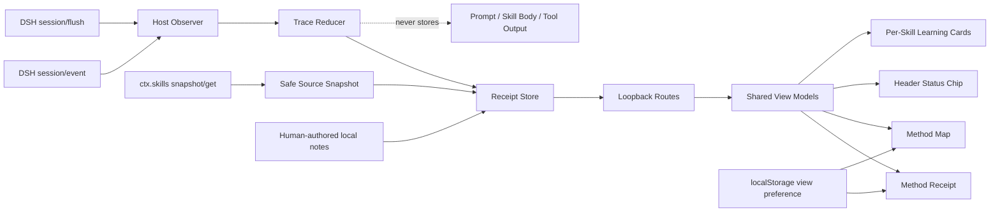
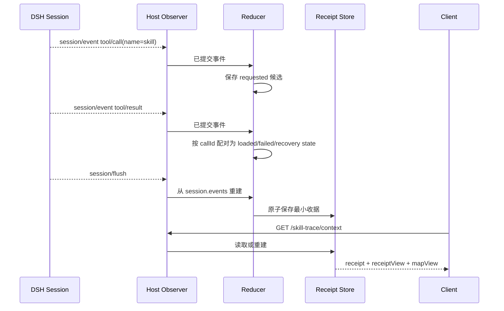
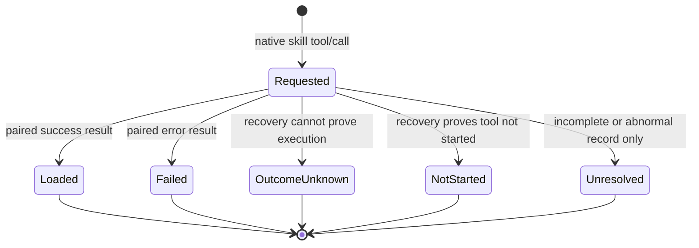
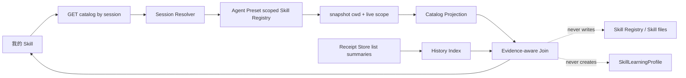

# DSH Skill Trace 技术设计

> 本文第 1–11 节描述 V0.1/V0.2 的已实现结构；第 12 节描述 V0.4 P0；第 13 节记录 V0.5 真实使用工程证据。产品语义以 `04-product-requirements.md` 为权威。

## 1. 技术结论

采用“标准 Skill 事件观察器 + 确定性 Reducer + 会话 Agent Preset 作用域 Registry + 独立本地收据 + 分 Skill 学习投影”的单插件方案。Host 不接管 Skill 路由，不修改 DSH 原始 Session，也不调用模型。Skill 收据、流程地图、学习卡和会话头部提示共享同一个 `SkillRunReceipt` View Model；“我的 Skill”复用收据目录生成独立的只读跨会话投影。

V0.2 的关键变化是把“会话级继续使用候选”与“逐个 Skill 的学习卡”分开：前者回答整次工作能否延续，后者回答每个 Skill 声明了怎样的步骤、用户如何形成自己的理解和迭代计划。

V0.4 P0 已按 Spike 结论实现：目录优先读取当前已挂载会话的 Agent Preset 作用域 Registry；旧收据没有运行当时的 Provider/来源身份，只能作为候选历史。V0.4 P1 在 Schema 5 中把人工验证结果继续挂在原会话收据上，并由目录投影生成待回看队列和时间线；不创建跨会话“正确理解”对象。

## 2. 运行架构



### 2.1 模块职责

| 模块 | 文件 | 职责 | 明确不做 |
|---|---|---|---|
| Trace Reducer | `src/core/trace-reducer.mjs` | 过滤标准 `skill`、配对 call/result、计算指纹、提取有界 Continuity 候选、投影分 Skill 学习卡 | 不解析 Prompt，不推断有效性 |
| Source Snapshot | `src/core/source-snapshot.mjs` | 查询当前根级 Registry，保存安全来源标签与当前 Hash | 不保存绝对路径或 Skill 正文，不保证看到 Agent 作用域挂载 |
| Receipt Store | `src/storage/receipt-store.mjs` | 独立目录、哈希文件名、原子写入、删除 | 不修改 DSH Session 文件 |
| Preference Store | `src/storage/preference-store.mjs` | 保存用户默认收据/地图偏好 | 不保存 Session、Prompt 或项目内容 |
| Host Adapter | `src/dsh/host/index.js` | 订阅事件、flush 收口、提供本机路由 | 不路由或执行 Skill |
| Skill Runtime Scope | `src/core/skill-runtime-scope.mjs` | 把一次 Skill 加载收敛为可审计的**运行证据范围**：以 Turn 为结构边界、标记 `observed`/`correlated`/`unlinked`、拒绝时间相邻 | 不推断因果、不评分、不读提示词与工具参数、不把同 Turn 的两次加载切开 |
| Client UI | `src/dsh/client/client.js` | Skill 收据、流程地图、会话状态提示、分 Skill 学习卡、个人笔记、迭代清单复制、输出引用、本地 Continuity 判断，以及 `ctx.locale` 中英文适配 | 不建立第二套分析逻辑，不翻译源数据，不写回或发布 Skill |
| Project Verify | `scripts/verify-project.mjs` | 结构、双视图契约、隐私字段静态检查 | 不替代真实桌面验证 |

## 3. 事件到收据的数据流



`session/event` 用于实时观测，`session/flush` 用于一致性收口。每次重建都从 DSH 持久事件生成业务对象，因此插件自己的临时内存不是事实权威。

Reducer 生成两层只读投影：`events[]` 保留每次调用，`methods[]` 按 `skillName` 聚合。`methodCount` 是保留兼容的内部字段，表示唯一 Skill 数；`eventCount` 表示加载调用数，两者不能互换。同名 Skill 的多次调用共享 Skill 节点，但保留不同的事件 ID、Turn、Step 和结果状态。

Reducer 同时生成 `turnDetails[]`、`summary`、SHA-256 指纹与最多五条会话级 Continuity 候选。共享投影再按 `skillName` 生成 `learningCards[]`：每个 Skill 独立合并最多八条候选步骤和自己的依赖信号，不跨 Skill 混合。Skill 正文只在内存中从标准标签精确截取，用于 Hash、有序列表和依赖关键词解析，之后丢弃；Client 不读取 Prompt、Assistant 正文或项目文件，也不解释 Agent 动机。

## 4. 最小持久化对象

### 4.1 SkillTraceEvent

```text
eventId, sessionId, turn, step, skillName,
status, callId, callSeq, resultSeq,
consumer, consumerIdentity, coverage,
evidenceFingerprint?, continuityCandidate?
```

### 4.2 SkillRunReceipt

```text
schemaVersion, receiptId, sessionId,
traceEvents[], coverage, sourceSnapshots[],
humanAssessment(legacy), outputReferences[],
continuity, learningNotes[], validationResults[], updatedAt
```

### 4.3 MethodContinuityCard

V0.1 Beta 从本次实际返回的标准 Skill 指令中提取最多五条有序步骤和依赖候选；默认始终为 `unassessed/candidate`。用户可在本机确认 `manual / partial / blocked`，但这只表示当前卡片的延续判断，不是完全离线保证，也不会作为开发者反馈上传。

### 4.4 SkillLearningCard

`SkillLearningCard` 是确定性 View Model，不单独持久化：

```text
skillName, loadCount, loadedCount,
observedHashes[], currentHash, versionState,
steps[], dependencies[], evidenceState,
note?
```

它只消费同名成功事件中的候选结构。失败、结果未知和未开始事件仍显示在加载记录中，但不会被拿来生成“如何运行”的步骤。

### 4.5 PersonalLearningNote

```text
skillName,
understanding, improvementIntent, validationPlan,
authorship: human,
updatedAt
```

三项正文均由用户主动输入，单项最多 500 字。Host 确认 `skillName` 在当前收据中存在成功加载证据后才允许保存。Schema 1/2 迁移时保持空数组，不自动补写个人认识。

### 4.6 SkillValidationResult

```text
skillName,
status: met | not-met | inconclusive,
observedOutcome, nextAction,
authorship: human,
validatedAt, updatedAt
```

验证结果与 `PersonalLearningNote` 同样挂在原会话收据上。Host 必须确认对应 Skill 在该收据中存在成功加载证据；`observedOutcome` 必填，正文上限与敏感内容拒绝规则复用学习笔记。写入 `unassessed` 且正文为空表示明确清除。Schema 1–4 迁移只补空数组，不生成验证结论。

目录投影只暴露状态、时间和精确/候选计数：非空 `validationPlan` 且无结果派生为 pending，存在结果派生为 recorded。验证结果不会改变 `associationLevel`、版本状态或收据证据强度。

## 5. 状态机



状态仅描述加载证据。`outputReferences` 是独立的人工关联对象，不是 Loaded 的自动升级。旧 `humanAssessment` 字段只为 Schema 1 读取兼容保留，V0.1 UI 与 Host 不再提供写入入口。

## 6. 双视图策略

- 首次使用默认为 `receipt`；用户主动切换后写入 `localStorage` 的 `dsh-skill-trace.default-view`。
- Host 同时将默认视图保存为 `~/.dsh/skill-trace/preferences.json`；Client 的 `localStorage` 只作兼容回退，桌面端重启后以 Host 本地偏好为准。
- Client 只通过 `view === 'receipt' ? ReceiptView : MapView` 挂载一个主视图。
- Host 的 `buildViewModels(receipt)` 一次构造两个确定性投影；不触发模型、网络或第二份持久化。
- 地图使用稳定坐标、HTML 节点和 SVG 正交连线。蓝色表示事件关系或人工明确关联，灰色虚线表示尚未关联或依赖尚未评估。
- 颜色取 DSH 业务蓝 Token，并由文字、图标、边框和线型共同编码，避免仅靠颜色传达状态。
- 收据按唯一方法生成卡片，卡片内的加载记录保留全部事件；方法级状态由事件集合确定，成功与失败并存时为 `mixed`。
- 收据新增“逐个看懂 Skill”区域，每个 `SkillLearningCard` 都有完整描边，候选步骤固定标注“来自 Skill 指令，不代表本次已执行”。
- 地图按 `max(methodCount, eventCount)` 动态计算画布高度；不使用固定前四条截断。每次加载事件都是独立 Step，并连回对应的唯一 Skill 节点。
- 地图不把声明步骤画成已执行节点；选中 Skill 节点后，Inspector 展示对应学习卡的步骤、依赖和版本状态。
- 右侧栏的“我的理解与迭代”按当前 Skill 保存三个用户字段；收据模式默认第一个成功 Skill，地图模式优先跟随选中的 Skill。
- “复制清单”只在 Client 组装短指纹、候选步骤和人工笔记并写入剪贴板；没有 Host 文件写入、Skill Registry 写入、安装、Git、上传或发布动作。
- Client 在 `loading / error / empty / ready` 之间先做状态 Gate。只有 `ready` 才挂载视图切换、Receipt/Map 和侧栏；`empty` 只显示与 Observer 覆盖一致的一句提示。
- 收据阶段和方法事件使用原生 `details/summary` 展开；地图使用“节点选择 → 右侧 Inspector”展开。两者共同调用同一组确定性事件解释规则。
- `SessionSummary` 同时用于收据和地图，只消费 View Model 的 `summary` 与 `outputs`；“运行逻辑”明确限定为事件顺序，不生成因果结论。
- 地图外层画布宽度为 `max(100%, 1000px)`，网格绘制在整张 HTML 画布上；内部 `st-map-stage` 固定为 1000px，并同时承载 SVG 关系层、区块标签和绝对定位节点。`margin-inline: auto` 使其在宽屏居中；低于 1000px 时外层最小宽度与滚动容器保留左侧起点和横向导航。网格色由弱边框色再混合 50% 透明度得到。
- Client 通过 DSH `ctx.locale` 注册 `dsh-skill-trace` 的静态 `zh / en` 字典，动态计数、节点说明和调用信息使用显式中英模板，并订阅 locale revision 原位重渲染；只有插件自有 UI 文案经过翻译包装，所有来源数据以 raw 路径直出。未知 active locale 沿用 DSH 英文回退。
- 验证结果清除采用 Client 内联二次确认，再向 `/skill-trace/validation-result` 提交 `unassessed` 与空文本；不调用宿主 WebView 的原生 `window.confirm`，避免确认框被宿主吞掉时形成无反馈操作。清除只移除对应 `validationResults[]` 项，原学习笔记与验证计划保持不变。目录历史以收据 `createdAt` 作为 `sessionAt` 展示与排序，`updatedAt` 仅保留修改时间，避免保存或清除结果后把旧会话移动到当天。
- 输出引用只从会话任务节点连接，不从最后一个加载步骤连接，避免暗示某个 Skill 导致产出；多个输出在地图中聚合为一个可展开节点，Inspector 列出全部相对引用。
- Header Status Chip 每 15 秒读取同一 `/context` View Model，只显示方法数与成功/总调用数；没有 Trace 时不渲染。
- 指纹只显示短前缀，完整 SHA-256 保存在收据中；Registry 来源不可用时明确降级，不从事件或路径猜测。

## 7. 本机接口

所有路由仅由已安装的 DSH Host 插件提供，不是公网 API。

| 方法 | 路径 | 用途 |
|---|---|---|
| GET | `/skill-trace/context?sessionId=...` | 读取/重建收据和双视图模型 |
| POST | `/skill-trace/outputs` | 保存用户明确输入的工作区相对引用 |
| POST | `/skill-trace/continuity` | 保存当前收据的本地人工延续判断 |
| POST | `/skill-trace/learning-note` | 保存某个已成功加载 Skill 的本地个人理解与迭代计划 |
| POST | `/skill-trace/validation-result` | 保存或清除原会话中某个已成功加载 Skill 的人工验证结果 |
| GET | `/skill-trace/backups` | 从固定目录重读备份元数据与有界损坏告警 |
| POST | `/skill-trace/backups` | 创建、原子落盘并回读验证本地备份 |
| GET | `/skill-trace/backups/preview?id=...` | 校验备份并返回可恢复摘要，不写数据 |
| POST | `/skill-trace/backups/restore` | 仅恢复缺失 Session；保留同 Session 现有收据 |
| DELETE | `/skill-trace/outputs` | 移除收据中的单条输出引用，不触碰项目文件 |
| DELETE | `/skill-trace/receipt` | 二次确认后删除当前收据 |
| DELETE | `/skill-trace/receipts` | 先创建安全备份，再清空全部收据；备份失败则中止 |

输出引用拒绝绝对路径、远程 URL 和父目录跳转。错误只保存有界类别，不保存完整工具输出。

## 8. 存储与隐私

- 目录：`~/.dsh/skill-trace/receipts`；文件名由 Session ID 哈希生成。
- 备份目录：`~/.dsh/skill-trace/backups`；文件名只接受固定时间戳与随机 ID 白名单，不接受调用方提供的任意路径。
- 写入：临时文件后原子 rename；目标文件权限为 `0600`。
- 允许字段：会话标识、Turn/Step、Skill 名、状态、事件序号、覆盖声明、SHA-256、安全来源标签、候选步骤/依赖、工作区相对输出引用、用户主动输入的有界学习笔记与验证结果，以及旧 Schema 兼容字段。
- 禁止字段：Prompt、Assistant 正文、Skill 正文、Tool 输出、Token、Cookie、绝对路径、项目正文。
- 插件卸载与收据删除分离，防止包管理动作静默删除用户记录。
- 备份目录权限为 `0700`、文件为 `0600`；写临时文件后原子 rename，再通过同一读取与校验路径确认成功。备份不自动清理，防止静默删除恢复点。
- 没有 Trace、输出引用或学习笔记的会话不会持久化成“零数据收据”；旧人工评价本身不再构成持久化理由，Host 启动时会清理这类空收据文件。
- 学习笔记和验证结果与收据共存，不创建第二套数据库；删除收据会同时删除这些人工记录。

## 9. 非干扰边界

- 插件与 `dsh-visual-acceptance` 是两个独立 Bundle；当前没有运行时调用和共享 Store。
- Observer 出错只记录插件错误，不改变原生 Tool 结果。
- 官方 Consumer 与 SkillFlux 0.2.0 已验证标准事件兼容；单事件仍标记 `consumerIdentity: unavailable`。不符合标准事件契约的 Consumer 保持 `coverage-unknown`。
- 当前版本已有只读“我的 Skill”独立入口；仍没有自动试跑、Skill 安装、动态挂载、统计 Dashboard 或跨会话综合理解。

## 10. 测试策略

1. Reducer 单测：成功、失败、恢复态、异常未配对、指纹、候选解析、否定依赖、分 Skill 学习卡、Schema 5 迁移、逐事件身份保留、笔记与验证结果校验、忽略非 Skill、正文不持久化。
2. Store 与目录单测：原子写读删、损坏文件跳过、相对引用校验、四级关联、同名异源、不完整 Snapshot 与唯一目录身份。
3. 投影一致性：收据和地图的 Skill、状态、Turn、Step 完全一致；重复 Skill 聚合但事件不丢失。
4. 项目静态 Gate：文件结构、互斥渲染、禁止字段、零 Skill 文案，以及禁止固定四条截断。
5. DSH Desktop：插件同时加载、历史单句空态、至少 3 个有效 Skill、重复与失败事件、双视图全量呈现、重启迁移、视图偏好和关键视觉状态。
6. 隔离 Profile：官方 Consumer、固定 SHA 的 SkillFlux、插件停用、历史收据校验值不变。
7. UI 交互复验：阶段展开、加载记录白话、分 Skill 学习卡、地图节点 Inspector、个人笔记保存、验证结果保存/清除、待回看筛选、学习时间线、迭代清单复制、双视图概要、会话状态提示、宽屏图形舞台居中、右侧栏开合后重新居中、窄屏横向滚动、刷新图标完整显示，以及 Skill 写入/发布入口不存在。
8. Locale 复验：首次中文、首次英文、运行中中英互切、未知 locale 英文回退、插件自有硬编码扫描，以及切换前后收据/笔记/输出引用持久化不变。

## 11. 已知技术债

- DSH 会把中断工具补写为 `TOOL_OUTCOME_UNKNOWN / TOOL_NOT_STARTED`；两种映射已有 Reducer 证据，未把不存在的“永久未配对”当作正常 Gate。
- “我的 Skill”P0 已实现；P1 跨会话综合理解、批量目录索引和大规模性能优化尚未启动。
- 地图已经取消固定条数截断；超长会话仍需要后续增加按 Turn 折叠、定位与概览缩放，当前采用纵向滚动保证证据不丢失。
- Schema 1→5 迁移保持旧收据读取兼容；Schema 4 增加逐事件 `runtimeIdentity`，Schema 5 增加原收据人工验证结果，批量数据管理尚未实现。
- 备份恢复按 Session 幂等补缺；格式、版本、重复 Session 或单条收据无效会在任何写入前失败。极端磁盘故障可能造成部分缺失收据已写入，重试会跳过已写入项并继续补缺，不覆盖现有记录。
- DSH 处于 RC，事件字段或 Client Slot 变化时必须重跑 Spike。

## 11.1 V0.5 修正：Session 级匹配（此前**从未登记**在技术债里）

Alignment 的匹配范围此前是**整个 Session**：

```js
const invocations = aggregateInvocations(receipt?.runtimeEvents ?? [])
```

这不是一个"已知并接受"的限制——**它从未出现在上面那份技术债清单里**。
于是它既没有被发现，也没有被记录，而是一直在产生错误的归属：
「Turn 1 的 read / Turn 2 加载 Skill A / Turn 3 的 test」会让 Skill A 声明的
「Inspect → Test」同时匹配 Turn 1 与 Turn 3。

**V0.5 已修**：见 `skill-runtime-scope.mjs`。**教训是清单本身**——一条既不在范围文档、
也不在技术债里的行为，等于无人负责。

### 11.2 V0.5 之后仍然存在的限制

| 限制 | 证据 | 影响 |
|---|---|---|
| Subagent 谱系不可用 | `childId` 在真实会话 **0/1343** 个事件上出现；`subagent.spawn` 不指名创建者 | Subagent 派生无法进入可靠边界 |
| 跨 Turn 的 Skill 工作 | 无「Skill 结束」事件 | 刻意排除——宁可少算，不算错 |
| 工具词表固定 | `classifyInvocationStep` 只认 `read`/`edit`/`bash` 等 | `read_image`/`job_output` 等真实工具名归为 `other`，不强行归类 |
| 无 candidate 规则 | 当前 `candidate` 状态已定义但未启用 | P3 一旦开启即成为新的归属来源，需更严的证据门槛 |

## 11.3 测试策略补充：三层，防止"测试自己"

项目出现过多次「组件写了 / 测试绿了 / 产品走不到」。**组件自己的测试看不见可达性。**
V0.5 起，涉及 Host → Client 的能力必须分三层：

| 层 | 测什么 | 反面教材 |
|---|---|---|
| **A. Core Unit** | 算法本身 | — |
| **B. Contract** | Host → Client 的 Payload 是否携带客户端用来分支的字段 | beta.44：`capabilityId` 没传，Skill 三个 Tab 从未出现 |
| **C. Real Render / Integration Smoke** | 真实数据 → Host → Alignment → Inspector 能否走通 | beta.31：293 项测试通过、面板空白 |

**并且：每一条守卫都必须验证"回退被测代码时它会失败"。** V0.5 的 19 项 Scope 测试即如此验证
（回退 alignment → 2 项失败）。**一个抓不到已知缺陷的测试比没有测试更糟。**

## 12. V0.4 P0“我的 Skill”只读实现

### 12.1 Spike 冻结的技术事实

| 事实 | 结论 | 设计影响 |
|---|---|---|
| 原生 `skill.list` RPC | 可按已挂载 Session 返回用户可调用 Skill；当前样本为 3 个，字段只有 `name / description / modelInvocable` | 可作为 `/` 菜单对照，但缺少 `complete / provider / source`，不能作为 P0 完整目录与身份来源 |
| 会话作用域 `snapshot()` | 隔离 Profile 返回 `complete: true`；3/3 个 Skill 均有名称、简介、Provider、来源和调用策略 | P0 Host 必须直接读取会话 Agent Preset 的 Registry |
| 根级 Registry | 当前 Web Profile 的文件系统 Skill Provider 由 Agent Preset 挂载，根级读取无法得到当前会话的完整来源 | 现有 `buildSourceSnapshots()` 的根级调用不能复用于目录或未来精确身份 |
| 正式收据枚举 | 4 个文件、总计 69,451 bytes，当前样本读取约 1.3 ms；权限与敏感字段扫描通过 | P0 先做无索引的只读摘要枚举；该数字不外推为大规模性能保证 |
| 旧收据身份 | 4 份收据包含 5 个不同 Skill、7 个按收据聚合的 Skill 条目，其中 0 个保存了完整 Provider＋来源身份 | 旧记录不得按名称自动并入当前 Skill |
| 旧收据内容指纹 | 当前 3 个 Skill 的 6 次历史成功事件与当前定义 Hash 全部一致 | 只能显示“内容匹配的可能历史”，不能反推运行当时的来源 |

### 12.2 只读数据流



“跨会话”只表示详情能回看多个历史收据，不表示存在脱离当前 Session、工作区和 Agent Preset 的全局安装清单。没有已挂载普通会话时，P0 只返回历史条目，并把当前目录标为不可确认；不得为了读取目录冷启动 Agent。

### 12.3 会话作用域 Registry Adapter

实现复用 DSH 原生 Web API 的作用域选择逻辑：

1. 由 `sessionId` 取得已挂载 Session 与 `cwd`；
2. 取得该 Session 的 live Agent；
3. 优先使用 `agentPresets.serviceFor(live, "skills")`，不存在时才退回根级 `skills`；
4. 使用 `{ cwd, scope: live }` 调用 `snapshot()`；
5. 只有 `complete === true` 时显示确定总数；否则保留候选条目但显示“目录可能不完整”。

目录投影只允许输出：

```text
name, description, provider,
sourceFingerprint, modelInvocable, userInvocable,
snapshotComplete, observedAt
```

原始 `source` 只在内存中规范化并计算 SHA-256；绝对路径、完整 Skill 正文、资源目录和 Provider locator 不进入 Client 或持久化目录。

### 12.4 历史收据摘要

P0 在现有 `ReceiptStore` 上新增只读摘要枚举能力，不创建第二套数据库。每个文件先按现有迁移规则读取，再只投影：

```text
receiptId, sessionId, updatedAt,
skillName, loadStatus, observedInstructionSha256,
provider?, sourceFingerprint?, learningNotePresent
```

枚举必须：

- 只接受 64 位十六进制文件名；
- 跳过已删除、格式损坏或无法迁移的单个文件，并返回有界告警数量；
- 不把 Prompt、Assistant 正文、Tool 输出或用户笔记正文放进列表接口；
- 只有打开某次历史理解时才从对应收据读取该条 `PersonalLearningNote`；
- 未经实际规模测试前不增加索引文件、数据库或后台扫描任务。

### 12.5 身份与关联等级

| 等级 | 证据 | UI 行为 |
|---|---|---|
| `exact` | 运行当时持久化的 Provider＋Skill 名称＋安全来源指纹，与当前条目一致 | 自动进入“实际运行记录” |
| `content-match-candidate` | 旧收据名称一致，观察到的指令 Hash 与当前定义 Hash 一致，但缺运行当时来源 | 显示“内容匹配的可能历史”，用户可打开核对；不计为已验证同源 |
| `name-only-candidate` | 只有名称一致 | 单列“可能相关”，不自动合并笔记或次数 |
| `conflict` | Provider、来源或名称存在明确冲突 | 分开展示，不关联 |

新收据若要进入 `exact`，必须在事件发生或 flush 收口时通过同一会话作用域 Registry 把 Provider 与安全来源指纹保存到每次成功加载事件；同一收据只要存在缺失身份或同名异源冲突，就不能汇总为 `exact`。旧收据不得通过当前 Registry 回填运行当时来源；该变更冻结为 Schema 4。

### 12.6 已实现本机接口

| 方法 | 路径 | 用途 | 写入 |
|---|---|---|---|
| GET | `/skill-trace/catalog?sessionId=...` | 返回当前作用域目录、完整度、历史摘要与关联等级 | 无 |
| GET | `/skill-trace/history-note?sessionId=...&skillName=...` | 按用户操作读取原收据中的单条会话理解 | 无 |
| GET | `/skill-trace/history-receipt?sessionId=...&skillName=...` | 返回有界收据概要与指定 Skill 的单条会话理解，不返回其他 Skill 笔记 | 无 |

P0 没有增加新的 POST、Skill 文件操作、模型调用、网络服务或 `SkillLearningProfile` Store。

### 12.7 失败降级与验证 Gate

- Session 未挂载：目录 `coverage-unknown`，只显示历史，不冷启动 Agent；
- Snapshot 不完整：不显示确定总数，候选条目带“不完整”说明；
- 单个 Provider 失败：遵循 `snapshot.complete === false`，不得把返回的部分列表写成全部；
- 旧身份缺失：降级为候选历史，不按名称自动合并；
- 单个收据损坏：其他历史仍可读，同时返回有界告警；
- Registry 或历史枚举失败：不影响当前会话、Skill Consumer 或现有收据/地图功能；
- scoped Registry Adapter、历史枚举、四级关联、隐私、同名异源、冷 Session 与不完整 Snapshot 已纳入自动测试；V0.5 已补齐真实新事件 `exact` UI 与会话笔记回读样本，大规模收据性能仍待后续验证。

## 13. V0.5 真实使用工程证据

- 3 个当前可发现 Skill 分别在独立会话中产生 1 次成功 `skill(name)` 加载；
- Schema 4 逐事件 `runtimeIdentity` 已在真实新收据中形成 `exact` 关联，不再只是单元测试覆盖；
- 每张收据各保存 1 条 `PersonalLearningNote`，目录接口显示“1 张真实收据＋1 条会话理解”，并按用户操作回读原笔记；
- `continuity.status` 真实覆盖 `partial` 与 `blocked`：两个 Cordis Skill 为 `partial`，`pinokio` 因控制平面不可达为 `blocked`；
- 以上证据验证存储和投影链路，不验证用户认知；主持人代理笔记不能升级为 `SkillLearningProfile` 或综合理解。

当前仍待验证：大量历史性能、系统级无障碍、真实小屏设备，以及钟先生本人不看材料时的即时与 24 小时理解。

## 14. 0.4.0-beta.3 本地数据闭环

### 14.1 旧方案失效机制

旧 Client 在取得 JSON 后创建 Blob、触发 `<a download>`，随即无条件显示“备份已下载到本机”。该提示只证明点击逻辑运行，不证明 WebView 把文件交付到用户可找到的位置；Host 不落盘，界面也没有文件名、历史、打开位置或恢复入口。因此旧 `/skill-trace/export` 已改为 `409`，防止继续形成假成功。

### 14.2 当前写入与恢复路径

1. Host 从 Receipt Store 构建有界 archive，不包含 Prompt、Assistant 正文、Skill 正文、Tool 输出、Cookie 或绝对路径。
2. Backup Store 校验 archive 后以 `0600` 写临时文件，原子 rename 到固定目录，再 stat、读取、解析并核对收据数量。
3. Client 只有收到 `201` 与回读后的 metadata 才显示成功；历史列表来自后续独立 `GET /backups`，不是复用内存假状态。
4. 恢复预览逐条迁移校验并拒绝重复 Session；正式恢复再次执行相同前置校验，只写缺失 Session。
5. 清空和单删调用同一 verified backup helper；备份创建失败会在任何删除前抛错。
6. Client 将个人理解、人工验证和输出引用的未保存草稿按 Session / Skill 暂存在 WebView `sessionStorage`；视图卸载后重新挂载会恢复同一已保存版本上的草稿，保存版本变化时拒绝套用旧草稿。成功保存按条清理，成功单删按 Session 清理，成功全清统一清理；Host 失败则保留草稿。

### 14.3 语言与数据边界

Client 订阅 Host locale revision。静态文案走 `zh/en` 字典，带文件名、数量和时间的动态状态保存为双语模板参数并在渲染时按当前 locale 选择，避免切换后残留旧语言。文件名、Skill 名、用户个人理解、未保存草稿、输出引用和备份正文均按 raw 数据展示或保存，不参与翻译。

### 14.4 验证状态

- 自动测试：63 项通过，包含不可变备份、路径穿越/损坏拒绝、目录与文件权限、空收据/非法输出引用拒绝、未保存草稿分域/恢复/清理/离开保护与暂存失败显式告警合同、冲突跳过、重复 Session 写前拒绝、安全备份失败中止，以及隔离 Store 的“备份 → 清空 → 恢复”往返。
- 静态 Gate：项目结构、双视图契约、来源隐私、本地学习环和只读目录检查通过。
- 真实 Desktop：已验证创建文件、磁盘重读历史、备份预览和现有 9 张收据全部跳过且不覆盖；未清空钟先生真实数据。
- 真实 Desktop：首次使用 `workspaces.openPath()` 的方案被同 Profile 的 `dsh-better-sidebar` 包装并把目录导向文件编辑器，已停止沿用。改为官方 `/api/host.openPath` RPC 后返回 `opened: true`；钟先生已人工点击按钮，确认 Finder 打开 `~/.dsh/skill-trace/backups` 并显示目标 JSON。真实数据清空与恢复只在明确授权后执行。
- 真实 Desktop：个人理解已通过 DSH 原生 Tab 离开/返回恢复；人工验证和输出引用已通过插件页面卸载/返回恢复；改回原值后不再显示假未保存状态。新增状态已验证中文、英文与深色主题，测试草稿全部清除，宿主恢复中文和跟随系统主题。
