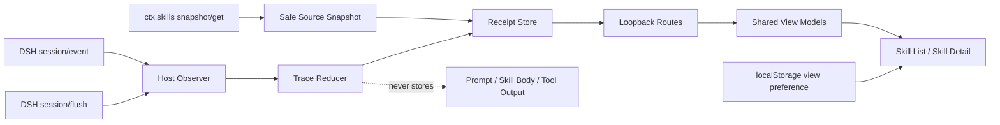
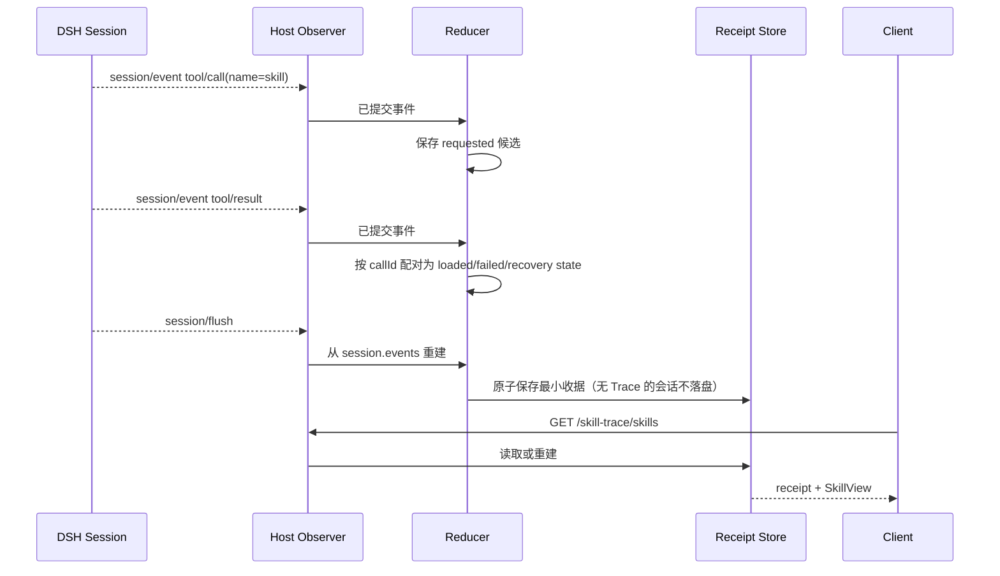
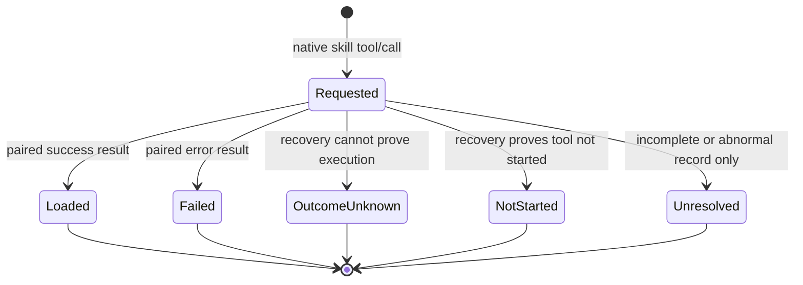

# DSH Skill Trace 技术设计

> 产品语义以 `04-product-requirements.md` 为权威，当前实现以 **§0** 为准，运行时的证据链细节以 `docs/ARCHITECTURE.md` 为准。

## 0. 当前架构（先读这一节）

**其余各节写于 V0.1–V0.5。** 产品此后经历了两次收缩（v0.6 的两级信息架构、其后的详情页增强），所以本文在 2026-10-02 做了一次清理：**描述已删除对象的整节已经从这里移走**，不再让"已经不存在的页面"继续占据篇幅、误导读者。

移走的是这些（要查原文：`git log -p -- 05-technical-design.md`）：

| 已移走的章节 | 为什么 |
|---|---|
| §4.3 `MethodContinuityCard` | 承载它的页面已删除 |
| §4.4 `SkillLearningCard`、§4.5 `PersonalLearningNote`、§4.6 `SkillValidationResult` | v0.6 删掉了整个跨会话学习工作台。**旧收据里的字段保留不迁移**，由 `LEGACY_LEARNING_FIELDS_OK` 守着"不删字段、不复活入口" |
| §6 双视图策略 | 收据与地图不再有页面身份，一级页面只剩两个 |
| §12 "我的 Skill" 只读实现（含 12.1–12.7） | 目录页与跨会话投影随 v0.6 移除 |
| §13 V0.5 真实使用工程证据、§14 0.4.0-beta.3 本地数据闭环 | 过程记录，已由 `CHANGELOG.md` 承担 |

剩下各节里，**§2 的运行架构图与 §2.1 的模块表已经按当前实现改过**；§3 / §4.1 / §4.2 / §5 / §7 / §8 / §9 / §10 / §11 逐节核对过，仍然准确。


### 0.1 现在的形状

一级页面两个、「本次 Skill」与「已安装 Skill」，共用一个二级页「Skill 详情」。宿主只注册 **7 条** `/skill-trace/*` 路由（`context` / `definition` / `translate` / `catalog` / `skills` / `skill` / `preferences`）。客户端的全部内容是 `src/dsh/client/client.js`，约 1500 行，打包成约 62 KB 的 `dist/client.js`。

```text
Workbench                    两个一级页面的切换 + 宿主偏好
  ├─ CurrentSkillPage         本次 Skill     ← GET /skills, /skill
  ├─ InstalledSkillsPage      已安装 Skill   ← GET /catalog
  └─ SkillDetailPage          唯一二级页     ← GET /definition, POST /translate
       ├─ SkillFramework      声明流程 + 证据状态，**在文档之前**
       └─ renderSkillMarkdown 原文与译文共用的唯一渲染入口
```

### 0.2 现在的核心模块

`src/core/` 共 20 个模块、约 6164 行。按"它在陈述什么"分三类：

| 类别 | 模块 | 陈述什么 |
|---|---|---|
| **定义侧**（只读 SKILL.md，不 import 任何运行时模块） | `skill-definition.mjs`、`skill-flow.mjs`、`definition-outline.mjs`、`repository-resolver.mjs`、`markdown-table.mjs`、`step-kind.mjs` | 这个 Skill **声明**了什么 |
| **运行时侧**（只读会话事件，不知道定义） | `runtime-events.mjs`、`runtime-graph.mjs`、`runtime-evidence.mjs`、`runtime-fingerprint.mjs`、`skill-runtime-scope.mjs`、`source-snapshot.mjs`、`session-log.mjs`、`trace-reducer.mjs` | 这次会话里**发生**了什么 |
| **组合侧**（唯一允许把两者放在一起的地方） | `skill-view-model.mjs`、`runtime-alignment.mjs`、`flow-evidence.mjs`、`installed-view.mjs`、`skill-translation.mjs`、`translation-cache.mjs` | 声明与发生**对上多少** |

这条分层的意义是：**方向不可逆**。`Skill Definition → Declared Flow → Runtime Evidence`，运行时证据只能给已有步骤附加状态，不能新增、删除、重命名或重排任何一步。谁越界，`SKILL_FRAMEWORK_OK` 会报错。

### 0.3 两条实现层面的硬约束

- **声明流程只做标注。** `SkillFramework` 只读 `flow.steps`，不得出现 `runs` / `invocations` / `observedNodeIds` / `evidenceIds` / `runtimeEvidence`。否则步骤数会变成"发生了什么"的函数，而不是"定义说了什么"。
- **一个渲染器，一个调用点。** `renderSkillMarkdown()` 在客户端只能有一个调用点（守卫会数）。两个调用点意味着原文与中文预览可能分家，而其中一套没人测。

状态词表固定在 `src/core/flow-evidence.mjs`：五档与 `ALIGNMENT_RELATIONSHIPS` 一一对应，`FLOW_EVIDENCE_FORBIDDEN` 里的八个词（已执行 / 未执行 / 已完成 / 未完成 / 执行成功 / 执行失败 / 已运行 / 未运行）不得出现在界面里。守卫**导入这个模块读标签值**，而不是 grep 源码——因为它自己那行就含这八个词，按字面量搜会放过真正的违规。

### 0.4 验证在哪里

`node --test` 377 项、`node scripts/verify-project.mjs` 23 道静态契约守卫。**守卫守的是关系，不是函数名**：`SKILL_FRAMEWORK_OK` 的每一条断言都反向验证过（把被守的东西改坏，它必须报错）。守卫清单见 `scripts/verify-project.mjs` 的 `console.log('*_OK')`。

**注意**：`docs/RELEASE.md` §6.5c 说明了一件事——这一版**没有新增宿主路由**，所以没有任何 HTTP 探针能区分它与上一版；客户端新旧只能靠逐文件 sha256（§6.4）加重启后的人眼（§6.6）。

## 1. 技术结论

采用「**标准 Skill 事件观察器 + 确定性 Reducer + 会话作用域 Registry 快照 + 独立本地收据 + 只读的组合视图**」的单插件方案。Host 不接管 Skill 路由，不修改 DSH 原始 Session。**只有翻译一处会调用模型**，且它的输出只活在客户端内存里。

组合层的方向不可逆：

```text
Skill Definition ──► Declared Flow ──► Runtime Evidence
   （现读正文）        （抽出的步骤）      （只能给已存在的步骤贴状态）
```

`src/core/skill-view-model.mjs` 由收据 + 活读的 Definition 组合出 `SkillView`，交给客户端渲染。**客户端只渲染这一层，不自行推理 Skill**——它没有能力新增一步，也不允许把"没观察到证据"写成"没有执行"。

## 2. 运行架构



### 2.1 模块职责

| 模块 | 文件 | 职责 | 明确不做 |
|---|---|---|---|
| Trace Reducer | `src/core/trace-reducer.mjs` | 过滤标准 `skill`、配对 call/result、计算指纹、提取有界 Continuity 候选 | 不解析 Prompt，不推断有效性 |
| Source Snapshot | `src/core/source-snapshot.mjs` | 查询当前根级 Registry，保存安全来源标签与当前 Hash | 不保存绝对路径或 Skill 正文，不保证看到 Agent 作用域挂载 |
| Receipt Store | `src/storage/receipt-store.mjs` | 独立目录、哈希文件名、原子写入、删除 | 不修改 DSH Session 文件 |
| Preference Store | `src/storage/preference-store.mjs` | 保存用户当前视图偏好 | 不保存 Session、Prompt 或项目内容 |
| Host Adapter | `src/dsh/host/index.js` | 订阅事件、flush 收口、提供本机路由 | 不路由或执行 Skill |
| Skill Runtime Scope | `src/core/skill-runtime-scope.mjs` | 把一次 Skill 加载收敛为可审计的**运行证据范围**：以 Turn 为结构边界、标记 `observed`/`correlated`/`unlinked`、拒绝时间相邻 | 不推断因果、不评分、不读提示词与工具参数、不把同 Turn 的两次加载切开 |
| Client UI | `src/dsh/client/client.js` | 两个一级页面 + 唯一的 Skill 详情（事实卡、**声明流程框架**、`SKILL.md` 原文 / 中文预览、GFM 表格），以及 `ctx.locale` 中英文适配 | 不建立第二套分析逻辑、不推理 Skill、不翻译源数据、不写回或发布 Skill |
| Project Verify | `scripts/verify-project.mjs` | 结构、隐私字段、客户端行为契约的静态检查 | 不替代真实桌面验证 |

## 3. 事件到收据的数据流



`session/event` 用于实时观测，`session/flush` 用于一致性收口。每次重建都从 DSH 持久事件生成业务对象，因此插件自己的临时内存不是事实权威。

**`turn/end` 只用于落盘，不作 Skill Run 的边界**——DSH 全部事件里既没有"skill 加载完成"也没有"skill 结束"，所以边界只能用 Turn 近似，并且必须承认它是近似。

Reducer 生成两层只读投影：`events[]` 保留每次调用，`methods[]` 按 `skillName` 聚合。`methodCount` 是保留兼容的内部字段，表示唯一 Skill 数；`eventCount` 表示加载调用数，两者不能互换。同名 Skill 的多次调用共享 Skill 节点，但保留不同的事件 ID、Turn、Step 和结果状态。

Reducer 同时生成 `turnDetails[]`、`summary`、SHA-256 指纹，以及（为兼容旧 Schema 保留的）会话级 Continuity 候选与 `learningCards[]`——**后者自 v0.6 起不再有任何界面读取它**，属于 §11 的第一条技术债。Skill 正文只在内存中从标准标签精确截取，用于 Hash 与步骤解析，之后丢弃；Client 不读取 Prompt、Assistant 正文或项目文件，也不解释 Agent 动机。

## 4. 最小持久化对象

### 4.1 SkillTraceEvent

```text
eventId, sessionId, turn, step, skillName,
status, callId, callSeq, resultSeq,
consumer, consumerIdentity, coverage,
evidenceFingerprint?, continuityCandidate?
```

### 4.2 SkillRunReceipt

```text
schemaVersion, receiptId, sessionId,
traceEvents[], coverage, sourceSnapshots[],
humanAssessment(legacy), outputReferences[],
continuity, learningNotes[], validationResults[], updatedAt
```

标注 `(legacy)` 与 `learningNotes` / `validationResults` 的都是**只读遗留字段**：它们留在结构里是为了让旧收据还能读，不是为了再用。写入侧没有任何入口。

## 5. 状态机



状态仅描述加载证据。`outputReferences` 是独立的人工关联对象，不是 Loaded 的自动升级。旧 `humanAssessment` 字段只为 Schema 1 读取兼容保留，V0.1 UI 与 Host 不再提供写入入口。

## 7. 本机接口

所有路由仅由已安装的 DSH Host 插件提供，不是公网 API。

**全部 7 条，一条不多**（`src/dsh/host/index.js:534` 起逐个 `if` 判断，没有路由框架）：

| 方法 | 路径 | 用途 | 代码位置 |
|---|---|---|---|
| GET | `/skill-trace/context` | 当前会话的收据与已加载 Skill | `src/dsh/host/index.js:534` |
| GET | `/skill-trace/definition` | 现读某个 Skill 的定义正文与 outline | `src/dsh/host/index.js:562` |
| POST | `/skill-trace/translate` | 分段翻译定义正文 | `src/dsh/host/index.js:589` |
| GET | `/skill-trace/catalog` | 当前环境可发现的 Skill 目录 | `src/dsh/host/index.js:671` |
| GET | `/skill-trace/skills` | 本次会话加载过的 Skill | `src/dsh/host/index.js:689` |
| GET | `/skill-trace/skill` | 单个 Skill 的详情视图模型 | `src/dsh/host/index.js:703` |
| POST | `/skill-trace/preferences` | 保存当前视图偏好 | `src/dsh/host/index.js:736` |

客户端 bundle **不走这些路由**：DSH shell 通过插件的 `exports["./client"]` 加载它。所以没有任何接口能证明前端是当前版本（见 `docs/RELEASE.md` §6.5c）。

`context` / `skills` / `definition` 只接受**内存中活着的 sessionId**；对磁盘上的历史会话一律返回 0 条，宿主不会去猜。定义正文只现读现返，**永不落盘、永不进收据**。

## 8. 存储与隐私

磁盘上只有两样东西（实测 `~/.dsh/skill-trace/`）：

```text
~/.dsh/skill-trace/
  ├─ preferences.json      当前视图偏好（47 字节）
  └─ receipts/             每个会话一个收据，文件名由 sessionId 哈希生成
```

- **写入**：先写临时文件，再原子 `rename`；权限 `on disk 0600`、目录 `0700`。
- **允许字段**：会话标识、Turn/Step、Skill 名、状态、事件序号、覆盖声明、SHA-256、安全来源标签、候选步骤、工作区相对输出引用，以及旧 Schema 的兼容字段。
- **禁止字段**：Prompt、Assistant 正文、**Skill 正文**、Tool 输出、Token、Cookie、绝对路径、项目正文。
- **定义正文永不落盘、永不进收据**：只在当前会话上现读现返。
- **译文只在内存**：`src/core/translation-cache.mjs` 上限 8 条，切 Skill 保留、退出即消失，不写 localStorage、不写文件。**（v0.7 已取代本节这一条）** 译文现在落盘在 `<dataRoot>/translations/`，键为「Skill 名 + 正文指纹 + 语言」且不含会话；`translation-cache.mjs` 降为页面内的第一层缓存。见 `FR-UI-060`。
- 插件卸载与收据删除**分离**，防止包管理动作静默删除用户记录。
- 没有任何 Trace 的会话不会持久化成"零数据收据"，Host 启动时清理这类空文件。

**备份功能已经不存在**（路由与服务一起在 v0.6 移除）。旧收据里遗留的学习笔记与验证结果字段保留不迁移，但没有任何写入入口——`LEGACY_LEARNING_FIELDS_OK` 守的就是"不删字段、不复活入口"。

## 9. 非干扰边界

- 插件与 `dsh-visual-acceptance` 是两个独立 Bundle；当前没有运行时调用和共享 Store。
- Observer 出错只记录插件错误，不改变原生 Tool 结果。
- 官方 Consumer 与 SkillFlux 0.2.0 已验证标准事件兼容；单事件仍标记 `consumerIdentity: unavailable`。不符合标准事件契约的 Consumer 保持 `coverage-unknown`。
- 仍然没有：自动试跑、Skill 安装、动态挂载、统计 Dashboard、跨会话综合理解。这些不是"还没做"，是**产品明确不做**（`04-product-requirements.md` §2 非目标）。

## 10. 测试策略

四层，`npm run verify` 一次跑完：

| 层 | 文件 | 守什么 |
|---|---|---|
| **核心纯逻辑** | `test/trace-reducer.test.mjs`、`skill-flow`（在 `phase14`）、`markdown-table.test.mjs`、`flow-evidence.test.mjs`、`translation-segmentation.test.mjs`、`translation-cache.test.mjs`、`source-snapshot`、`receipt-store`、`preference-store`、`installed-view`、`skill-translation` | 解析、配对、指纹、抽步骤、表格形状、翻译校验、缓存寿命 |
| **客户端契约** | `test/client-bundle.test.mjs`、`client-hook-order.test.mjs`、`client-render-smoke.test.mjs`、`client-style-lifecycle.test.mjs`、`layout-contract.test.mjs` | 产物必须是 `__ModuleLoader__.load` 包裹的 CJS、hook 不得写在提前 return 之后、组件能真的渲染出节点、样式只装一次、高度链 |
| **宿主策略** | `test/host-policy.test.mjs`、`host-write-policy.test.mjs`、`host-session-log-contract.test.mjs` | 路由只读边界、写盘字段白名单、会话格式 V4 |
| **静态契约守卫** | `scripts/verify-project.mjs` | 23 道 `*_OK`，跨文件的关系（见 §0.4） |

`client-render-smoke.test.mjs` 值得单独说：它**真的调用函数组件**并收集返回的节点树，所以"表格有没有被画成表格""某个禁用词有没有出现在界面上"这类问题在测试里就能回答，不必等到人眼。代价是它的 `lowerEsmToCjs()` 只认 `export function` / `export const` 这几种导出形式，别的形式会让它报 `uses an export form this harness cannot lower`——**这条报错是特性，不是障碍**：它逼核心模块保持可被客户端直接 `require` 的形状。

**这一层测不到的东西**：真实 DSH Desktop WebView 里的观感、暗色、断点、以及"重启后新代码到底有没有生效"。这些只能人眼，清单在 `01_重构方案/发布会话验收清单.md`。

## 11. 已知技术债

| 债 | 事实 | 影响 |
|---|---|---|
| **遗留在数据层的废弃对象** | `trace-reducer.mjs` 仍在计算 `learningCards[]`，但客户端自 v0.6 起不再显示它 | 每次归约多做一份没人读的工作；字段本身由守卫要求保留，所以**不能只删计算**——要删得连守卫一起重新设计 |
| **客户端没有接口探针** | 前端由 DSH shell 通过 `exports["./client"]` 加载，不走 HTTP | 没有任何探针能证明装的是当前版本；只能逐文件 sha256 + 重启后人眼（`docs/RELEASE.md` §6.5c / §6.6） |
| **Subagent 谱系不可用** | `childId` 在真实会话 0/1343 个事件上出现；`subagent.spawn` 不指名创建者 | 派生关系无法进入可靠边界 |
| **没有"Skill 结束"事件** | 全 DSH 不存在 | 跨 Turn 的 Skill 工作刻意排除——宁可少算，不算错 |
| **工具词表固定** | `classifyInvocationStep` 只认 `read` / `edit` / `bash` 等 | `read_image`、`job_output` 等真实工具名归为 `other`，不强行归类 |
| **DSH 处于 RC** | 事件字段或 Client Slot 可能变 | 每次升级都要重跑 spike |

## 11.1 V0.5 修正：Session 级匹配（此前**从未登记**在技术债里）

Alignment 的匹配范围此前是**整个 Session**：

```js
const invocations = aggregateInvocations(receipt?.runtimeEvents ?? [])
```

这不是一个"已知并接受"的限制——**它从未出现在上面那份技术债清单里**。
于是它既没有被发现，也没有被记录，而是一直在产生错误的归属：
「Turn 1 的 read / Turn 2 加载 Skill A / Turn 3 的 test」会让 Skill A 声明的
「Inspect → Test」同时匹配 Turn 1 与 Turn 3。

**V0.5 已修**：见 `skill-runtime-scope.mjs`。**教训是清单本身**——一条既不在范围文档、
也不在技术债里的行为，等于无人负责。

### 11.2 V0.5 之后仍然存在的限制

| 限制 | 证据 | 影响 |
|---|---|---|
| Subagent 谱系不可用 | `childId` 在真实会话 **0/1343** 个事件上出现；`subagent.spawn` 不指名创建者 | Subagent 派生无法进入可靠边界 |
| 跨 Turn 的 Skill 工作 | 无「Skill 结束」事件 | 刻意排除——宁可少算，不算错 |
| 工具词表固定 | `classifyInvocationStep` 只认 `read`/`edit`/`bash` 等 | `read_image`/`job_output` 等真实工具名归为 `other`，不强行归类 |
| 无 candidate 规则 | 当前 `candidate` 状态已定义但未启用 | P3 一旦开启即成为新的归属来源，需更严的证据门槛 |

## 11.3 测试策略补充：三层，防止"测试自己"

项目出现过多次「组件写了 / 测试绿了 / 产品走不到」。**组件自己的测试看不见可达性。**
V0.5 起，涉及 Host → Client 的能力必须分三层：

| 层 | 测什么 | 反面教材 |
|---|---|---|
| **A. Core Unit** | 算法本身 | — |
| **B. Contract** | Host → Client 的 Payload 是否携带客户端用来分支的字段 | beta.44：`capabilityId` 没传，Skill 三个 Tab 从未出现 |
| **C. Real Render / Integration Smoke** | 真实数据 → Host → Alignment → Inspector 能否走通 | beta.31：293 项测试通过、面板空白 |

**并且：每一条守卫都必须验证"回退被测代码时它会失败"。** V0.5 的 19 项 Scope 测试即如此验证
（回退 alignment → 2 项失败）。**一个抓不到已知缺陷的测试比没有测试更糟。**
