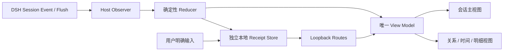

# DSH 会话视图插件交接实施手册

> 用途：把 `DSH Skill Trace` 已验证的“会话事实 → 本地业务收据 → 双视图”实现方式，交接给下一个需要在 DSH 对话页展示会话信息的插件。它提供可复用的工程骨架、验证顺序和反例，不复制 Skill Trace 的业务判断。

## 1. 先给结论

下一个会话视图插件应采用下列边界，而不是直接在 Client 里读取 DSH 原始事件或另起一套展示数据：



核心原则只有六条：

1. DSH 原始 Session 事件是运行事实；插件的收据是自己的最小业务投影，绝不反写 Session、Agent 或原生工具。
2. Host 负责订阅、收口、持久化与本机接口；Reducer 负责确定性解释；Client 只消费 View Model，不重新推断事实。
3. 同一会话事实只能有一个权威投影。列表、地图、顶部状态、详情页可以换阅读方式，不能各自再解析一遍事件。
4. 观察到的事件只能支持与其相称的文案。不要把“调用成功”写成“已执行完成、结果正确或导致产出”。
5. 空态、恢复态、失败态、重复事件和切换会话，都必须是正式状态，不是演示后补的异常分支。
6. 本地持久化和接口默认最小化、可删除、无公网暴露；只有用户明确输入的内容才可以写入。

本手册复用的是架构、验证和风险控制；新插件仍需重新定义自己的业务对象、事件契约、隐私字段和用户可见结论。

## 2. 当前基线与证据边界

| 项目 | 当前结论 | 可否直接沿用 |
| --- | --- | --- |
| DSH Desktop / Runtime 基线 | `0.8.3` / `0.1.1-rc.2` 下，Skill Trace 的 Host、会话视图、事件恢复、重启和停用不干扰已真实验证 | 只能作起点；新插件和 DSH 升级后必须重跑真实 Spike |
| `0.3.0-beta.1` | 已完成真实 Desktop 多 Skill、零 Skill、成功/失败、重启、双视图与停用验证 | 可引用为工程模式证据 |
| `0.3.0-beta.2` | 新增宿主 `zh/en` 同步与宽屏地图居中；当前工作区有未提交改动，自动测试与静态 Gate 已通过 | 未完成本轮 Desktop 回归；不要表述为已完成该改动的真实界面验收 |
| 业务事实 | `skill(name)` 的调用与结果配对是 Skill Trace 的专有事实契约 | 不可直接搬用；改成新插件已验证的事件和状态 |
| 本地学习卡、目录、来源指纹 | 是 Skill Trace 的领域能力 | 仅在新产品确有同样需求时才复用 |

现有工程验证证明“这个实现链路可以工作”，不证明任意 DSH 事件、任意 Consumer 或任意未来 Runtime 都兼容。尤其是 DSH 的事件字段、Session 恢复语义、Client Slot 和 Agent Preset 作用域，属于每次升级都要复验的外部契约。

## 3. 交接人先读什么

按以下顺序阅读，避免从截图或 Client 样式倒推业务规则：

| 顺序 | 文件 | 用途 |
| ---: | --- | --- |
| 1 | [04-product-requirements.md](04-product-requirements.md) | Skill Trace 的产品事实、状态语义和非目标；新插件用它的写法，不照抄它的领域结论 |
| 2 | [05-technical-design.md](05-technical-design.md) | Host / Reducer / Store / Client 的职责边界、接口与数据流 |
| 3 | [06-spike-report.md](06-spike-report.md) | 哪些链路是在真实 Desktop 验证过的，以及未验证项 |
| 4 | [07-adversarial-review.md](07-adversarial-review.md) 与 [08-ux-refinement-review.md](08-ux-refinement-review.md) | 已发生的误读、数据丢失和布局问题；优先复用其中的防线 |
| 5 | [11-design-evidence-index.md](11-design-evidence-index.md) | 当前界面状态、截图覆盖范围与设计债务 |
| 6 | `src/dsh/host/index.js`、`src/core/trace-reducer.mjs`、`src/dsh/client/client.js` | 真实实现；代码优先级高于历史文档中的实现描述 |
| 7 | `test/` 与 `scripts/verify-project.mjs` | 可复制的最小自动 Gate，不替代 Desktop 验收 |

阅读时先确认新插件的输入事实是什么、能得出什么结论、哪些数据必须不保存。不要先复制页面。

## 4. 可复用骨架：保留什么，替换什么

| 层 | 当前实现 | 下一个插件应保留 | 必须替换为新插件定义 |
| --- | --- | --- | --- |
| Bundle | `package.json` + `cordis.patch.yml` | 独立 bundle、独立 Host、独立 Client 注入 | 插件名、依赖、Slot、路由前缀 |
| Host | `src/dsh/host/index.js` | 单会话串行队列、`session/event` 增量观察、`session/flush` 全量收口、循环地址限制、受限 JSON body | 观察事件类型、领域校验、路由和写入动作 |
| 领域解释 | `src/core/trace-reducer.mjs` | 纯函数 Reducer、Schema 迁移、从完整事件流重建、一次生成 View Model | 事件配对、状态机、领域对象、可见摘要 |
| 持久化 | `src/storage/receipt-store.mjs`、`preference-store.mjs` | 会话 ID 哈希文件名、原子写入、`0700/0600` 权限、空记录清理 | 数据目录、保留规则、迁移版本、用户设置 |
| UI | `src/dsh/client/client.js` | Slot 注册、加载 Gate、Host API、同一模型的多视图、Host locale、窄屏策略 | 文案、信息架构、图形节点、用户操作 |
| 自动验证 | `test/*.test.mjs`、`scripts/verify-project.mjs` | 领域单测 + 结构静态 Gate + 手工 Desktop 矩阵 | Fixture、业务断言、禁止能力清单 |

新插件不应 import 或写入 Skill Trace 的本地数据目录；应拥有自己的插件 ID、URL 前缀、Store 根目录、Schema 和删除入口。

## 5. 建议的实施顺序

### 5.1 第 0 步：先冻结最小事实契约

在创建 UI 前回答并写入新插件的 PRD / 技术设计：

1. 观察哪个已验证的 DSH 事件或服务？字段名、时序和恢复语义是什么？
2. 每条原始事件会投影成哪个领域对象？哪一层是原始事实，哪一层是合理推断，哪一层需要用户确认？
3. 空数据的含义是什么：确实未发生、当前覆盖未知，还是尚未加载完成？三者不能混写。
4. 哪些字段允许持久化？Prompt、工具完整输出、项目内容、绝对路径、凭据和 Cookie 是否必须拒绝？
5. 哪些用户动作有写入权？“查看、筛选、切换视图”应是纯前端状态；“关联、备注、确认”才可以经过 Host 校验后写入。
6. 插件关闭、事件缺失、Host 重启后，原生 DSH 行为应保持什么样？

如果第 1 项还没有真实 Spike，不应开始写“已使用 / 已完成 / 已产出”类 UI。先做只读探针和一个无害真实会话。

### 5.2 第 1 步：搭建独立插件壳

以 Skill Trace 的 `package.json` 为结构参照：

- 保留 `main` 指向 Host、`exports` 暴露 Host 与 Client、`dsh.bundle.patch` 指向独立 patch；
- Client 按实际需要注入 `@deepseek-ai/dsh-client-runtime`、会话 UI 包；使用界面语言时再注入 `@deepseek-ai/dsh-client-locale`；
- 在 `cordis.patch.yml` 中使用自己的 plugin id；
- 不修改其他已安装插件，不把新会话能力塞入 Visual Acceptance 或 Skill Trace 的目录。

这里的成功标准只是 DSH 能独立加载插件、Host 输出 ready 日志、会话入口出现。不要因为 Tab 出现就声明事件追踪已可用。

### 5.3 第 2 步：先完成 Host 的“增量观察 + Flush 重建”

Host 的推荐职责模型：

```text
session/event
  -> 仅过滤已验证事件类型
  -> 按 sessionId 串行化
  -> reducer(currentReceipt, event)
  -> 必要时最小写入

session/flush
  -> reducer.rebuild(sessionId, session.events, previousReceipt)
  -> 用完整事实流收口
  -> 原子写入
```

Skill Trace 里的实现要点可直接借鉴：

- `enqueue(sessionId, work)` 避免同一会话的 `tool/call`、`tool/result`、`flush` 并发交叉覆盖；
- 增量事件提高实时性，但 `session/flush` 必须从 `session.events` 重建，避免内存临时态成为事实权威；
- Session 不在运行内存时只返回已保存的最小收据，并写明覆盖未知；不把“不在内存”翻译成“没有发生”；
- 路由只接受 loopback；所有 `sessionId`、枚举、字符串长度和 JSON body 都在 Host 校验；
- 禁止让 Client 直接访问文件系统、Session 内部对象或 Skill Registry。

### 5.4 第 3 步：写纯 Reducer，再写页面

Reducer 至少应提供四类纯函数：

```text
emptyReceipt(sessionId)
migrateReceipt(stored, sessionId)
reduceSessionEvent(receipt, event)
rebuildReceipt(sessionId, allEvents, previousReceipt)
buildViewModels(receipt)
```

实施约束：

- `rebuildReceipt()` 在同一事件输入下必须产生稳定结果；
- 收据保存原子事件、明确状态和最小元数据，不能保存 UI 计算结果作为第二事实源；
- 视图模型将“唯一实体”和“每次事件”分开。Skill Trace 的 `methods[]` 是按名称聚合的唯一 Skill，`events[]` 是每次加载；二者的计数不能互换；
- 用户备注、人工关联、默认视图等属于独立用户输入，必须与系统事件清楚区分；
- Schema 迁移只保留兼容所需字段，不允许拿当前环境反向补写历史身份或历史事实。

新插件若没有 call/result 这种配对关系，也应明确定义自己的生命周期状态机。例如“观察到 → 已完成 / 明确失败 / 恢复未知 / 记录异常”，不要使用模糊的单一 `success`。

### 5.5 第 4 步：持久化最小收据，不持久化空壳

Skill Trace 的 Store 模式值得直接复用：

- 文件名取 `sha256(sessionId)`，避免将会话 ID 直接暴露到目录名；
- 目录权限 `0700`、文件权限 `0600`；
- 先写同目录临时文件，再 `rename()` 原子替换；
- `shouldPersistReceipt()` 明确规定：只有真实可追踪事件、用户明确关联或用户明确笔记才保留；
- 启动时 `prune()` 删除不再满足保留规则的旧空壳。

空态页面不等于应写一份“空收据”。否则跨会话入口会把无事实记录误导成一段真实历史。

### 5.6 第 5 步：用本机接口输送 View Model

推荐接口形态：

| 接口 | 目的 | 要点 |
| --- | --- | --- |
| `GET /<plugin>/context?sessionId=` | 返回当前会话的 `receipt + views + preferences` | Server 端构建 View Model；客户端不复算事件 |
| `POST /<plugin>/preferences` | 保存用户默认阅读方式 | 只接收白名单枚举 |
| `POST /<plugin>/<user-action>` | 保存用户明确备注、关联或确认 | 校验 Session、对象身份、长度与敏感内容 |
| `DELETE /<plugin>/receipt` | 删除当前本地数据 | 必须是用户明确动作，且只删除本插件自己的数据 |

不要把完整的内部 Session、Prompt、工具输出或目录对象直接 JSON 化给 Client。Skill Trace 的 `publicReceipt()` 就是明确的脱敏边界。

### 5.7 第 6 步：Client 只渲染状态和投影

会话 Client 的最小结构应是：

```text
当前 sessionId 变化
  -> 立即清空旧 data
  -> loading
  -> GET context
  -> error / empty / ready 四态之一
  -> ready 时才挂载主视图、侧栏、地图与表单
```

这条顺序防止用户切换到一个空会话时，短暂看到上一个会话的真实内容。Skill Trace 已遇到过这个问题（AR-06），不能省略。

页面实现同时遵循：

- 通过 `ctx.slots.inject('conversation.view', ...)` 注册独立会话入口；顶部提示等附属 UI 另注册对应 Slot；
- 使用 `React.useSyncExternalStore` 或同等可靠订阅方式读取当前会话，不能让异步请求的旧结果覆盖新 session；
- `receipt / map / timeline / detail` 等多种阅读方式只消费同一个 `views`，切换不触发重新分析或另存一份数据；
- `loading`、`error`、`empty`、`ready` 先 Gate，再渲染复杂组件。空态只显示其真实含义，不显示模拟卡片、旧统计或“暂无数据”的流程图；
- DSH 语言跟随：插件注册 `ctx.locale` 字典，订阅 locale revision，并在运行中原位刷新；只翻译插件自身的 UI 文案，原始事件、名称、用户笔记和外部来源数据保留原样；
- 页面使用 DSH Token 并保留文字、图标、边框/线型等非色彩状态提示；不要只用红绿颜色表达成功失败。

### 5.8 第 7 步：复杂关系图只画证据，别画推理

若新插件需要流程图或关系图：

- 节点只来自已观察的事实或用户明确关联；
- 声明步骤、候选依赖、推断原因应留在 Inspector / 卡片，不能伪装为已发生的事件节点；
- 产出默认连接到会话或用户关联对象，而不是连接到“最后一个步骤”，否则会暗示因果；
- 不要把事件数量限制为前 4 条或前 N 条后静默截断。应按事件数扩展高度，或提供显式折叠、定位和概览；
- 宽屏可采用 `min-width` 的固定坐标舞台，外层允许横向滚动，内部用 `margin-inline: auto` 居中；窄屏改为单列或主从页面，不能硬塞双栏。

Skill Trace 的流程图只证明事件顺序和用户关联，明确不声称 Agent 的选择原因、指令遵循或结果因果。这是所有可视化会话数据的默认表述基线。

## 6. 必须从一开始写进测试的反例

| 风险 / 现象 | 根因 | 必须实现的防线 |
| --- | --- | --- |
| 零数据仍显示一张完整收据 | UI 把空对象当可展示事实 | `loading/error/empty/ready` Gate；空态隐藏复杂视图；空数据不落盘 |
| 重复调用被覆盖或计数变大 | 把唯一实体和事件实例混为一层 | 同时维护聚合实体与逐次事件；所有摘要保留完整事件顺序 |
| 复杂会话后半段静默丢失 | 地图固定截断前 N 条 | 动态画布或显式分页 / 折叠；验收至少覆盖超过默认数量的事件 |
| 退出 Desktop 后默认视图丢失 | 偏好只存组件 state 或 `localStorage` | Host 本地偏好 Store；重启实测 |
| 新会话短暂显示旧会话 | session 切换时未先清空异步状态 | 立即 reset + request/session 匹配校验 |
| 将“未观测”说成“未使用” | 观察范围和业务否定混淆 | 有 `coverage-unknown` 或同等状态；文案明确覆盖范围 |
| 将“成功调用”说成“有效或造成结果” | 把工具状态升级为业务因果 | 独立“人工关联 / 人工确认”对象；关系图不从最后步骤连到产出 |
| 旧历史被当前 Registry 补写成同源 | 名称或内容相同被误作身份相同 | 运行时身份逐事件保存；旧记录最多标为内容匹配或同名候选 |
| 关键词把否定句误判为依赖 | 只做正向包含匹配 | 按分句处理否定并添加 fixture，例如“不需要网络 / MCP” |
| 用户误以为本地笔记会反馈给开发者 | UI 有写入入口但无接收链路 | 没有真实闭环就不要提供“评价 / 反馈”入口；说明数据归属与用途 |
| 插件关闭影响原生能力 | Host 接管或改写原生会话 / 工具 | 只读观察；停用后强制运行原生路径并对比本地数据校验值 |
| Beta 升级被当成已验证 | 改动后的静态通过替代桌面验证 | 版本分层记录：静态、自动、Desktop、用户价值分别声明 |

## 7. 验收 Gate：自动测试之后还必须跑什么

### 7.1 自动 Gate

至少包含以下 fixture 与断言：

- 正常事件链：新插件的核心成功路径可稳定还原；
- 明确失败：失败不被聚合成功覆盖；
- 恢复态：未知、未开始、异常未配对分别有语义；
- 重复实体与多实体：聚合正确、每个事件仍可回看；
- 非目标事件：不会污染领域收据；
- 从完整事件流 rebuild：与增量结果一致；
- Schema 迁移：旧数据可读，且不生成新事实；
- Store：读写、原子覆盖、空记录清理、错误文件容错；
- 隐私：禁止字段、绝对路径、`file:` URL、带凭据 URL、超长文本被拒绝；
- 多视图：读取同一统计和同一事件集合；
- 新增用户操作：只修改允许的局部字段，不跨会话、跨对象写入。

`scripts/verify-project.mjs` 适合保留为第二道静态 Gate：检查 bundle 注入、必需文件、`node --check`、关键路由和必须存在/禁止重返的文本或能力。它只能防结构回归，不能证明宿主真的加载或 UI 真正可用。

### 7.2 DSH Desktop 手工验收矩阵

| 场景 | 必看结果 |
| --- | --- |
| 插件首次加载 | 独立 Host ready、独立会话入口；未干扰已有插件 |
| 全新空会话 | 只显示准确空态，不创建空记录，不继承上一会话内容 |
| 最小真实事件 | 在真实 Turn / Step / 结果位置显示，且与 DSH 原生工具行一致 |
| 明确失败 | 保留事件与位置，不能显示为成功或已完成 |
| 多实体 + 重复事件 | 聚合数与调用数正确；所有事件可到达 |
| 重启 Desktop | 收据、用户明确输入和 Host 偏好按设计恢复 |
| 切换会话 | 无旧内容闪现；空 / 错误 / 就绪切换正确 |
| 宽屏与 DSH 窄窗 | 主信息可读；地图有明确导航；侧栏不挤压成不可操作文本 |
| 中文 ↔ 英文切换 | 仅插件文案原位刷新；来源内容与用户输入不被改写 |
| 禁用本插件 | 原生 DSH 事件 / 工具仍正常；本插件 Tab 与路由消失；已有本地数据未被改写 |

若任一行未跑，最终结论应写“未验证”，不要用单测、截图或以前版本替代。

## 8. 交接给下一个对话的实施提示词

把以下提示词连同本文件路径交给新的 Codex 对话即可：

```text
请在开始编码前完整阅读：
1. /Users/zhongwentuo/Codex Native/DSH_Skill_Trace/13-DSH会话视图插件交接实施手册.md
2. 当前目标项目的 AGENTS.md、README、未提交改动和现有插件入口。

任务：为 [新插件名称] 实现 DSH 对话会话视图插件。先以只读方式确认其业务对象、已验证 DSH 事件契约、空态含义、持久化白名单、用户可写动作和验收矩阵；不要直接复用 Skill Trace 的 Skill 状态、学习卡或目录业务语义。

实现必须保持以下架构：Host 观察与 Flush 收口 → 纯 Reducer → 本插件独立本地收据 Store → Loopback 的脱敏 View Model → Client 多视图。Client 不得直接读取 Session / 文件系统，也不得为第二个视图另做事件解析。

请先给出“已验证事实 / 合理推断 / 待验证项”和最小实施范围。获得编码授权后，按本手册的自动 Gate 与 Desktop 手工矩阵验证。每个结论都需标记为静态、自动测试、真实 Desktop 或未验证；不发布、不安装新依赖、不修改其他插件，除非另有明确授权。
```

## 9. 可直接复用的完成定义

只有同时满足下列条件，才可以把新插件称为“会话视图链路已完成”：

- 新插件有独立 bundle、Host、Client、数据目录和 URL 前缀；
- 已经针对其自身事件契约跑通一条真实 DSH Desktop 路径；
- Host 增量观察与 `session/flush` 重建的结果一致；
- 所有视图由一份确定性 View Model 生成；
- 空、失败、恢复、重复、切换会话、重启、禁用插件等状态均有对应验收；
- 没有把观察事实升级成因果、正确性、采用或完成度结论；
- 本地数据白名单、输入限制、删除路径和非干扰边界都经过检查；
- 自动测试与静态 Gate 通过，且报告中清楚列出未跑的 Desktop / 用户价值验证。

不满足时，应按真实完成度称为“架构完成”“自动测试通过”或“Desktop 部分验证”，不要笼统称“已落地”。

## 10. 本手册的维护规则

未来若在新的会话视图插件中遇到新的宿主契约、真实故障或修复，应补充到本文件的“反例”和“验收 Gate”，并标注 DSH 版本、插件版本、证据类型与未验证边界。不要仅把结论写进聊天记录；下一次交接仍应从这份文档开始。
