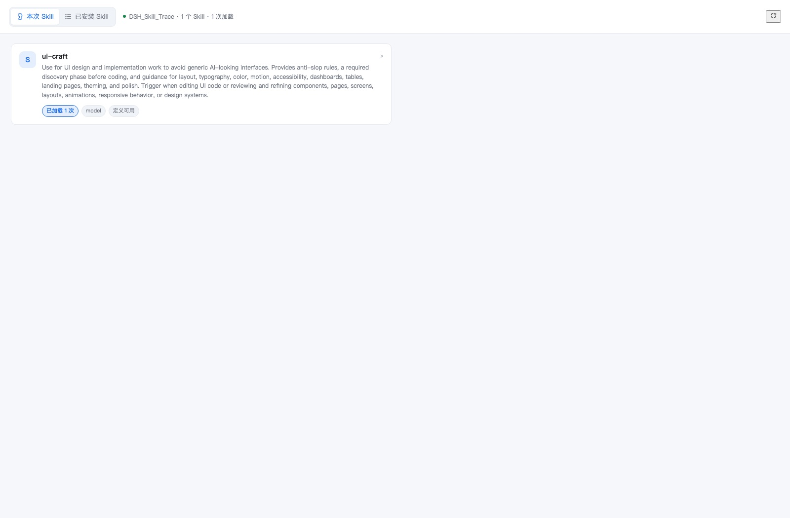
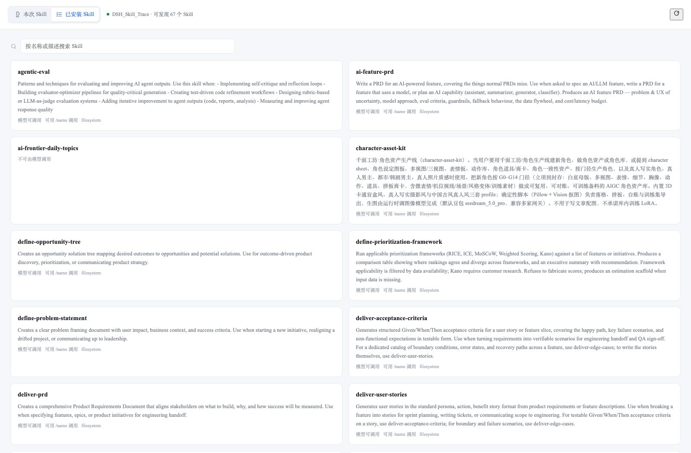
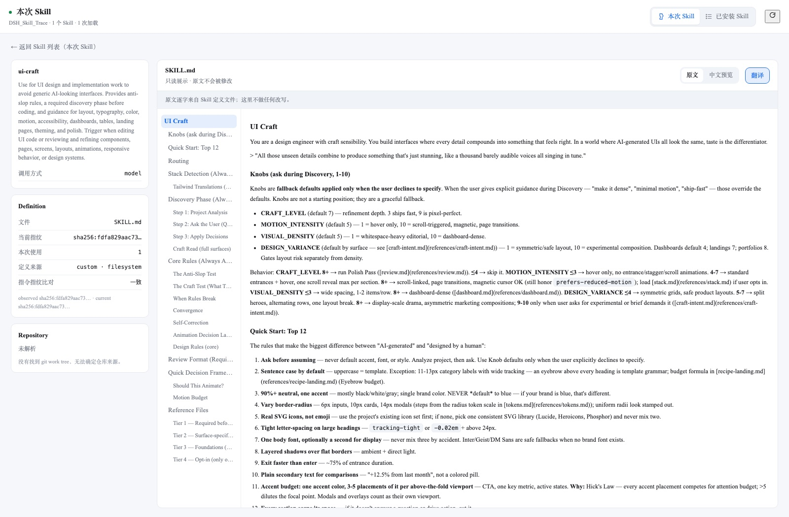
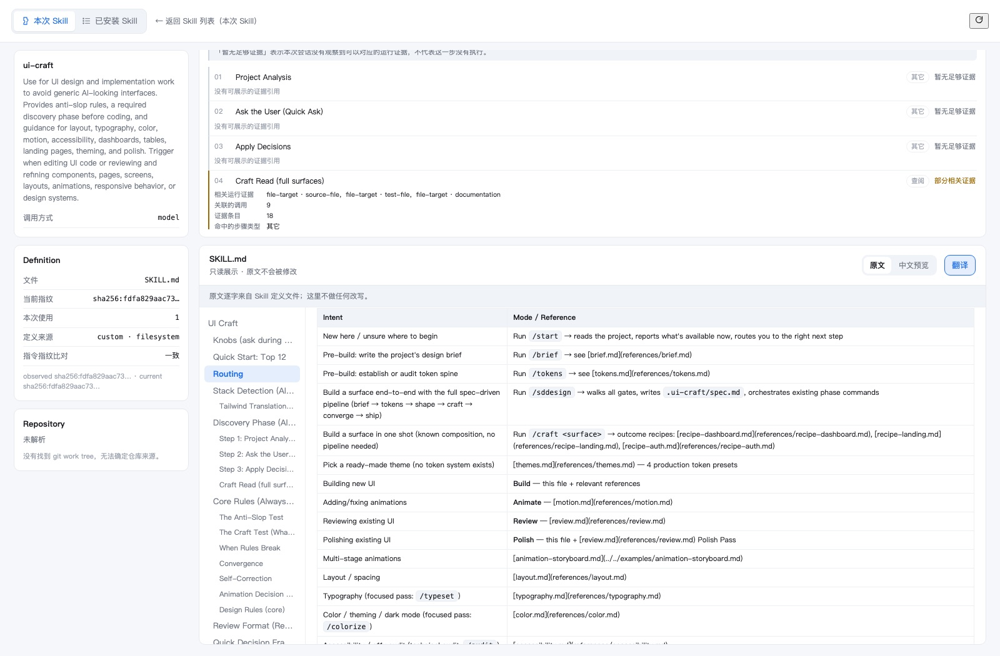
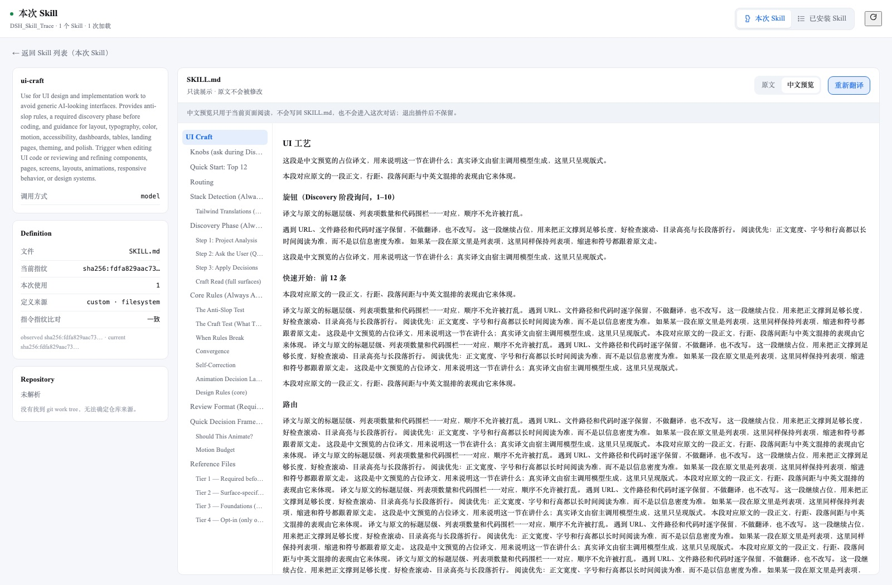
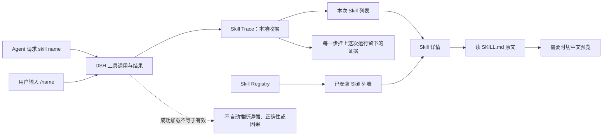

# DSH Skill 智能实验室

`dsh-skill-intelligence` · [](https://www.npmjs.com/package/dsh-skill-trace)
[](LICENSE)

> 探索优秀 Agent Skill 的结构与方法，
> 将成熟 AI 工作流转化为个人能力和企业业务能力。

DSH Skill Intelligence 是面向 DeepSeek Harness 的 Agent Skill 研究与演进工具。

通过 **Skill 洞察**，用户可以：

- 理解优秀 Skill 的设计结构
- 分析 Skill 的运行逻辑
- 阅读和翻译 Skill 文档
- 复刻已有 Skill
- 持续沉淀个人与企业 AI 能力

DeepSeek Harness 插件 · 本地优先 · MIT · DSH 会话里的显示名：**Skill 洞察**（品牌：**DSH Skill 智能实验室**）

**它仍然只做一件事，只是名字换了：** Skill 是一级对象 —— 它声明了什么、这次会话到底加载过它、以及它的 `SKILL.md` 原文。底层能力是 **Skill Trace**（本地加载证据：`/skill-trace/*` 路由、npm 包名 `dsh-skill-trace`、存储结构都不改名），产品层是**理解 → 阅读 → 翻译 → 复刻 → 演进**。

当 Agent 自动选择 Skill 时，普通用户常常只看到结果：不知道它加载了什么、按什么步骤工作。DSH Skill Intelligence 把两件事分开摆：**Skill 声明了什么**（只来自 `SKILL.md` 正文）与**这次会话实际加载过什么**（只来自 DSH 的运行时事实）。两者不互相推断，也都不打分。

> 一次成功的 `skill(name)` 调用只证明 Agent 请求并成功加载了 Skill；**不**证明 Agent 完全遵循其指令，也不证明 Skill 导致了正确结果。插件会明确保留这条证据边界。



*第一屏回答“这次用了哪些 Skill”。截图由**真实客户端 bundle + 真实会话数据**渲染（渲染台是本地工具，不在仓库内）。*

## 快速概览

| 项目 | 说明 |
| --- | --- |
| 产品名称 | **DSH Skill 智能实验室**（英文：DSH Skill Intelligence） |
| 会话显示名 | **Skill 洞察**（英文：Skill Insight）—— DSH 侧边栏 / 工作栏 / 插件入口这类高频位置用的短名；产品品牌仍是 **DSH Skill 智能实验室** |
| 插件名称（npm / 目录 / 路由） | `dsh-skill-trace` —— **保持不变**：npm 上已发布，改名会让所有安装命令与已锚定的 `github:` 源失效 |
| 技术底座 | **Skill Trace** —— 本地加载证据；`/skill-trace/*` 路由、模块名与存储结构都属于内部技术层，不随品牌改名 |
| 适配平台 | DeepSeek Harness `web` Profile / Desktop（当前运行基线：DSH Desktop `0.11.3` / runtime `0.1.5-rc.2`；此前基线验证于 Desktop `0.8.3` / runtime `0.1.1-rc.2`） |
| 解决的问题 | Agent 加载了什么 Skill、何时加载、声明如何运行、我能否手动延续，都缺少用户可读的证据 |
| 核心界面 | **本次 Skill**、**已安装 Skill**，以及它们共用的二级页 **Skill 详情**（`SKILL.md` 原文 / 中文阅读版）；详情页左栏的对象动作里有 **复刻 Skill** |
| 第一屏 | 默认打开「本次 Skill」列表：这次会话真正加载过的 Skill（名称 / 简介 / 加载次数 / 最近加载 / 定义状态）。不需要先理解 Turn、Step 或 Runtime Graph |
| 证据范围 | 观测 `skill(name)` 的调用/结果；区分请求、成功、失败、未知与人工判断 |
| 阅读闭环 | 本次加载的 Skill（或已安装 Skill 列表里点一张卡）→ 读它自己的 `SKILL.md` → 看不懂原文时切中文阅读版 → 需要时回看它这次拿到的证据 → 想拿它当底子就复刻成自己的 Skill |
| 隐私 | 本地优先；不保存完整 Prompt、完整 Skill 正文、Token、Cookie、绝对路径或项目内容 |
| 界面语言 | 跟随 DeepSeek Harness 设置：中文显示中文，英文显示英文；运行中切换即时刷新 |
| 不做什么 | 不发现/安装/同步/路由 Skill；不自动运行脚本；不自动改写、提交或发布 Skill |

## 你会看到什么

整个插件只有**两个一级页面**，以及它们共用的**一个二级页面**。

### 1. 本次 Skill：这次用了哪些 Skill

打开就是这次会话真正加载过的 Skill 列表——**只有观测到真实加载证据的 Skill 才会出现**，当前环境里可发现但这次没用过的不在其中（那是「已安装 Skill」的回答）。

每一张卡片给出名称、声明简介，以及本次会话的加载次数、调用方式（`model` / `/name` / 未使用）和定义是否读得到。列表里没有 Tool 数、节点数和边数：Tool / MCP / CLI / Subagent 不是产品的一级对象，只作为某个步骤的运行证据出现。

### 2. 已安装 Skill：我现在有哪些可用 Skill

当前 DSH 环境可发现、可调用的 Skill，按名称排序，带一个实时过滤的搜索框（匹配名称与描述）。它**不读本次会话的收据**——不管这次加载过什么，这个列表都一样。

这一页刻意只做发现：没有学习状态、没有验证状态、没有历史理解、没有 review queue，也没有把“可发现”写成“已加载”。



### 3. Skill 详情：这个 Skill 声明了什么

从上面任一列表点进来，返回键会说明**你是从哪个列表进来的**，并回到那里。

左边是这个 Skill 的事实卡：调用方式、定义文件与**当前指纹**、本次加载次数、定义来源，以及**指令指纹比对**——把“这次运行实际收到的指令哈希”与“现在读到的定义哈希”并列，结论只有 `match` / `mismatch` / `unavailable` 三种（只有一侧存在哈希就是 `unavailable`，不会温和地写成 `mismatch`，也不会写成“Skill 已失效”，因为哈希只证明版本变化，不证明好坏）。再下面是**仓库来源**：只可能来自 frontmatter、git origin 或用户配置，找不到 `.git` 就显示「仓库 · 未解析」，**不用目录名或 Skill 名猜一个链接出来**。

主内容区从上到下是四层，顺序本身是产品的一部分：**框架 → 本次运行逻辑 → 步骤证据 → SKILL.md**。

**第一层是「Skill 框架」，它回答的是“这个 Skill 由什么组成”。** 框架不是那条 `01 → 02 → 03 → 04`——那只是 `SKILL.md` 里某个小节的有序列表，是一个 342 行能力包的一小部分。框架由三个子模块组成：

- **结构**：把正文按标题层级切成小节，归入八个角色（定位 / 触发 / 规则 / 控制 / 工作流 / 资源 / 产出 / 验证），**确定性解析，不调模型**。归不进角色的小节进「其它章节」而不是被丢掉；某个角色正文里没有，界面就直说缺什么（`ui-craft` 缺「验证」），不替它补一节。
- **声明流程 · Declared Workflow**：`detail.flow.steps[]` 原样保留，现在作为框架的子模块出现，竖排成 `01 → …`，每步给出序号、标题、类型，以及本次会话里**观察**到的证据状态。
- **渐进披露 · Progressive Disclosure**：`Skill 目录 → 载入 Skill → SKILL.md 全文 → 资源基准路径 → 被引用的资源 → 按需读取`，下面按 `Tier 1 — Required` 这样的层级列出被引用的资源。对 `ui-craft` 是「39 个声明引用 · 0 个已读取」，而 **0 个已读取是这一层要说的话**：收据里没有来源证据能证明某个 `references/tokens.md` 被读过，界面就不会说读过。



**第二层是「本次运行逻辑」**：只从当前会话的收据出发，走 `目录 → 载入 → 指令 → 运行能力 → 证据` 五段，每段给出能观察到的事实和观察不到时的原因。它不是运行图，阶段之间也没有因果顺序——`Skill Load` 之后 100ms 的一次工具调用不会被画成 `Skill → Tool`。

状态词是这两层最要紧的约定。五档读作「有相关运行证据 / 部分相关证据 / 仅有模型意图 / 暂无足够证据 / 无法判断」，**「已执行」「未执行」「已完成」「已加载」「已读取」这类词一个都不会出现**——没有观察到证据，推不出没有执行，这两句话之间的距离就是整个产品的立场。**第三层「步骤证据」**把每一步已经在后端算好的依据摆出来（命中类型、观察到的节点、证据 id、是否有模型意图、匹配数），并常驻一句：「暂无足够证据」不代表这一步没有执行。

点框架里的任意一节、任意一个资源、或声明流程里的任意一步，右侧文档会滚到对应章节并短暂高亮——用的是同一套锚点机制，**有锚点的渲染成按钮，没锚点的渲染成不可点的行**。不跳页，不打开任何运行图。

再往下才是 `SKILL.md` 本身，只读展示，两个模式：

- **原文**：逐字来自定义文件，这里不做任何改写；
- **中文阅读版**：把正文交给宿主模型翻译，用于**当前页面阅读**。标题层级、代码围栏、围栏内的命令、行内代码、URL、文件路径、frontmatter 键都由宿主的规则逐条校验，对不上就不接受。**译文存在本机**（`<dataRoot>/translations/`，按「Skill 名 + 正文指纹 + 语言」索引，不含会话），退出 DeepSeek Harness 后再打开同一个 Skill、还是同一版正文，就还是这份译文，不会重新请求模型。正文一改，指纹就变，旧译文**不再显示**，界面退回原文并允许重新翻译。译文**不写回 `SKILL.md`**、不进收据、不进这次对话。保存态是真的写成功才说：宿主没写成，界面就直说「中文阅读版没有保存到本机，下次打开需要重新翻译。」

左侧目录跟着当前显示的那一份走：切到中文阅读版时，目录锚定的是**译文里对应的标题**，而不是原文行号。

表格按 GFM 渲染成真正的表格（此前 `ui-craft/SKILL.md` 里 101 行以 `|` 开头的内容会退化成一串竖线）：



原文与中文预览共用**同一个**渲染器调用点，所以标题、列表、代码围栏与表格在两种模式下行为一致：



边界同样是产品的一部分：定义正文**永不落盘、永不进收据**，只在当前会话上现读现返；资源基的绝对路径只暴露类别不暴露路径；凭据型仓库地址（`https://user:token@…`）整条拒绝，不剥离也不半显。

## 工作方式



列表只有一条来路：**加载证据**。详情只有一条来路：**定义文本**。运行时证据只往已有步骤上挂标注，既不增加、也不删除、不改名、不重排步骤——反过来用运行时事件推断出一条流程，是这一版刻意排除的做法。

## 三步开始

### 1. 安装

从 GitHub 安装（锚定本次发布的 tag）：

```bash
dsh plugin --profile web add "github:PolinniZhong/dsh-skill-intelligence#v1.0.0&path:/"
```

或从 npm 安装（npm 上现在最新的就是 `1.0.0`，`beta` 与 `latest` 都指向它）：

```bash
dsh plugin --profile web add dsh-skill-trace@1.0.0
```

安装后重启 DeepSeek Harness Desktop，在会话中打开 **Skill 洞察**。

> 当前功能已通过本地链接安装的 Desktop 验证。`dsh plugin add` 会把包名参数转交 pnpm 解析，所以 npm 包名与 `github:` 源两种写法都可用；如未来 DSH 更新导致源安装行为变化，可使用下方的克隆安装作为回退方式。
>
> npm v12 起 `--allow-git` 默认是 `none`。上面两条命令走的是 `dsh plugin`（pnpm 通道），不受影响；只有直接用 **npm** 从 git 装（`npm i github:PolinniZhong/dsh-skill-intelligence#v1.0.0`）才需要加 `--allow-git=all`。本包 `dependencies` 为空、没有任何安装脚本，所以**不需要** `npm approve-scripts` 放行。

### 2. 跑一次真实任务

让 Agent 自然加载一个 Skill。若本次没有观测到任何 Skill，插件只显示“当前对话暂未加载任何 Skill”的空状态，不会填入示例数据。

### 3. 读它的 SKILL.md，不要停在列表

点开任意一张卡片，进入 **Skill 详情**。右侧是这份 Skill 的 `SKILL.md` 原文——逐字来自定义文件，不重排、不摘要、不改写；左侧的目录由正文标题确定性抽取，跟着当前显示的那一份走，点一下跳到对应位置。

需要中文时切到「中文阅读版」。这**不是**把 `SKILL.md` 改写成中文：代码围栏、URL、文件路径、行内代码与 frontmatter 都按原样保留，模型只翻译正文；译**存在本机**，按「Skill 名 + 正文指纹 + 语言」索引，退出 DSH 再打开、正文没变就还是它，正文一变就不再显示。它**不写回文件、不进入这次对话**。翻译失败时分段控件会回到「原文」，错误摆在最上面，原文不受影响。

看到一份值得学的 Skill，左栏对象区里有 **复刻 Skill**：给它起个名字、选当前项目还是我的 Skill、选复刻整包还是只要 `SKILL.md`，插件就读源、写新目录、回读校验。它**不改源**、**不覆盖同名 Skill**、**执行不了 Skill 里的 `scripts/`**，也**不显示任何本地绝对路径**。完成后它说三件事：写到哪、目录刷新观察到没有、源有没有被动过——最后一件是重新读源比对哈希得出的，不是一句保证。目录刷新观察不到时它会直说「待确认」并告诉你重启后一定可见。

左栏的事实卡回答的是**这次会话实际发生了什么**：本次加载了几次、每次用的哪种调用方式、加载时收到的指令哈希与现在读到的定义哈希是否一致（一致 / 文件已改变 / 无法比对）。声明是 `SKILL.md` 说的，观测是收据记的，插件从不把两者混成一句「Skill 有没有被正确执行」。

## 本地开发与回退安装

```bash
git clone https://github.com/PolinniZhong/dsh-skill-intelligence.git
cd dsh-skill-intelligence
npm test
npm run verify
dsh plugin --profile web add "link:$(pwd)"
```

移除插件：

```bash
dsh plugin --profile web remove dsh-skill-trace
```

移除插件不会自动删除已有本地收据；删除应始终由用户在产品内明确确认。

## 隐私与边界

- 不实现遥测、云同步、收据上传或远程分析。
- 只保存显示加载证据所需的最小元数据与安全来源标识。旧版本写入过的人工笔记与验证结果仍留在收据里，但 v0.6 已移除写入入口（学习工作台随信息架构一起删除）。
- 不保存完整 Prompt、完整 Skill 指令、访问 Token、Cookie、凭据、绝对路径、项目文件或生成内容。
- 网络、模型、MCP、脚本、权限只会作为**候选线索**呈现，仍需要人工核对；“可手工延续 / 可部分延续 / 当前受阻”也必须由用户自己判断。

详见 [隐私说明](docs/PRIVACY.md) 与 [架构说明](docs/ARCHITECTURE.md)。

## 当前状态

当前公开版为 `1.0.0`——GitHub Release（tag `v1.0.0`）与 npm 上是**同一份构建**。这一版是 **V1.0「Skill 评测」**（`FR-EVAL-*`）：把 V0.10.0 那份一次性生成的实例验收任务固化成可以反复使用的**评测 Case**，记录每次运行的条件（模型 / Provider / 推理档位 / 上下文窗口 / 插件版本 / 会话日志游标）与四段可观察事实（触发 / 加载 / 使用 / 结果，每段写明它够不着什么），并只在**同一个 Case** 内做两侧对照（改前 vs 改后、基线 vs 加上 Skill）——条件对不上就不给对照。**不给分、不排名、不做 benchmark、不产出任何聚合指标**，也不替你跑任务；判定由人给，没给就是「无法判断」，沉默不折算成「未通过」。它新增一处本机落盘（`<dataRoot>/evaluation/`，用户 2026-10-05 已授权）与第 13 条宿主路由 `POST /skill-trace/evaluation`，**不新增页面、不新增导航**。发布口径：**636 项测试 · 30 组守卫 · 13 条路由 · 客户端 4284 行 · bundle 228715 字节**（source hash `54bee3888d0299d8`）。逐条见 [CHANGELOG.md](CHANGELOG.md) 的 `## 1.0.0`。上一版 `0.10.0`（**V0.10.0「Skill 实例验收」**）：只有存在一次真实的本次修改时，详情页「本次修改对比」卡里才会出现 `[生成实例验收]`，按这次改动生成一份**确定性**的测试 Prompt 与一组**疑问句**观察项；插件只生成、不运行、不判定、不评分（发布口径：590 项测试 · 29 组守卫 · 12 条路由 · 客户端 3625 行 · bundle 189256 字节）。再上一版 `0.9.2`（V0.9.0「Skill 验收」+ V0.9.1「Skill Modify」+ V0.9.2「已安装列表排序」）的发布口径是 561 项测试 · 28 组守卫 · 客户端 3448 行 · bundle 170324 字节。


上一版 `0.8.0`（**V0.8「Skill 演进」**：复刻出来的副本与它的来源，现在可以比对了）：GitHub Release（tag `v0.8.0`）与 npm 上是**同一份构建**，npm 的 `beta` 与 `latest` 在它发布时都指向它。这一版加了**一条宿主路由**（`GET /skill-trace/diff`，共 11 条）、**三个模块**（`src/core/skill-lineage.mjs`、`src/core/skill-diff.mjs`、`src/storage/skill-lineage-store.mjs`）与**两块界面**（详情页左栏的「Skill 演进」卡，以及它打开的「Skill 差异」面板），并把此前两笔攒着的改动一起带上——「Skill 洞察」短显示名与「复刻 Skill」的请求体缺陷修复。npm 包名仍是 `dsh-skill-trace`，`/skill-trace/*` 路由、模块名与存储结构一个字没动。中间跳过的 `0.5.0` 与 `0.6.0` **只在 GitHub**，所以 npm 的版本号从 `0.4.0-beta.66` 直接跳到 `0.6.1`，再到 `0.7.0`、`0.7.1` 与 `0.8.0`。信息架构没动，四层仍是：框架（结构 + 声明流程 + 渐进披露）→ 本次运行逻辑 → 步骤证据 → `SKILL.md` 原文与中文阅读版。一级页面仍是两个——「本次 Skill」与「已安装 Skill」，两者点进同一个二级页「Skill 详情」，返回键写明是从哪个列表进来的。运行流程、运行图谱、Skill 收据、上下文检查器与「我的 Skill」学习工作台自 `0.5.0` 起保持删除状态，连同只服务于它们的 `elkjs` 与 `@xyflow/react` —— 相比它们还在时的 3536 行，客户端源码现在是 **2735 行**，bundle **142672 字节**，宿主路由 **11 条**。

**`0.9.2` 里的三批改动。** V0.9.0「Skill 验收」、V0.9.1「Skill Modify」与 V0.9.2「已安装列表排序」都已实现、通过全部守卫与测试、并已通过真机验收（发布口径：**561 项测试 · 28 组守卫 · 12 条路由 · 客户端 3448 行 · bundle 170324 字节**），逐条内容见 [CHANGELOG.md](CHANGELOG.md) 的 `## 0.9.2`。三批都不新增页面：① **验收**把「这个 Skill 现在符不符合规范」做成一屏确定性事实（五个 Profile、三态结论、每条发现落在规则 id 上，**没有模型调用**，也不新增路由）；② **修改**让用户写一句意图、勾范围与验收目标，然后由**当前会话的 Agent** 在原生对话里改——插件只把「改前」存进宿主内存、用 `agent.followup()` 代发一条消息，**自己不写任何文件**，来源指纹变了也只说「来源 Skill 在本次修改期间发生变化」；③ 已安装列表改成按**「这个 Skill 什么时候出现在本机」倒序**，读不到时间的如实报数并按名称排在最后，卡片上只说例外（日期只到 `MM-DD`、有血缘才有 `复刻自 X`、默认成立的调用方式与 `filesystem` 一个字都不写）。

**`0.8.0` 里的三件事。** ① **V0.8「Skill 演进」**：详情页左栏多一张「Skill 演进」卡（只对由本插件复刻出来的 Skill 显示），它打开一个「Skill 差异」面板，逐层比较副本与来源的**结构 / 内容 / 资源**。判据仍然是「只说得出证据的话」：读不到来源时面板直说「当前无法读取来源 Skill，无法完成差异比较。」并**不渲染任何列表**——绝不能退化成一张「没有变化」的空表；来源指纹变了就说变了，说不清就说说不清，界面里一个好坏判断词都没有。**宿主那半要重启 DSH 才会换成新句子与新路由**（客户端那半硬刷新浏览器即可）。② **短显示名**：DSH 会话内的显示名从「DSH Skill 智能实验室」改为「**Skill 洞察**」（英文 **Skill Insight**），只影响侧边栏 / 工作栏标签与面板的无障碍名称——产品品牌、npm 包名、路由与存储结构都不变。③ **「复刻 Skill」的请求体缺陷**：宿主 `handleClone` 必需 `sessionId`，而客户端没有发、详情页也没有传，所以**从 `0.7.0` 起这个按钮一次都没有成功过**，用户点下去只拿到一句 `sessionId 必填`；现在客户端补上了这个字段，宿主也不再靠正则猜消息决定状态码，校验失败一律说人话。

**`0.7.0` 把产品从「观察 → 理解」推进到「观察 → 理解 → 阅读 → 复刻 → 让当前 Agent 继续用」，三个能力都落在已有页面里，没有新增一级或二级页面。** 一是**已安装 Skill 的卡片整张可点**：它此前是个纯展示的 `article`，只能看不能进，现在点一下就进**同一个** `SkillDetailPage`，返回键照旧写明是从哪个列表来的；卡片里**没有**再加一个「查看详情」按钮——两个入口指向同一个动作，其中一个必然多余，渲染烟测直接断言这个页面的按钮数恰好等于卡片数。二是**中文阅读版从「临时」变成「资产」**：译文落到 `<dataRoot>/translations/`，按「Skill 名 + 正文指纹 + 语言」索引、**不含会话 ID**（它是资产，不是某次会话的产物），退出 DSH 再打开、正文没变就直接用，正文一变就退回原文并允许重译。保存态是真的写成功才说——宿主在 `/translate` 的响应里回一个 `saved` 布尔，没写成界面就直说「中文阅读版没有保存到本机，下次打开需要重新翻译。」三是**复刻 Skill**：详情页左栏对象区里唯一的对象级动作，弹一个 560px 的紧凑对话框（名字、当前项目还是我的 Skill、复刻整包还是只要 `SKILL.md`）。它只读源、只写新目录，`mkdir` 不带 `recursive`，所以**同名不覆盖**是文件系统的性质而不是一段记得住的判断；`sourceSha256` 随请求提交、宿主重新读源再校验，对不上就 409 让用户重开详情页；副本的 frontmatter `name:` 会被改写成目标名（DSH 认 frontmatter 不认目录名）；写完之后**必须回读**再报成功，并且重新读一遍源比对哈希、如实说源有没有被动过。它**不执行** Skill 里的 `scripts/`、不跑 bash、不触发 Agent，也**不返回任何本地绝对路径**。目录刷新是**观察**出来的——插件拿不到 provider 的 `invalidate`，观察不到就写「待确认」并说明重启后一定可见。

**`0.5.0` 之后，Skill 详情内部陆续加了几样东西，信息架构没动。** 先是**真正的 GFM 表格渲染**——此前 `ui-craft/SKILL.md` 里 101 行以 `|` 开头的内容全部退化成竖线串；同一版给翻译加了表格结构校验：单元格里的自然语言照翻，表格的行列形状不许变。

接着是把**「Skill 框架」重做了一遍**。第一版把框架做成了从正文里抽出的那条竖排链条，结果 `ui-craft` —— 342 行、11 个小节、39 个外部资源 —— 在界面上被说明成四步。**声明流程是一份 Skill 的一部分，不是这份 Skill 的形状。** 现在的框架由 `src/core/skill-framework.mjs` 从 `SKILL.md` **确定性**解析（无模型调用）：小节分类进八个角色，未归类的进「其它章节」而不是消失，缺哪个角色就直说缺哪个，被引用的资源按层级列出来并严格区分「声明」与「已读取」。`detail.flow` 一个字没删，只是降级成框架的一个子模块。

同一次改动加了**「本次运行逻辑」**（`src/core/skill-runtime-logic.mjs`：目录 / 载入 / 指令 / 运行能力 / 证据五段，每段只列当前会话能观察到的事实）与**「步骤证据」**（把 `detail.flow.steps[].evidence` 里早已算好的依据第一次显示出来）。四层在主内容区里的顺序由守卫盯着：框架 → 运行逻辑 → 步骤证据 → `SKILL.md`。

**声明与观测不互相推导**这条原则没有变，变的只是渲染它的界面。`SKILL.md` 的正文与目录是**声明**：逐字读取，**不经过任何模型、Embedding 或检索**。收据里的加载证据是**观测**：谁加载、加载了几次、用哪种调用方式、加载时的指令哈希是多少。v0.6 不再把两者叠成「声明流程 + 证据徽章」的中间栏——那只在旧的三栏工作台里说得通。列表只认加载证据；Run 标识不伪造（`runId` 字段刻意不存在）；仓库来源只可能来自 frontmatter、git origin 或用户配置，猜不到就显示「仓库 · 未解析」，不造链接。证据词表仍是五个值，仍然只做投影，只是不再有页面逐个渲染它。

`0.4.0-beta.66` 加入**定义视图**——三栏展示某个 Skill 的声明流程、SKILL.md 原文与目录、以及每一步当前拿到的证据等级，并把「这次运行实际收到的指令哈希」与「现在读到的定义哈希」并列比对，结论只有 `match` / `mismatch` / `unavailable` 三种（定义正文永不落盘，只在活会话上现读现返）。同一版修掉证据链路里**三处静默降级**——它们此前不会被任何测试抓到，因为每一处单看都「工作正常」：Scope 构造时丢弃了证据类别字段，导致 `npm test` 永远降级成裸能力；运行结果因为 `turn` 为 `null` 而进不了 Scope，导致 Scope 从来看不到 `success` / `failure`；声明步骤与运行时能力类别不匹配时直接判「证据不足」，导致「模型确实表达了这一步意图」这个事实根本没有机会被汇报。修复后，同一个 Turn 内的 Skill 加载与 `bash npm test` 已经能给出 `resolution=matched status=success category=test`。

上述实现已通过 **561 项自动化测试**与 **28 道静态合同守卫**，覆盖两个一级列表页、唯一二级页、中文阅读版的持久化边界（键里不许有会话、不许落盘不该落的东西、退出重启后还能取到、指纹变了就不显示）、「已安装」投影里不得出现绝对路径或定义正文，以及 v0.5.0 之后的 Skill 详情增强（声明流程只从定义抽取、证据状态词表不许说出「未执行」、框架只从正文确定性解析而不调模型、声明资源不得写成已读取资源、表格渲染与翻译表格校验共用一个解析器、原文与中文阅读版只有一个渲染调用点）。复刻那一块单独成组：目录解析、整包选取、符号链接绝不跟进副本、同名不覆盖且不先删后写、半途失败要把目录清掉、回读校验、`409` 分得清「源变了」还是「名字被占了」、以及响应里永远没有绝对路径。守卫里有一类值得单说：它们断言的是**今天仍然成立的事实**。第 5 步删掉 3536 行里的 22 个组件时，`verify-project.mjs` 的客户端契约里有 45 条断言在描述已经不存在的界面——其中大多数之所以还能通过，只是因为那句文案还留在英文字典里，而字典项没有消费者。契约清单因此重写成 28 条，并**反向**钉住那 15 条已删的宿主路由与 `buildRuntimeGraph` / `computeRuntimeLayout` / `buildCatalogView`：删掉的东西不该悄悄回来。界面验收仍是两层：渲染台用**真实客户端 bundle + 真实会话载荷**逐张核对（首屏、已安装列表、**点已安装卡片进入详情**、详情原文、详情里的表格、中文阅读版**已保存**态、本机没有这一版译文时回落到原文、翻译失败态、**复刻对话框**、复刻成功、目录刷新**待确认**、整包被上限截断、同名 `409` 错误就地显示），返回的 JSON 中不含任何绝对路径；两个升级缺陷（React #310 白屏、旧偏好里的缺省 `map`）是在**运行中的真实 DSH** 里用 CDP 复现并复验的。**仍未覆盖的一层是人眼走查**：以上都是无头浏览器截图，最终在 DSH Desktop WebView 里由人确认断点与可读性，留给发布会话。

`0.4.0-beta.7` 修复了 DSH 会话格式 V3 → V4 迁移带来的静默证据丢失：V4 把工具结果提升为一等 `tool` 消息并取消了 V3 的 `tool-result` 包裹块，而观察器只认包裹块，导致迁移后的会话仍报告“已加载”，却不再产生指令指纹、候选步骤与版本变化。现在两种格式都能读取，并新增了基于真实 V4 事件样本的契约测试。

`0.4.0-beta.8` 补齐观测面。此前只订阅工具事件，因此用户以 `/名称` 显式加载 Skill 时（DSH 以 `user/message` 注入，不产生 `skill` 工具调用）在收据里完全不存在；实测同一次会话中两次 `/character-asset-kit` 加载此前全部不可见，现在都能给出指令指纹与候选步骤。同时把 DSH 持久化发布的 Skill 目录作为声明基线记录下来，并把每个工具调用保留为有限的运行证据——工具、CLI、MCP、Subagent 调用本来就到达事件流，只是被入口丢弃，这正是运行图谱缺少原料的原因。运行证据只保留关联与分类元数据，不读取参数与结果内容。

`0.4.0-beta.9` 把运行事件归一化成统一的 `RuntimeEvent` 模型，并按 `invocationId` 聚合成 Invocation。每个事件带 `source`（`dsh` 宿主事实 / `derived` 具名规则派生）与可引用的 `eventId`；派生事件只会追加，绝不覆盖它读过的事件，且必须能说出依据的规则名（目前一条：`same-turn-repeat-after-failure`，用于识别同一 Turn 内失败后的重试）。聚合严格按 `invocationId` 配对，不使用时间相邻，因此没等到结果的请求保持 `unresolved-request`、没有请求的结果保持 `orphan-result`，不会被"就近补全"。Skill 证据仍然即时落盘，运行证据改为在 Turn 边界持久化——它是可以从会话日志重建的派生证据，而每次工具调用都重写整个收据会把同一个不断变大的文件写上百次。本版不上 UI。

`0.4.0-beta.10` 加入关联引擎与图谱重建。规矩只有一条，且高于其余所有：**图可以不全，但不能错**。每条边必须能引用收据里真实存在的事件，引用不到就丢弃并计入 `droppedEdgeCount`，不会降级成一条更弱的说法；无法确定归属的调用列进 `unlinked` 并附原因，不会挂到最近的节点上。包含关系（会话→Turn→调用）与 Subagent 派生是 `observed`，因为它们基于宿主事实（`turn`/`step` 与父会话发出的 `subagent/catalog.childId`）；唯一的启发式是"同一步骤内相邻"，且只标 `candidate`。目录事件里的自由文本 `label` 刻意不读——那是调用方文本。边的词表是封闭的：没有 `uses`、没有 `produces`（把工具调用归因给 Skill 需要对齐证据），也没有任何能表达"因果"的边类型。本版不上 UI。

`0.4.0-beta.11` 加入 **Declaration ↔ Runtime Alignment**——这是整个产品的分水岭。三条承诺：**不评分**（只报告证据状态计数，没有遵循率、百分比或排名）；**证据不足不等于没有执行**（没有对应证据的声明步骤记为 `insufficient`，词表里刻意没有 `not-observed`，因为缺失的数据永远无法证明 Agent 跳过了某步）；**直接证据不等于泛化证据**（`bash` 只证明"执行了某条命令"，不能证明就是测试步骤，所以只记为 `partial`）。

同时修掉了一个真实缺陷：声明步骤抽取此前只抓有序列表，在真实技能上抽出的 5 条全是条件分支与内容分类，而 **7 条真正的流程步骤一条没抓到**。现在改为**标题层级 + 有序列表双通道**且标题优先，实测 `ai-frontier-daily-topics` 正确给出 7 条真实步骤。另外，把 `## 硬约束` 里的条目当成"流程步骤"是错误标注，因此有序列表只在**流程类章节内**（或整篇无章节时）才计入——正文不声明流程的技能会明确说 `numbered-items-outside-a-process-section`，而不是把约束升格成对齐对象。本版不上 UI。

`0.4.0-beta.13` 加入**运行图谱画布**——插件里的第三个视图，也是 `beta.5` 以来第一次改动界面。按重构方案的硬约束**先量后决**：本机 56 个真实会话的图谱规模是**中位 61 节点、p90 915、最大 1095**，比扁平画布能承受的量大一个数量级，所以**分组是模型的一部分，不是事后优化**。三条规则依次生效：单个 Turn 超过 12 次调用→按能力折叠；会话超过 36 个 Turn→折成区间；单层超过 26 行→换列。它们把画布稳定压在 **200 节点以内、约 1036px 高**，56 个会话**无一超限**（布局耗时中位 0.3ms，最差 15ms）。

布局是图的纯函数：不存坐标、不记视口与缩放、不改动图本身——同一份收据永远画出同一张图，所以重绘不会被误读成新证据。**检查器**逐节点/逐边回答"这条线为什么存在"，每条关系都同时给出**含义**与**它不表示什么**（`follows` 是日志顺序不是因果；规则派生的 `spawns` 归属不是宿主事实；`retries` 不代表重试更接近成功），并携带 `causal/compliance/correctness: false` 的证据边界。画布只发计数不发 id 列表，细节按需重新推导——最大会话的响应从 **481KB 降到 145KB**（中位 21KB）。
上面的逐版说明只写到 `0.4.0-beta.13`，**完整历史见 [CHANGELOG.md](CHANGELOG.md)**（当前已到 `1.0.0`）。
以下是 `beta.14` 以来的主线：

- **`beta.14`–`beta.30`**：`My Skills` 目录页、指纹预留结构、五层运行时模型（会话 → Turn → 能力 → 调用 → 结果）、
  证据优先的 UI 治理收口
- **`beta.31`**：回改三处实现偏离，统一配色 Token（宿主 Token 优先，实现值为回退）
- **`beta.32`–`beta.42`**：按 `preview.html` 对齐视觉与交互；建立**真实插件静态渲染台**，
  运行流程的阅读密度从 195 节点降到 16–22 节点（100% 缩放可读）
- **`beta.43`–`beta.48`**：修掉**四个「功能写了、测试通过、产品里没有」的缺陷**——

  | 缺陷 | 根因 |
  |---|---|
  | 阅读视图看不到 Skill | 边界循环把 `skill × 1` 并进 `mixed` 分组，类型标签丢失 |
  | Skill 三个 Tab 从未出现 | inspect 的折叠节点没带 `capabilityId` |
  | Error 态页头与正文矛盾 / Tab 无标签 | 未区分"正在读"与"读失败"；标签表缺键 |
  | 选中 Skill 却提示"先选 Skill" | `skillLoads` 记调用 id，与分组 id 匹配不上 |

  共同根因：**折叠分组是布局层合成的，而周围代码都按"调用节点"设计。**
- **`beta.49`–`beta.52`**：节点字重复与图标来源修正、折叠分组缝隙系统性核查、补齐知识管理
- **`beta.53`–`beta.57`**：公开范围收敛。产品主张、需求与技术设计纳入公开仓库
  （过程目录 `00_` / `01_` / `99_` 与 `specs/` 仍留在本地），`.gitignore` 的注释改写为说明理由
- **`beta.58`–`beta.59`**：**Contextual Inspector**（Expanded / Collapsed / Rail）与
  **Skill Runtime Scope 的画布表达**。运行图谱默认折叠为 26px Rail，画布释放 314px；
  范围成员用 `data-in-scope` 淡淡标注，**不画包围盒、不画连线**，且只有 observed / correlated 参与
- **`beta.60`**：**Dark Mode 改为 Token 化**。14 个 `--st-*` 指向 DSH 的 `--dsw-alias-*`，
  不再维护第二套 CSS 与 `isDark` 状态
- **`beta.61`–`beta.63`**：**Layout Contract 修复**。详见下节
- **`beta.64`**：知识管理同步与根目录收敛（无代码改动）
- **`beta.65`**：**消除 `correlated` → `observed` 的静默提升**。区分「证据强度」（事件是否在可靠
  Scope 内）与「证据指向」（它是否指名了声明步骤所指的那个对象）两个正交轴；同 Turn 不再等同于归属
- **`beta.66`**：**定义视图** + 证据链路三处静默降级修复 + 证据词表收敛为 5 值 + 全库颜色字面量清零。
  详见上文「你会看到什么」第 4 节与 [CHANGELOG.md](CHANGELOG.md)
- **`beta.67`**：**Skill-first 信息架构**——第一屏从运行流程图换成「本次 Skill」，运行流程 / 运行图谱 /
  Skill 收据一并收进「高级 ▾」。这是**结构性重构，不是加第四个视图**。测试 382 → 406；
  随后一个修复把「拉不到列表」与「没有加载过 Skill」分开，到 407
- **`beta.68`**：修掉两个**只在真实应用里出现**的升级缺陷——Skill 标签页因为 hooks 排在提前 return
  之后抛 React #310 而整片空白；旧偏好文件里的缺省 `map` 被当成用户选择，导致升级后第一屏仍是
  运行流程图。两道源码文本层守卫（Hooks 顺序、偏好版本一致）就是这一版加的。测试 407 → 412
- **`beta.69`**：**SDD v0.6 结构性重构**——一级页面收敛为「本次 Skill」与「已安装 Skill」，
  运行流程 / 运行图谱 / 收据 / 上下文检查器 /「我的 Skill」学习工作台全部删除，新增只读且只存内存的
  中文预览。客户端 3536 → 1345 行，bundle 421 → 52 KB，宿主路由 22 → 7 条，测试 440 → 357
  （17 个测试文件只测已删界面）
- **`0.5.0`**：**首个正式版**——`beta.67` / `.68` / `.69` 三版从未单独公开，内容一并包含在这一版里。
  插件代码与 `0.4.0-beta.69` 逐字节相同，改动只在版本号与发布资产；**这一版只发布在 GitHub**，
  npm 上的 `latest` 仍是 `0.4.0-beta.66`
- **`0.6.0`**：**Skill 详情四层**——「Skill 框架」不再等于那条 `01 → 02 → 03 → 04`：框架改由
  `src/core/skill-framework.mjs` 从 `SKILL.md` 确定性解析出**组成结构**（八类小节 + 未归类章节 + 资源层级），
  `detail.flow` 降级成框架里的「声明流程」子模块；新增「渐进披露」（严格区分声明资源与已读取资源）与
  「本次运行逻辑」（`src/core/skill-runtime-logic.mjs`，目录 / 载入 / 指令 / 运行能力 / 证据五段，只列
  当前会话能观察到的事实）；新增「步骤证据」，把 `detail.flow.steps[].evidence` 第一次显示出来。
  主内容区顺序 框架 → 运行逻辑 → 步骤证据 → `SKILL.md` 由守卫按字面匹配。同版还包含
  `renderSkillMarkdown()` 的 GFM 表格渲染（`ui-craft/SKILL.md` 里 101 行竖线终于成了表）与翻译的
  表格结构校验。客户端 1345 → 1967 行，bundle 52 → 106 KB（108468 字节），测试 357 → 397，守卫 23。
  信息架构未动，一个页面都没加；**这一版同样只发布在 GitHub**，npm 上的 `latest` 仍是 `0.4.0-beta.66`
- **`0.6.1`**：**修一处布局塌陷**——`0.6.0` 把框架层做到 1811px 之后，详情页主内容区（一个
  `overflow:auto` 的 flex 列）里的 `SKILL.md` 面板用的是 `flex:1;min-height:0`，自由空间为负即被压成
  **2px**：表格、原文、中文预览在 1600×1050 里没有任何可读高度。面板改为自己带高度
  （`flex:0 0 auto;height:min(72vh,640px)`，内部各自滚动），实测 640px。README 的五张截图随之重拍，
  框架层与 `SKILL.md` 面板各占一张。客户端 1967 → 1970 行，bundle 108468 → 108839 字节，
  测试与守卫数量不变（397 / 23）；**这一版 GitHub 与 npm 同时发布**，npm 的 `beta` 与 `latest` 都指向它
- **`0.7.0`**：**Skill 理解与复用**——已安装 Skill 的卡片整张可点进同一个详情页（卡片里不再多一个
  「查看详情」，这个页面的按钮数恰好等于卡片数）；中文阅读版从内存搬进 `<dataRoot>/translations/`，
  键是「Skill 名 + 正文指纹 + 语言」**不含会话**，指纹一变旧译文就不再显示，界面说「已保存」必须
  真的写成功（宿主的 `saved` 布尔）；新增**复刻 Skill**——详情页唯一的对象级动作，只读源、只写新目录、
  `mkdir` 不带 `recursive` 所以同名不覆盖、`sourceSha256` 由宿主重新读源校验、副本 frontmatter 的
  `name:` 改写为目标名、写完必须回读再报成功、并重新读源比对哈希如实说源有没有被动过；不执行
  `scripts/`、不触发 Agent、不返回绝对路径。宿主路由 7 → 10 条，客户端 1970 → 2332 行，
  bundle 108839 → 129280 字节，测试 397 → 429，守卫仍是 23（`TRANSLATION_MEMORY_ONLY_OK` 改写成
  `TRANSLATION_PERSISTENCE_OK`，守的东西从「不许写」变成「哪些东西不许写进去」）。信息架构未动，
  一个页面都没加；**GitHub Release 与 npm 同时发布**，npm 的 `beta` 与 `latest` 都指向 `0.7.0`
- **`0.7.1`**：**品牌迁移**——产品名从 Skill Trace 改为 **DSH Skill 智能实验室**（英文 **DSH Skill
  Intelligence**），一句话介绍统一为「探索优秀 Agent Skill 的结构与方法，将成熟 AI 工作流转化为个人能力
  和企业业务能力。」；GitHub 仓库改名为 `PolinniZhong/dsh-skill-intelligence`（旧地址自动重定向），
  README 首屏、DSH 工作栏标签、空态文案、包描述与全部文档抬头一并换名。**只改这一层**：npm 包名
  `dsh-skill-trace`、`/skill-trace/*` 路由、`[data-plugin="dsh-skill-trace"]` 与存储结构一个字没动，
  客户端 2332 → 2339 行，bundle 129280 → 129315 字节，测试 429 与守卫 23 都不变；**GitHub Release 与
  npm 同时发布**，npm 的 `beta` 与 `latest` 都指向 `0.7.1`
- **`0.8.0`**：**V0.8「Skill 演进」**——复刻出来的副本现在能倒着看回去：详情页左栏多一张「Skill 演进」卡
  （只对由本插件复刻出来的 Skill 显示），它打开一个「Skill 差异」面板，逐层比较副本与来源的**结构 / 内容 /
  资源**。新增一条宿主路由（`GET /skill-trace/diff`；血缘随详情响应一起回，不另开路由）与三个模块
  （`src/core/skill-lineage.mjs` 174 行、`src/core/skill-diff.mjs` 527 行、
  `src/storage/skill-lineage-store.mjs` 139 行）。判据没有变，而且这一版把它推到最容易破的地方：读不到来源时
  面板直说「当前无法读取来源 Skill，无法完成差异比较。」并**不渲染任何列表**（一张空表会被读成「两边一样」），
  界面上一个好坏判断词都没有。同一版带上另外两件：**短显示名**——DSH 会话里的显示名从长品牌名改为
  **Skill 洞察**（英文 **Skill Insight**），面板 `aria-label` 同步，产品品牌 DSH Skill 智能实验室、npm 包名
  `dsh-skill-trace`、路由与存储结构一个没动；**「复刻 Skill」的请求体缺陷**——宿主 `handleClone` 必需
  `sessionId`，而客户端没发、详情页也没往下传，**从 `0.7.0` 起这个按钮一次都没成功过**，宿主顺带不再用正则猜
  消息决定状态码，校验失败改说人话（两条新守卫盯着这条缝）。客户端 2348 → 2735 行，宿主 1143 → 1292 行，
  bundle 129293 → 142672 字节（source hash `6ada68530c1fdcc2` → `f53a7ac5965b38b0`），测试 431 → **474**，
  守卫 23 → **25 组**，宿主路由 10 → 11 条。三个 Phase 的**真机走查已过**（用一份真实的复刻副本走完 12 个
  检查点；两个缺陷是真机上发现的，不是测试发现的）；**GitHub Release 与 npm 同时发布**，npm 的 `beta` 与
  `latest` 都指向 `0.8.0`
- **`0.9.2`**：**Skill 验收 / Skill Modify / 已安装列表排序**——三批一起发：① **验收**把「这个 Skill 现在
  符不符合规范」做成一屏确定性事实（五个 Profile、三态结论、每条发现落在规则 id 上，不调模型、不新增路由）；
  ② **修改**让用户写一句意图、勾范围与验收目标，由**当前会话的 Agent** 在原生对话里改（插件只把「改前」存进
  宿主内存、用 `agent.followup()` 代发一条消息，自己不写任何文件）；③ 已安装列表改成按**「这个 Skill 什么时候
  出现在本机」倒序**，读不到时间的如实报数并按名称排在最后。新增一条宿主路由（`POST /skill-trace/modify`）
  与四个模块（`src/core/skill-validation.mjs`、`src/core/skill-modification.mjs`、`src/core/skill-profiles.mjs`、
  `src/storage/modification-snapshot-store.mjs`）。客户端 2735 → 3448 行，宿主 1292 → 1625 行，
  bundle 142672 → 170324 字节（source hash `f53a7ac5965b38b0` → `66dd0b76118e7b85`），测试 474 → **561**，
  守卫 25 → **28 组**，宿主路由 11 → 12 条。三批的**真机走查已过**（2026-10-03）；**GitHub Release 与 npm
  同时发布**，npm 的 `beta` 与 `latest` 都指向 `0.9.2`
- **`V0.10.0`（2026-10-05）**：**Skill 实例验收**——在详情页「本次修改对比」卡里按这次改动生成一份确定性的测试 Prompt 与观察项（`src/core/skill-instance-test.mjs`，571 行、零依赖，客户端第 8 支 `require`），Prompt 与观察项**物理分离**，插件**不运行、不判定、不打分**、**不新增路由**。客户端 3448 → 3625 行，bundle 170324 → 189256 字节（source hash `66dd0b76118e7b85` → `faed5e9cef7db24c`），测试 561 → **590**，守卫 28 → **29 组**，宿主 1625 行 / 12 条路由不变
- **`1.0.0`（2026-10-05）**：**Skill 评测**——把 V0.10.0 那份一次性的实例验收任务固化成可重复的 **Evaluation Case**（`src/core/skill-evaluation.mjs`，565 行零依赖纯函数，客户端第 9 支 `require`）：Case 身份 = `sha256(六行哈希输入)`，绑定生成它的那一版 Skill；每次运行由宿主从会话日志与收据里取**条件**（模型 / Provider / 推理档位 / 上下文窗口 / 插件版本 / 日志游标）与**四段证据**（触发 / 加载 / 使用 / 结果，每段写明够不着什么），客户端只交判定与结果；同一个 Case 只在两侧条件可比时给逐条对照（改前 vs 改后 / 基线 vs 加上 Skill），条件对不上就不给对照。新增第 13 条宿主路由 `POST /skill-trace/evaluation`（第二处真的会写文件的路由）与一处本机落盘（`<dataRoot>/evaluation/`，`0700`/`0600`，上限 200 个 Case / 每 Case 50 次运行）。**不给分、不排名、不做 benchmark、不聚合、不自动跑。** 客户端 3625 → 4284 行，bundle 189256 → 228715 字节（source hash `faed5e9cef7db24c` → `54bee3888d0299d8`），测试 590 → **636**，守卫 29 → **30 组**，宿主 1625 行 / 12 条路由 → 1844 行 / 13 条；**GitHub Release 与 npm 同时发布**，npm 的 `beta` 与 `latest` 都指向 `1.0.0`

### Layout Contract：为什么嵌入插件不能按视口高度布局

Skill Intelligence 运行在 DSH 内部，因此

```
Browser Viewport ≠ DSH Content Area ≠ Plugin Content Area
```

插件高度必须**测量宿主**（向上找最近一个有确定高度的祖先，取其底部到本插件顶部的距离），
发布为 `--st-host-h`，**不使用 `100vh` / `100dvh` / `calc(100dvh - Npx)`**。

**`beta.63` 修掉的一个真实缺陷值得记录**：插件根规则（承载 `font-size` / `line-height` /
`height` / `overflow` / `color` / `background`）曾被嵌套在 `@media(max-width:1050px)` 内部——
起因是**删掉了一个本该闭合媒体查询的花括号**。后果是桌面宽度下该规则**完全不生效**：
`font-size` 回退到宿主的 16px（整个 UI 大一号），`height` 塌成内容高度（运行图谱只占顶部一小块）。

**337 项测试当时全部通过**，因为没有一条测试把样式表当 CSS 解析。现在由
`test/layout-contract.test.mjs` 守住：根规则必须位于 brace depth 0、必须携带
排版与布局基准、高度链禁止视口单位、花括号必须配平。

> 这四个缺陷**都不是测试发现的、也不是读代码发现的——是截图与真实数据发现的**。
> 项目为此加了三层守卫：真实渲染冒烟测试、渲染台截图、字段可达性契约测试。


仍待验证：真实 DSH Desktop WebView 里的人眼走查（亮/暗主题与 1180 / 980 两个断点下的可读性），以及系统级无障碍审计。渲染台截图不能替代它——渲染台不加载宿主主题，也不在真实的可滚动容器里。

## 开发与验证

```bash
npm test
npm run verify
npm pack --dry-run
```

当前包含 **636** 组自动化测试（`0.10.0` 发布口径是 590 组，`0.9.2` 是 561 组），覆盖事件归并、来源快照、Schema 迁移、收据与偏好持久化、已安装 Skill 投影、并发原子写、清空维护屏障、Host 隐私策略、DSH 会话格式 V3/V4 的 `tool/result` 契约、Phase 0 观测面、Phase 1 运行事件模型、Phase 2 关联与出处（SDD §17.4 假关系测试）、Phase 3 对齐（双通道声明抽取、证据状态语义、"证据不足≠没有执行"、泛化证据只记 partial、无评分守卫）、Skill Runtime Scope（同 Turn 结构边界、同一 Turn 两次加载都判 unlinked、拒绝时间相邻）、定义视图（frontmatter 解析、ATX 标题目录与行号、仓库来源四种解析路径、凭据型 remote 整条拒绝、绝对路径不外泄、定义指纹三态比对）、**v0.6 信息架构**（两个一级页面、共用的二级详情页、返回键跟随来源、已安装投影不含绝对路径与定义正文、列表不触发全文加载、已安装卡片整张可点且这个页面不多一个按钮）、**中文阅读版的边界**（只读、按 `sourceSha256` 绑定、围栏与路径逐字保留、违规检测；v0.7 追加：持久化键不含会话、八类禁止字段一律拒绝写入、`0700`/`0600` 与原子 rename、重启后仍能取到、指纹或语言不匹配读作「没有」而旧文件仍在、精确三字段删除、`pruneVersions` 保留最新、损坏 JSON 只计入告警不抛错）与**声明流程的证据词表**（五档与 `ALIGNMENT_RELATIONSHIPS` 一一对应、八个禁用词一个都不许出现在界面里、未知关系兜底成「无法判断」而不是「没有证据」、`intent-supported` 不得与 `partial` 同句），以及 GFM 表格（表头 + 分隔行才算一张表、setext 的 `---` 不是分隔行、对齐语法、单元格内的行内代码与链接、`\|` 还原、表格不吞邻居段落、围栏里的伪表格不被渲染）与翻译侧的形状校验（行列数与分隔结构变了就判 `table`，但掩码被破坏仍必须报 `placeholder`——否则用户会去改一张没坏的表）、**复刻 Skill**（三个真实目录的解析与排序、扁平文件不算 bundle、整包选取与上限、符号链接绝不跟进副本、同名不覆盖且不先删后写、半途失败要清掉目录、回读校验比对 frontmatter 名字、`400`/`409`/`422`/`500` 分档、`409` 分得清「源变了」还是「名字被占了」、响应里永远没有绝对路径、非本机请求先 403 再谈别的）、Layout Contract（根规则不得被困在媒体查询内、高度链禁用视口单位、括号配平）、Hooks 顺序（同一组件内 hook 不得排在提前 return 之后，含单行与花括号换行两种形状的反例）与 §25 逐条验收（`test/phase25-v06-acceptance.test.mjs`）。以上命令不替代完整的 DSH Desktop 端到端回归；发布流程见 [发布清单](docs/RELEASE.md)。

## FAQ

| 问题 | 回答 |
| --- | --- |
| 为什么显示“已加载”却不显示“有效”？ | 加载结果只能证明工具调用成功，不能证明 Agent 遵循了全部指令、结果正确或由该 Skill 造成。 |
| 一个会话用了多个 Skill，能看到吗？ | 能。收据按实际观测的加载事件记录多个 Skill 和重复加载。 |
| 没有加载 Skill 时会怎样？ | 显示明确空状态；不会用演示内容或历史数据冒充本次运行。 |
| 「已安装 Skill」会替我安装或更新吗？ | 不会。它只列出当前作用域下注册表能发现的 Skill，是一份只读投影。 |
| 「本次 Skill」和「已安装 Skill」有什么区别？ | 前者只列出这次对话真的加载过的（收据里的加载证据），后者列出这台机器上能发现的全部；两者共用一个详情页。 |
| 中文阅读版会把译文写回文件，或发回项目方吗？ | 都不会。译文存在**本机**的插件数据目录里，按「Skill 名 + `sourceSha256` + 语言」索引，不写回 `SKILL.md`、不进对话、不上传；正文一改指纹就变，旧译文立刻不再显示。 |
| 切到中文阅读版时，我的 SKILL.md 会被发到哪里？ | 会调用一次你在 DSH 里配置的模型来翻译，输入就是这份定义正文本身；除此之外不落盘、不上传、不缓存。译文本身只写进本机那个数据目录。 |
| 复刻会改动源 Skill 吗？会覆盖同名 Skill 吗？ | 都不会。复刻只读源、只写新目录，而且新目录用的是不带 `recursive` 的 `mkdir`——同名目录已经存在就直接冲突报错，没有「先删再写」这条路。写完还会回读一遍，再重新读源比对哈希，如实告诉你源有没有被动过。 |
| 复刻会执行 Skill 里的 `scripts/` 吗？ | 不会。复刻只做四件事：读、复制、写、校验。不跑 bash、不跑 Python、不触发 Skill、不触发 Agent。复刻到的是文件，不是一次运行。 |
| 复刻成功为什么还说「目录刷新状态待确认」？ | 因为那是我观察出来的，不是我保证得了的。插件拿不到 Skill 目录 provider 的刷新接口，只能轮询注册表；没轮询到就直说，并告诉你重启 DSH 后一定可见。 |
| 清空 DSH Skill 智能实验室的数据会删除 DSH 对话吗？ | 不会。它只删除插件自己的本地收据；当前仍在运行的会话证据可能根据 DSH 事件重新建立。 |
| 能直接生成或发布改好的 Skill 吗？ | 不能。这一版帮你读定义、看清这次会话加载过什么，并把一份 Skill 复刻成你自己的；它不编辑源、不安装、不发布、不评判 Skill 好坏。 |

## 相关文档

**要改这个插件，先读这三份，顺序不要换：**

1. [产品需求](spec/PRD.md) — 产品语义的**唯一权威**：目标、业务对象、状态语义、范围与验收标准。产品上说不清的，都该在这里先写清楚
2. [技术设计](spec/SDD.md) — **当前架构的唯一权威**：模块分层、13 条路由、数据流、存储与隐私、模块清单
3. [Architecture](docs/ARCHITECTURE.md) — 运行时那条链：事件 → 收据 → 定义视图，以及每一步的边界

**动手前后各看一眼：**

- [Design system](design.md) — 视觉、交互与组件合同，验收权威。改样式前必读
- [Release checklist](docs/RELEASE.md) — 发版与发布后校验，特别是「我装好了 ≠ 它在跑」
- [Privacy](docs/PRIVACY.md) / [Security policy](SECURITY.md) — 本地数据边界与报告方式
- [Changelog](CHANGELOG.md) — 版本变化

**v0.7 及以前的产品与技术原文在 [`docs/archive/`](docs/archive/)**（全量 PRD、V0.1–V0.5 技术设计、产品命题初稿）。那是**历史，不是权威**：只用于追溯，冲突时以 `spec/` 与源码为准。

**验证有两条命令，分工不同**：

```bash
npm test        # 636 项单元 / 渲染 / 契约测试（0.10.0 发布口径是 590 项，0.9.2 是 561 项）
npm run verify  # 30 组源码文本守卫（路由字面、必须出现的句子、CSS 数值区间…；0.10.0 发布口径是 29 组，0.9.2 是 28 组）
```

两条都不替代真实 DSH Desktop 的人眼走查——那是一份本地清单（`01_重构方案/发布会话验收清单.md`，不随仓库发布）。

> **关于 `01_重构方案/`**：本地规格与验收材料，不随仓库发布。2026-10-02 做过一次清理——描述已删除对象（运行流程 / 运行图谱 / 检查器 / 回放 / 学习工作台）的文档全部移除，索引见其 `README.md`。

## License

[MIT](LICENSE)
