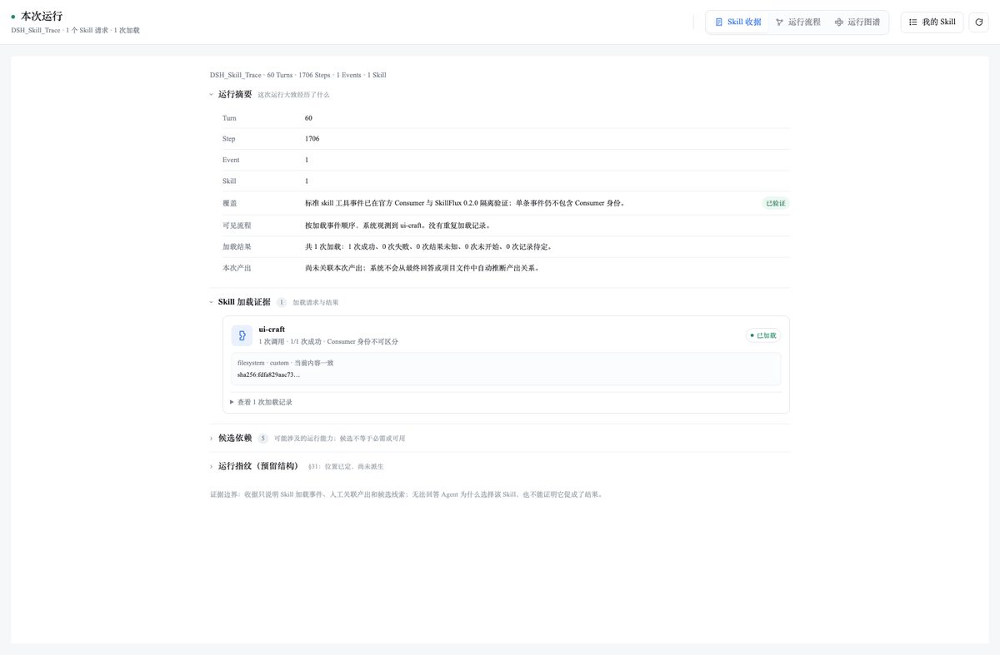
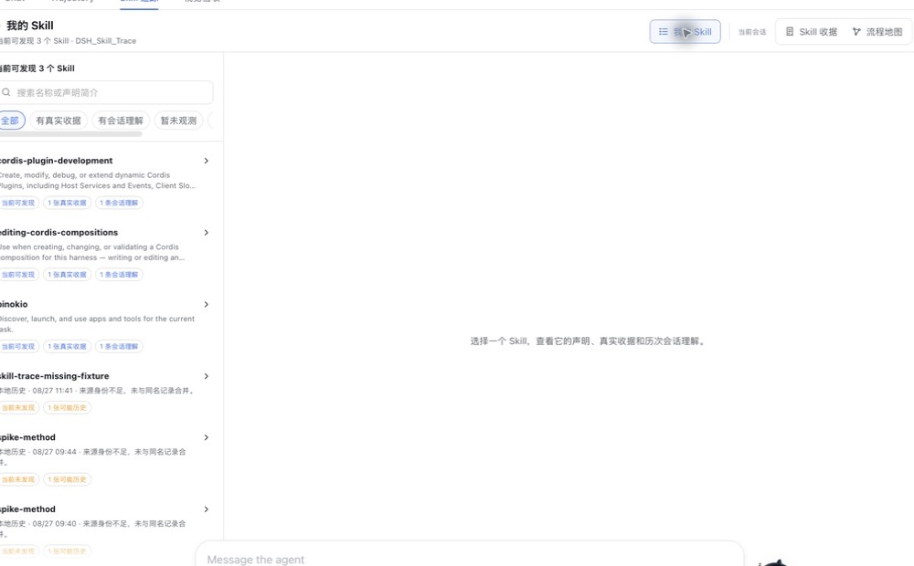

# DSH Skill Trace

> **看清 Agent 在这次会话实际加载了什么 Skill，把运行过程变成可复看、可学习的本地收据。**

DeepSeek Harness 插件 · 本地优先 · MIT · 中文界面名：**Skill 追踪**

当 Agent 自动选择 Skill 时，普通用户常常只看到结果：不知道它加载了什么、按什么步骤工作、依赖什么，或自己是否已经真的学会。DSH Skill Trace 将可观测的加载事件、Skill 声明步骤和你的个人理解放在同一处，帮助你从“看见发生了什么”走到“下次能自己继续”。

> 一次成功的 `skill(name)` 调用只证明 Agent 请求并成功加载了 Skill；**不**证明 Agent 完全遵循其指令，也不证明 Skill 导致了正确结果。插件会明确保留这条证据边界。



*本次 Skill 收据：每个阶段都可展开查看；截图来自本轮 DSH Desktop，已裁去侧栏和个人填写区。*

## 快速概览

| 项目 | 说明 |
| --- | --- |
| 插件名称 | `dsh-skill-trace` |
| 适配平台 | DeepSeek Harness `web` Profile / Desktop（当前运行基线：DSH Desktop `0.11.3` / runtime `0.1.5-rc.2`；此前基线验证于 Desktop `0.8.3` / runtime `0.1.1-rc.2`） |
| 解决的问题 | Agent 加载了什么 Skill、何时加载、声明如何运行、我能否手动延续，都缺少用户可读的证据 |
| 核心界面 | **Skill 收据**、**流程地图**、**我的 Skill** |
| 证据范围 | 观测 `skill(name)` 的调用/结果；区分请求、成功、失败、未知与人工判断 |
| 学习闭环 | 查看声明步骤 → 回看真实收据 → 写下个人理解与验证计划 → 人工记录验证结果 → 待回看工作台 → 手工延续 |
| 隐私 | 本地优先；不保存完整 Prompt、完整 Skill 正文、Token、Cookie、绝对路径或项目内容 |
| 界面语言 | 跟随 DeepSeek Harness 设置：中文显示中文，英文显示英文；运行中切换即时刷新 |
| 不做什么 | 不发现/安装/同步/路由 Skill；不自动运行脚本；不自动改写、提交或发布 Skill |

## 你会看到什么

### 1. 本次 Skill 收据：先回答“刚刚发生了什么”

按时间顺序展示本次会话中的 Turn、步骤、请求加载、结果和收据状态。多次调用、多个 Skill、加载失败和没有观测到 Skill 的空状态都会分别呈现，而不是把“未观测”写成“未使用”。

### 2. 流程地图：适合有系统结构基础的用户

把同一组事实组织成节点和关系：哪个 Turn 请求了哪个 Skill、成功或失败结果、可见输出关联与依赖候选。它与收据共用同一事实源，只改变阅读方式，不额外制造一套“AI 推断流程”。

### 3. 我的 Skill：不记得 `/` 命令时，也能找到已发现的 Skill

“我的 Skill”是当前 Agent Preset 作用域内的只读学习索引和待回看工作台，可搜索名称、声明简介以及用户自己填写的理解、验证计划和人工结果，并区分真实收据、会话理解、待回看、已记录验证结果、暂未观测、历史候选和版本变化。Skill 详情按原收据创建时间保留每次会话的理解、验证计划与人工验证结果；后续编辑不会把旧会话移动到今天，也不会自动合并成“当前正确理解”。它不是 Skill 管理器，不会安装、卸载、同步或更新任何 Skill。

尚未选择左侧 Skill 时，右侧会以一句价值说明、七步使用路径和一条合并边界说明产品怎样工作：观察加载请求 → 形成真实收据 → 用地图看顺序 → 找到对应 Skill → 写下个人理解 → 判断如何手工延续 → 复测后记录人工结果。看过某个 Skill 后，可通过目录摘要旁的“使用指南”再次打开。导览不使用演示收据冒充真实数据，也不把“看过界面”写成“已经学会”。



*我的 Skill：把当前可发现的 Skill、真实收据和本地会话理解放在可搜索的目录中。*

## 工作方式

```mermaid
flowchart LR
    A[Agent 请求 skill(name)] --> B[DSH 工具调用与结果]
    B --> C[Skill 追踪：本地收据]
    C --> D[查看声明步骤与依赖线索]
    D --> E[写下个人理解 / 改进 / 验证计划]
    E --> F[人工记录验证结果]
    F --> G[在我的 Skill 中回看时间线]

    B -. 成功加载不等于有效 .-> H[不自动推断遵循、正确性或因果]
```

## 三步开始

### 1. 通过 GitHub 试用版安装

```bash
dsh plugin --profile web add "github:PolinniZhong/dsh-skill-trace#v0.4.0-beta.4&path:/"
```

安装后重启 DeepSeek Harness Desktop，在会话中打开 **Skill 追踪**。

> 当前功能已通过本地链接安装的 Desktop 验证。GitHub 源安装命令采用 DSH 的 `github:` 插件源格式；如未来 DSH 更新导致源安装行为变化，可使用下方的克隆安装作为回退方式。

### 2. 跑一次真实任务

让 Agent 自然加载一个 Skill。若本次没有观测到任何 Skill，插件只显示“当前对话暂未使用任何 Skill”的空状态，不会填入示例数据。

### 3. 用收据学习，而不是把加载当作成功

展开“发生了什么”和“加载记录”，再逐项看 Skill 声明的候选步骤。用自己的话填写：

- **我的理解**：这个 Skill 的目标与步骤是什么？
- **我想改进**：我会修改哪些分支、边界或不适用场景？
- **下次如何验证**：我准备怎么验证改动？

这些内容仅保存在本机当前收据中，可在“我的 Skill → Skill 详情 → 历次会话理解”回看；不会上传给项目维护者，也不会写回或发布 Skill。

完成验证后，可在当前收据或“我的 Skill”的学习时间线中补充：

- **结果状态**：符合预期、不符合预期或暂不能判断；
- **实际观察**：这次人工验证看到了什么；
- **下一步动作**：是否继续、调整方法或补充验证。

验证结果同样属于用户主动填写的本地记录。它不证明 Skill 的普遍质量，也不会被用于评分、排行或自动推荐。

## 本地开发与回退安装

```bash
git clone https://github.com/PolinniZhong/dsh-skill-trace.git
cd dsh-skill-trace
npm test
npm run verify
dsh plugin --profile web add "link:$(pwd)"
```

移除插件：

```bash
dsh plugin --profile web remove dsh-skill-trace
```

移除插件不会自动删除已有本地收据；删除应始终由用户在产品内明确确认。

## 隐私与边界

- 不实现遥测、云同步、收据上传或远程分析。
- 只保存显示加载证据所需的最小元数据、安全来源标识和用户主动填写的本地笔记。
- 不保存完整 Prompt、完整 Skill 指令、访问 Token、Cookie、凭据、绝对路径、项目文件或生成内容。
- 网络、模型、MCP、脚本、权限只会作为**候选线索**呈现，仍需要人工核对；“可手工延续 / 可部分延续 / 当前受阻”也必须由用户自己判断。

详见 [隐私说明](docs/PRIVACY.md) 与 [架构说明](docs/ARCHITECTURE.md)。

## 当前状态

当前公开预发布版为 `0.4.0-beta.3`。上一候选的 Desktop Blob 下载被实测为假成功，现已停用；本版本改为由 Host 原子创建并回读验证备份，提供备份历史、打开所在文件夹、预览后恢复缺失数据，并在清空/单删前自动创建安全备份。若清空后活动会话先重建了加载证据，恢复会保留当前证据，只补回备份中缺失的个人理解、人工结果、输出引用和继续方式；当前已存在的同类用户记录不会被覆盖。个人理解、人工验证与输出引用的未保存草稿会在当前 Desktop 运行期间本地暂存，切换页面后返回可恢复；只有明确保存后才进入收据与备份。

上述实现已通过静态合同和本地 store 自动化测试，包括活动会话重建后的个人记录补回、并发原子写，以及清空期间阻塞新写入的维护屏障；技术边界见 [架构说明](docs/ARCHITECTURE.md)。真实 Desktop 已验证备份创建、回读、历史展示与打开所在文件夹；为避免破坏个人记录，发布前未对维护者的真实收据执行“清空 → 恢复”往返，该破坏性路径以隔离自动化覆盖并作为预发布限制公开保留。

`0.4.0-beta.7` 修复了 DSH 会话格式 V3 → V4 迁移带来的静默证据丢失：V4 把工具结果提升为一等 `tool` 消息并取消了 V3 的 `tool-result` 包裹块，而观察器只认包裹块，导致迁移后的会话仍报告“已加载”，却不再产生指令指纹、候选步骤与版本变化。现在两种格式都能读取，并新增了基于真实 V4 事件样本的契约测试。

`0.4.0-beta.8` 补齐观测面。此前只订阅工具事件，因此用户以 `/名称` 显式加载 Skill 时（DSH 以 `user/message` 注入，不产生 `skill` 工具调用）在收据里完全不存在；实测同一次会话中两次 `/character-asset-kit` 加载此前全部不可见，现在都能给出指令指纹与候选步骤。同时把 DSH 持久化发布的 Skill 目录作为声明基线记录下来，并把每个工具调用保留为有限的运行证据——工具、CLI、MCP、Subagent 调用本来就到达事件流，只是被入口丢弃，这正是运行图谱缺少原料的原因。运行证据只保留关联与分类元数据，不读取参数与结果内容。

`0.4.0-beta.9` 把运行事件归一化成统一的 `RuntimeEvent` 模型，并按 `invocationId` 聚合成 Invocation。每个事件带 `source`（`dsh` 宿主事实 / `derived` 具名规则派生）与可引用的 `eventId`；派生事件只会追加，绝不覆盖它读过的事件，且必须能说出依据的规则名（目前一条：`same-turn-repeat-after-failure`，用于识别同一 Turn 内失败后的重试）。聚合严格按 `invocationId` 配对，不使用时间相邻，因此没等到结果的请求保持 `unresolved-request`、没有请求的结果保持 `orphan-result`，不会被"就近补全"。Skill 证据仍然即时落盘，运行证据改为在 Turn 边界持久化——它是可以从会话日志重建的派生证据，而每次工具调用都重写整个收据会把同一个不断变大的文件写上百次。本版不上 UI。

`0.4.0-beta.10` 加入关联引擎与图谱重建。规矩只有一条，且高于其余所有：**图可以不全，但不能错**。每条边必须能引用收据里真实存在的事件，引用不到就丢弃并计入 `droppedEdgeCount`，不会降级成一条更弱的说法；无法确定归属的调用列进 `unlinked` 并附原因，不会挂到最近的节点上。包含关系（会话→Turn→调用）与 Subagent 派生是 `observed`，因为它们基于宿主事实（`turn`/`step` 与父会话发出的 `subagent/catalog.childId`）；唯一的启发式是"同一步骤内相邻"，且只标 `candidate`。目录事件里的自由文本 `label` 刻意不读——那是调用方文本。边的词表是封闭的：没有 `uses`、没有 `produces`（把工具调用归因给 Skill 需要对齐证据），也没有任何能表达"因果"的边类型。本版不上 UI。

`0.4.0-beta.11` 加入 **Declaration ↔ Runtime Alignment**——这是整个产品的分水岭。三条承诺：**不评分**（只报告证据状态计数，没有遵循率、百分比或排名）；**证据不足不等于没有执行**（没有对应证据的声明步骤记为 `insufficient`，词表里刻意没有 `not-observed`，因为缺失的数据永远无法证明 Agent 跳过了某步）；**直接证据不等于泛化证据**（`bash` 只证明"执行了某条命令"，不能证明就是测试步骤，所以只记为 `partial`）。

同时修掉了一个真实缺陷：声明步骤抽取此前只抓有序列表，在真实技能上抽出的 5 条全是条件分支与内容分类，而 **7 条真正的流程步骤一条没抓到**。现在改为**标题层级 + 有序列表双通道**且标题优先，实测 `ai-frontier-daily-topics` 正确给出 7 条真实步骤。另外，把 `## 硬约束` 里的条目当成"流程步骤"是错误标注，因此有序列表只在**流程类章节内**（或整篇无章节时）才计入——正文不声明流程的技能会明确说 `numbered-items-outside-a-process-section`，而不是把约束升格成对齐对象。本版不上 UI。

`0.4.0-beta.13` 加入**运行图谱画布**——插件里的第三个视图，也是 `beta.5` 以来第一次改动界面。按重构方案的硬约束**先量后决**：本机 56 个真实会话的图谱规模是**中位 61 节点、p90 915、最大 1095**，比扁平画布能承受的量大一个数量级，所以**分组是模型的一部分，不是事后优化**。三条规则依次生效：单个 Turn 超过 12 次调用→按能力折叠；会话超过 36 个 Turn→折成区间；单层超过 26 行→换列。它们把画布稳定压在 **200 节点以内、约 1036px 高**，56 个会话**无一超限**（布局耗时中位 0.3ms，最差 15ms）。

布局是图的纯函数：不存坐标、不记视口与缩放、不改动图本身——同一份收据永远画出同一张图，所以重绘不会被误读成新证据。**检查器**逐节点/逐边回答"这条线为什么存在"，每条关系都同时给出**含义**与**它不表示什么**（`follows` 是日志顺序不是因果；规则派生的 `spawns` 归属不是宿主事实；`retries` 不代表重试更接近成功），并携带 `causal/compliance/correctness: false` 的证据边界。画布只发计数不发 id 列表，细节按需重新推导——最大会话的响应从 **481KB 降到 145KB**（中位 21KB）。

仍待验证：真实用户关闭材料后的即时复述、24 小时复测、超长流程地图导航，以及系统级无障碍审计。人工填写“符合预期”也只代表该用户对这次验证的记录，请不要把它视作“用户已经理解 Skill”、Skill 普遍有效或加载必然带来有效产出的证明。

## 开发与验证

```bash
npm test
npm run verify
npm pack --dry-run
```

当前包含 231 组自动化测试，覆盖事件归并、来源快照、Schema 迁移、收据与偏好持久化、目录投影、学习笔记、人工验证结果、本地搜索、未保存草稿保护及暂存失败告警、备份落盘/读取、活动会话个人记录补回、并发原子写、清空维护屏障、清理安全、Host 隐私策略、DSH 会话格式 V3/V4 的 `tool/result` 契约、Phase 0 观测面、Phase 1 运行事件模型、Phase 2 关联与出处（SDD §17.4 假关系测试），以及 Phase 3 对齐（双通道声明抽取、证据状态语义、"证据不足≠没有执行"、泛化证据只记 partial、无评分守卫）与 Phase 4 画布（布局确定性、不改图、有界折叠、隐藏项计数守恒、每条边可解释"为什么存在"、检查器必然声明它不表示什么）。以上命令不替代完整的 DSH Desktop 端到端回归。

## FAQ

| 问题 | 回答 |
| --- | --- |
| 为什么显示“已加载”却不显示“有效”？ | 加载结果只能证明工具调用成功，不能证明 Agent 遵循了全部指令、结果正确或由该 Skill 造成。 |
| 一个会话用了多个 Skill，能看到吗？ | 能。收据按实际观测的加载事件记录多个 Skill 和重复加载。 |
| 没有加载 Skill 时会怎样？ | 显示明确空状态；不会用演示内容或历史数据冒充本次运行。 |
| “我的 Skill”会替我安装或更新吗？ | 不会。它仅展示当前作用域下可发现的 Skill 和本地学习证据。 |
| 为什么未选择 Skill 时会显示使用路径？ | 它帮助第一次使用的人理解“证据 → 方法候选 → 个人理解 → 人工复测”的闭环；选择左侧条目后会切换到该 Skill 的真实详情。 |
| 我写的理解和验证结果会传回项目方吗？ | 不会。它们只保存在你的本机收据中。 |
| 本地备份会上传吗？ | 不会。`0.4.0-beta.3` 由本机 Host 写入插件专用备份目录；界面可打开所在文件夹并恢复缺失数据。 |
| 清空 Skill Trace 数据会删除 DSH 对话吗？ | 不会。它只删除插件自己的本地收据；当前仍在运行的会话证据可能根据 DSH 事件重新建立。 |
| 能直接生成或发布改好的 Skill 吗？ | 不能。这一版本只帮助你理解、记录改进意图与准备验证清单。 |

## 相关文档

- [Design system](design.md) — Skill Trace 后续 UI 的视觉、交互与验收权威
- [Architecture](docs/ARCHITECTURE.md) — 事件、收据和目录的实现边界
- [Privacy](docs/PRIVACY.md) — 本地数据边界与报告注意事项
- [Changelog](CHANGELOG.md) — 版本变化
- [Security policy](SECURITY.md) — 非敏感问题报告方式

## License

[MIT](LICENSE)
